# AMP Elevate insurance  

Product disclosure statement and plan document  

  

Life Insurance   
Life Insurance Superannuation   
Life Insurance SMSF   
Total and Permanent Disability Insurance   
Total and Permanent Disability Insurance Superannuation   
Total and Permanent Disability Insurance SMSF   
Trauma Insurance   
Income Insurance   
Income Insurance Superannuation   
Income Insurance SMSF   
Business Expenses Insurance  

# About this product disclosure statement and plan document  

For more information about AMP please visit amp.com.au or contact AMP Customer Service 131 267  

Products in this Product Disclosure Statement and Plan Document (PDS) are available from 10 June 2017.  

# Product issuer  

This PDS relates to a number of separate financial products which are referred to as plans.  

All plans, except the Life Insurance Superannuation Plan, TPD Insurance Superannuation Plan and the Income Insurance Superannuation Plan, are issued by AMP Life Limited ABN 84 079 300 379 AFS Licence No. 233671.The Life Insurance Superannuation Plan, TPD Insurance Superannuation Plan and Income Insurance Superannuation Plan are issued by N.M. Superannuation Proprietary Limited ABN 31 008 428 322 AFS LicenceNo.234654( NMSuper )astrusteeoftheSuperDirections Fund ABN 78 421 957 449 ( Super Directions ) and of the Wealth Personal Superannuation and Pension Fund ABN 92 381 911 598 ( Wealth Super ).  

NMSuper and AMPLife eachtakefullresponsibilityforthewhole of this PDS , although only the product issuer of a plan is responsible for the obligations under the plan .The products contained in this PDS are not investment products.  

# Information contained in this PDS  

This PDS contains information about insurance plans available from AMP and NM Super , including the terms and conditions applicable to those plans .  

The information in this PDS will help you to decide whether these plans will meet your needs. It will assist you in comparing the types of cover available in the marketplace but does not take into consideration your individual needs and circumstances. Before acting on the information in this PDS , you should consider the appropriateness of this information and consult a financial adviser .  

Regulatory identifiers   

<html><body><table><tr><td>Super Directions Fund (Super Directions)</td><td>ABN78421957449</td></tr><tr><td>N.M.SuperannuationProprietaryABN31008428322 Limited (NMSuper)</td><td>AustralianFinancialServices (AFS)Licence No.234654</td></tr><tr><td>AMPLifeLimited(AMPLife)</td><td>ABN84079300379 AFSLicenceNo.233671</td></tr><tr><td>WealthPersonalSuperannuationABN92381911598 andPensionFund(WealthSuper)</td><td></td></tr></table></body></html>  

The plans described in this PDS are available only to persons receiving the PDS (including electronically) within Australia. We can’t accept cash or applications signed and mailed from outside Australia. Monies received or paid must always be in Australian dollars.  

# This is a combined PDS and plan document  

If you purchase an AMP Elevate insurance plan , this PDS constitutes your plan document. This PDS sets out the terms and conditions of all available plans . The particular terms and conditions that apply to your contract of insurance will depend of the plan and option(s) you have purchased which will be set out in the insurance schedule .  

# Changes to the PDS  

Information in the PDS may be amended from time to time. If the amendment is not materially adverse, it may be updated and information provided on amp.com.au/pdsupdates. A printed or electronic copy of any amendments can be obtained free of charge by contacting our Customer Contact Centre on 131 267.  

Some terms we use in this PDS   

<html><body><table><tr><td>In this PDS, any referenceto:</td><td>means:</td></tr><tr><td>You or Your</td><td>When werefertoyou oryourinthis document,we'rereferringtothepolicy owner.Thepolicyowner cansometimes be the insured person.</td></tr><tr><td>Us, we, our, AMP, AMPLifeorthe insurer</td><td>AMP Life Limited.</td></tr><tr><td>Financial adviser</td><td>Thefinancial adviser who is advisingyou.</td></tr><tr><td>PDS</td><td>Thisproductdisclosure statement and plan document,and any updates to this document.</td></tr><tr><td>SMSF</td><td>Self-managed superannuationfund.</td></tr><tr><td>Super</td><td>Superannuation and self-managed superannuationfunds.</td></tr></table></body></html>  

There are many terms with a specific meaning, which will be in bold . You can find their definition in Glossary of terms starting on page 115.  

# Throughout this document the following symbols have been used  

Superannuation   
Indicates that the benefit/option/definition is available on plans issued by NM Super , being the Life Insurance Superannuation Plan, TPD Insurance Superannuation Plan and the Income Insurance Superannuation Plan. Non-superannuation   
Indicates that the benefit/option/definition is available on plans outside super.   
Non-superannuation linked plan/option   
Indicates that the benefit/option/definition may be linked to either a superannuation plan or   
non-superannuation plan .Thisincludes FlexiLinkplans ,PremierLink or StandardLink options.   
Self managed superannuation fund   
Indicates that the benefit/option/definition is available on plans issued by AMP Life to a SMSF or Small APRA Super Fund, being the Life Insurance SMSF Plan, TPD Insurance SMSF Plan and the Income Insurance SMSF Plan.  

# Contents  

Introducing AMP Elevate Introducing AMP Elevate About AMP Elevate insurance   
What you need to know when applying for cover What you need to know when applying for cover Plan structure Steps to being insured Who can be an insured person Who can own your insurance What can you apply for? Cost of insurance What are insurance premiums? How we work out your insurance premium Premium structures Fees, charges and discounts Variations Our approach to claims Our customers' claims experiences How to claim Customer satisfaction and complaint resolution We’re here to help Complaint resolution   
AMP Elevate insurance in detail AMP Elevate insurance in detail – Life, TPD & Trauma insurance About AMP Elevate Life insurance About AMP Elevate Total and Permanent Disability insurance About AMP Elevate Trauma insurance About AMP Elevate Children’s trauma option Life, TPD and Trauma insurance benefits and features in detail AMP Elevate insurance in detail – Income & Business expenses About AMP Elevate Income insurance AboutAMPElevateBusinessexpensesinsurance  

13   
15   
16   
23   
29   
29   
29   
30   
31   
32   
33   
33   
34   
35   
35   
35   
36   
37   
37   
40   
43   
46   
48   
65   
65   
70   
4 Selecting your level of Income insurance and   
5 Business expenses insurance 71   
6 Income insurance and Business expenses   
8 insurance benefits and features in detail 72   
9 Continuing your insurance cover 98   
9 When the plan will end 99   
Restoring a plan 101   
Key information you need to know 102   
Holding your plan in super 103   
Plan membership 103   
Taxation information 103   
Nominating beneficiaries 105   
General terms and conditions 109   
The plans in this PDS are not savings plans 109   
Tax on insurance outside super 109   
Paying your premiums 110   
Financial adviser remuneration 111   
Declarations and consent 112   
Significant risks 113   
Your application 113   
Privacy – use and disclosure of personal   
information 114   
Glossary of terms 115   
Glossary of general terms in this document 115   
Glossary of Total and Permanent Disability (TPD)   
insurance definitions 119   
Glossary of medical conditions 120   
Glossary of Income insurance definitions 128   
Interim cover certificate 130  

# Introducing AMP Elevate  

In this section we will:  

Discuss being there for you when you need us  

Introduce AMP Elevate insurance  

# Introducing AMP Elevate  

Live life knowing that we will be there for you.  

# We’ll be there for you when you need us  

Like most people, you probably don't think anything bad will ever happen to you.  

If something unexpected does happen, you want to protect what’s important. You don’t want to worry about how to pay the bills and look after your loved ones.  

With AMP Elevate insurance, we can help you to have that covered. What's more, if you need to make a claim, we’ll be there for you every step of the way.  

That’s why we’re Australia’s favourite for personal insurance 1 . In 2016 we paid 11,145 customers and a total of \$1.058 billion in insurance claims across our entire insurance range. That’s about \$2.9 million paid every day.  

# Our claims philosophy  

At AMP we see our role as more than just paying a claim. We create tailored solutions to help you and your family live the best life you can should something happen. While this may involve paying a financial benefit, depending on the nature of the claim it may also involve rehabilitation, working with you on a return to work program, or offering domestic assistance.  

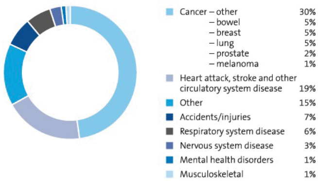  

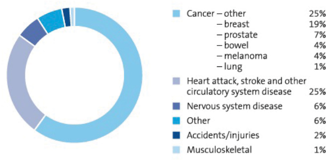  

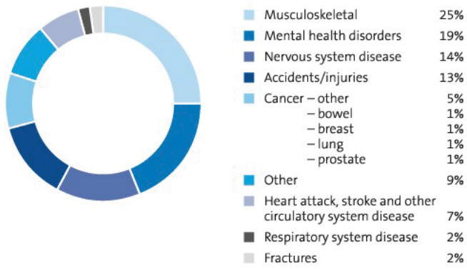  

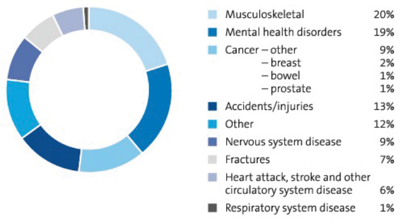  

# About AMP Elevate insurance  

# Understanding insurance  

AMP Elevate insurance is designed to provide financial security for you and your family when something unexpected happens.  

We offer a wide range of cover to suit your needs.   

<html><body><table><tr><td>Type of insurance</td><td>People we havehelped live their best lives</td><td>Why do I need it?</td><td>Key benefits payable</td></tr><tr><td>Life insurance</td><td>“Being a parent makes yourealisewhat's important.AndIwant tomakesureIlookafter myfamilyif anything happens to me."</td><td>YoumaywanttotakeoutLife insurancetoprovidefinancial security,iftheinsuredperson dies,tohelpcovermortgage andotherdebtpaymentsand providelovedoneswiththe fundstheyneedtohelpthem continue their lifestyle.</td><td>Wepayalumpsumif theinsuredpersondies orisdiagnosedwitha terminalillness.</td></tr><tr><td>Total and permanent disability insurance</td><td>“Aftermyaccident,was devastatedtofindout Icouldnevergobackto work.Whilemylifewon't bethesame,atleastthe moneyIreceivedmeans my billswill be paid."</td><td>Moneyisthelastthingyou wouldwanttothinkabout whenfacedwithalifelong disability.Anemotionalstrain canbeplaced onafamilyto providesupporttosomeone whomayneedfull-timecare andmayneverbeableto work again.</td><td>Wepayalump sum iftheinsuredperson becomestotallyand permanentlydisabled.</td></tr><tr><td>Trauma insurance</td><td>"Myfriend contracted cancerand hadtogo throughlotsoftherapy. She'sok,butIwantto make sureifithappensto me,Idon'thavetoworry aboutmoney."</td><td>Nobodylikestothinkabout thepossibilityofexperiencing a seriousillnessorinjury butyoucan makeplansto helpsupport yourself if the unexpected happens. Traumacovercanhelpprovide thefundsforout-of-pocket treatmentexpensesand makinglifestyleadjustments afterexperiencingaserious illness orinjury.</td><td>Wepayalumpsumtohelp theinsuredpersonrecoverand adjusttolifeiftheysuffera seriousillnessorinjurylisted inthesectionAboutElevate Traumainsurance. Someeventsthatwecover includecancer,heartattack and stroke. Ourmedicaldefinitionsdefine theeventswecoverunder Trauma insurance.These definitionsgenerallytake</td></tr><tr><td>Income insurance</td><td>"'m single,I'vejust boughtahouseandI'm stillpaying off my car.If Igetinjured,want makesureIcanstillmake all therepayments."</td><td>Incomeinsurancecanhelp theinsuredpersoncontinue topaytheirday-to-dayliving expenseswhilethey'retooill orinjuredtogotowork,so they canfocusonrecovery.</td><td>into accounttheseverityof a condition. Wepayamonthlybenefit if theinsuredpersonbecomes totallyorpartiallydisableddue to aninjuryorsicknesswhich stopsthemfromworking.</td></tr><tr><td>Business expenses insurance</td><td>"Inbusiness you have toconsidertherisks. And theriskofmy business going down justbecauseIfall over is too high." （000</td><td>Businessexpensesinsurance can helpwithbusiness expensestokeepthe businessgoingwhilethe insuredpersonistooillor injuredtogotowork.</td><td>Wepayamonthlybenefit tohelpmanagetheinsured person'sbusinessexpenses andkeepthebusinessgoing iftheinsuredpersonbecomes totallyorpartiallydisableddue toaninjuryorsicknesswhich stopsthemfromworking.</td></tr></table></body></html>  

# Your privacy  

Your privacy is important to us. See page 114 for information about how we handle your personal information.  

# You can change your mind  

If we accept your application, we’ll send you an insurance schedule . You’ll have 28 days (from the day you receive your insurance schedule ) to check that your plan meets your needs. This is known as the cooling-off period. If it doesn’t meet your needs, or you change your mind for any reason, simply contact us to cancel your plan .  

As long as you haven’t made a claim under your plan , we’ll cancel your plan and refund any amounts you’ve paid us.  

# Contact us  

We’re here to help. If you have any questions, please contact our Customer Contact Centre or your financial adviser .  

# Phone  

131 267   
1800 674 684   
askamp@amp.com.au AMP Customer Service PO Box 14330   
MELBOURNE VIC 8001  

# Address  

# What you need to know when applying for cover  

In this section we'll discuss:  

Plan structure   
Steps to being insured   
Who can own your insurance   
What you can apply for   
Cost of insurance   
How to claim   
Customer satisfaction and complaint resolution  

# What you need to know when applying for cover  

AMP Elevate insurance is an insurance product designed to provide financial benefits for you and your family when something unexpected happens.  

# Plan structure  

AMP Elevate offers a wide range of plans and options to structure your insurance which provides flexibility, so you can choose what cover you want and how to structure it – and only pay for what you choose.  

If you decide to hold some cover in super but want additional protection that is not available through super due to superannuationlaw,AMPElevateoffersFlexiLink,PremierLinkandStandardLinkoptionswhichcanbeaddedtoinsurance plans owned through super. You’ll find out more about these benefits starting on page 38.  

The various types of insurance covers can pay a lump sum amount or a monthly benefit. Please refer to the table below for the available structures for each insurance product.  

  

# How do you want to structure your insurance?  

If you select more than one type of cover for the same insured person , you can choose to make the covers either standalone plans or link them under the same plan . Standalone plans generally have a higher premium than linked cover.  

<html><body><table><tr><td colspan="2">The structure can impact your insurance cover in the event of a claim</td></tr><tr><td>Standaloneplan</td><td>If we pay a benefit under a standalone plan (for example, a TPD Insurance Plan), it does not reduce the sum insured of any other cover (for example, a Life Insurance Plan) for the insured person. For example, you took $2 million in a Life Insurance Plan and $75o,ooo in a TPD Insurance Plan. If you made a TPD claim and a full benefit is paid, the $2 million on your Life Insurance Plan won't be reduced. You can purchase Lifeinsurance,TPD insurance,Traumainsurance,Incomeinsurance and Business expenses insurance asstandaloneplans that operateindependently of each other.</td></tr><tr><td>Linkedcovers</td><td>If we pay a benefit under a linked option (for example,a TPD option),the sum insured ofeach remaining linked cover(forexample,a LifeInsurancePlan)forthatinsured personisreduced bythe amount wepay,unlesswe stateotherwiseinthisPDs. in the table above. Income insurance plans and the Business Expenses Insurance Plan may not be linked with anylumpsumcovers. For example, you took $2 million in a Life Insurance Plan and $750,0o0 on a linked TPD option. If you made a TPD claim and the full benefit of $750,0o0 is paid, your Life Insurance Plan will be reduced to$1.25 million. Youcanpurchase TPDinsurance and Traumainsurance asoptions undera lifeInsurance plan.You can also purchase TPD insurance as an option under a trauma insurance plan.</td></tr></table></body></html>  

# Purchasing plans outside and through super  

AMP Elevate provides ways to structure your plan by acquiring and paying for it outside or through super. We offer both super and SMSF plans to suit your needs.  

Flexible linking options – You can link TPD, Trauma and Income insurance cover outside super, with cover acquired through super. This can help manage your cashflow while enjoying the benefits of coverage options only available outside super. For more details about FlexiLink, PremierLink or StandardLink, see pages 18 to 22.  

# Insurance purchased outside super  

When purchasing insurance as a plan outside super, you can choose to link other types of insurance cover as options to your plan .  

Life, TPD and Trauma insurance   

<html><body><table><tr><td>Standalone plans</td><td colspan="2">Linked cover</td></tr><tr><td></td><td colspan="2">If we pay a benefit under a linked option added in Step 2, the sum insured of each remaining linked cover (plans and options) for that insured person is reduced by the amount we pay, unlesswestateotherwiseinthisPDS.</td></tr><tr><td>Step 1 NS Youcanselectoneormoreplans</td><td>Step 2a NS You can choose to link other types of insurance cover as options to your plan</td><td>Step 2b NS There are many other options available that can be added to your plan or option</td></tr><tr><td>Life insurance</td><td>TPD option</td><td>Forotheroptionsavailableonlifeinsuranceplans,</td></tr><tr><td>Life Insurance Plan</td><td>Trauma option Children's Trauma option</td><td>seepages38to39.</td></tr><tr><td>TPD insurance TPD Insurance Plan</td><td>- Children's Trauma option</td><td>ForotheroptionsavailableonTpDinsuranceplans, see page 42.</td></tr><tr><td>Trauma insurance Trauma Insurance Plan Trauma Insurance Plus Plan</td><td>TPD option Children's Trauma option</td><td>For otheroptions available ontraumainsurance plans,seepage 44.</td></tr></table></body></html>  

Income insurance and Business expenses insurance   

<html><body><table><tr><td colspan="2">Standaloneplans</td></tr><tr><td>Step 1 NS</td><td>Step 2 NS</td></tr><tr><td>Youcanselectoneormoreplans</td><td>There are many other options available that can be added to your plan</td></tr><tr><td>Incomeinsurance IncomeInsurancePremierPlan IncomeInsurance PlusPlan</td><td>For options available on income insurance plans, see page 67.</td></tr><tr><td>IncomeInsurancePlan IncomeInsuranceSeniorPlan (only available as a conversion from eligible plans)</td><td></td></tr><tr><td>Business expenses insurance BusinessExpensesInsurancePlan</td><td>N/A</td></tr></table></body></html>  

# Insurance purchased through super  

When purchasing insurance as a plan through super , you can choose to link other types of insurance cover as options to your plan .  

Life, TPD and Trauma insurance   

<html><body><table><tr><td>Standalone plans</td><td colspan="3">Linked cover If we pay a benefit under a linked option added in Step 2, the sum insured of each remaining linked cover (plans and options) for that insured person is reduced by the amount we pay, unless we state otherwise in this PDS.</td></tr><tr><td>Step 1 SSMSF You can select one or more plans through super</td><td>Step 2a SSMSF options to your plan</td><td>Step 2b ② You can choose to link other You can choose to link other types of There are many other options types of insurance cover as insurance cover outside super as options to your plan through super</td><td>Step 3 SSMSF available that can be added to your plan or option</td></tr><tr><td>Life insurance Life Insurance Superannuation Plan</td><td>through super TPD option (Any occupation)</td><td>-PremierLink TPD option (Own occupation) -FlexiLink TPD Plan</td><td>For other options available on life insurance plans, see pages 38 to 39.</td></tr><tr><td>Life Insurance SMSF Plan</td><td></td><td>-FlexiLink Trauma Plan If you purchase any of the above, you may alsolinktheChildren'sTrauma option.</td><td></td></tr><tr><td>TPD insurance TPD Insurance Superannuation Plan TPDInsurance SMSF Plan</td><td>N/A</td><td>-PremierLink TPD option (Own occupation)</td><td>For other options available on TPD insurance plans, see page 44.</td></tr></table></body></html>  

Income and Business expenses insurance   

<html><body><table><tr><td colspan="3">Standaloneplans</td></tr><tr><td>Step 1 S SMSF</td><td>Step2</td><td>Step 3 SMSF</td></tr><tr><td>You canselectoneormoreplans through super</td><td>You canchoose tolinkothertypesof your plan through super</td><td>There are many other options available</td></tr><tr><td>Incomeinsurance</td><td>-PremierLinkIPoption</td><td>Forotheroptionsavailableonincome</td></tr><tr><td>IncomeInsuranceSuperannuationPlan IncomeInsuranceSMSFPlan</td><td>StandardLinkIPoption</td><td>insuranceplans,seepage67.</td></tr></table></body></html>  

# Owning and paying your insurance through super  

AMP Elevate also allows you to pay for your insurance through super. There are some important differences to think about, compared to owning and paying for your insurance outside of super.  

Your financial adviser will help you to work out the way for you to structure your insurance so it is appropriate for your needs and circumstances.  

<html><body><table><tr><td colspan="2">Owning and paying through super</td><td>Owning and paying from funds outside super</td></tr><tr><td>In general</td><td>Can be a tax-effective way to pay premiums (if your taxable income is above the tax-free threshold, and below the high-income earners threshold). eg $100 premium will cost $100 from pre-tax income paid by your employer. The benefit is paid to the Trustee who then releases the benefit if a condition of release is met. Paying for your insurance through super could reduce your retirement savings. Premiums count towards your contribution caps. Premiums can be paid through various AMP platforms such as MyNorth, Summit, Generations and iAccess.</td><td>-You will be paying for premiums from after-tax income.</td></tr><tr><td>Life insurance</td><td>The Life benefit (page 50) is paid to the Trustee. They will decide whoto paythe benefit to, taking into account your nomination of beneficiaries (page 105). Beneficiaries - those who receive your assets after you die may have to pay tax on the benefit (page 105).</td><td>- The benefit will be paid to the policy owner or your nominated beneficiaries.</td></tr><tr><td>TPD insurance</td><td>Definitions must comply with superannuation law. Uses an Any occupation definition in the event of a claim as assessment of your ability to return to work. Any benefit amount paid may be taxed. Please see Holding your plan in super on page 103 for more detail.</td><td>Choice of an Any or Own occupation definition. Can be linked to insurance plans held through super via FlexiLink and PremierLink options (pages 18 to 22). There are a greater number of features available in insurance outside super</td></tr><tr><td>Trauma insurance</td><td>- Not available through super.</td><td>-Can be held outside super or linked to insurance plans held through super via FlexiLink (page 18).</td></tr><tr><td>Income insurance</td><td>Definitions must comply with superannuation law. Insured on an indemnity basis only (page 71).</td><td>Insurance premiums are generally tax-deductible. - You can choose between an agreed value or indemnity benefit type (page 71). -There are a greater number of features available for Income insurance outside super. Can be held outside super or linked to income insurance plans held through super via a PremierLink IP option or StandardLink IP option (page 21).</td></tr></table></body></html>  

Steps to being insured   

<html><body><table><tr><td>Step 1 Think about what types of</td><td colspan="2">and your budget. It's important to understand the different types of insurance and what's covered. Your financial adviser can help you decide which plan, and which options, are suitable for your circumstances</td></tr><tr><td>insurance you need and needs.</td><td colspan="2">If you are applying for cover as the trustee of a SMSF or a small APRA Super Fund, you should also be Your financial adviser will help you work out how much cover you need, which plans and options suit</td></tr><tr><td>Step 2 Talk about your options</td><td colspan="2">your needs, and recommend the way for you to structure your insurance for your circumstances. To create insurance cover that is tailored to your needs, you'll need to decide on:</td></tr><tr><td>Step 3 Create your insurance cover</td><td colspan="2">- who you want to insure, - which insurance plan you need (pages 9 to 11), - the amount of insurance you need,</td></tr><tr><td></td><td colspan="2">- who will own the plan, - any options you want to add to your plan (at an extra cost), - the premium structure for your plan, eg stepped or level premiums (page 30), and - how to pay for your insurance (see page 110). The AMP Elevate insurance plans and options have a range of benefits, features and extra cost options</td></tr><tr><td>Step 4 Find out how much your insurance will cost Step 5</td><td colspan="2">in AMP Elevateinsurance in detail, startingonpage 36. provide a quote.</td></tr><tr><td rowspan="6">Completing your application</td><td colspan="2">Before you apply for cover, it's important for you and the insured person to carefully read (page 112), and if you're applying for insurance through super, the Holding your plan in super section (page 103).</td></tr><tr><td colspan="2">about who is the policy owner and insured person, address, payment options and Tax File Number. It also includes a Personal Statement which will ask more personal questions. Forexample, questions about the insured person's health history, occupation, income, residence and travel details, as well as factors</td></tr><tr><td colspan="2">ssased euoeaan pue suods se ynss Online</td></tr><tr><td colspan="2">adviser.</td></tr><tr><td colspan="2">Paper An Application form and Personal Statement are included at the back of this document.</td></tr><tr><td colspan="2">Complete them and send them to us at: AMPCustomerService PO B0X 14330 MELBOURNE VIC 8001</td></tr><tr><td colspan="2">Step 6 The underwriting process</td><td>information, or ask you to undertake a medical examination. While this is going on, we'll provide you with interim cover at no extra cost. Please see page 130 for more</td></tr><tr><td colspan="2">Step 7 We'llcomebackwithan offer</td><td>details on interim cover. We'll make a decision based on the information you give us and come back to you with an offer based onourassessmentofyourparticular circumstances. We thoroughly evaluate each application we receive and offer underwriting terms based on a thoughtful and reasonable assessment of the information you give us and your individual circumstances.</td></tr></table></body></html>  

<html><body><table><tr><td></td><td>In some cases, we may offer insurance that's different to what you applied for (known as revised terms) andagreedwithyoubeforethecovercommences. We'll keepyou fully informed about the progress ofyour application and provide you with a logical reason foranydecisionswemake. After we issue your insurance plan, you have a cooling-off period where you may change your mind.</td></tr><tr><td>Step8 The insurance schedule</td><td>PleaseseetheCooling-offperiodsectionbelow. schedule will form the insurance contract between you and us. It will set out the policy owner, insured person,commencement date,the sum insured,the plans and options selected,exclusions and all other</td></tr><tr><td>Step 9 Keeping you informed log in to My AMP.</td><td>important information. Each yearwe'll send you an updated schedule confirming theinsurance,fees and premiums. If you change your occupation, stop smoking or improve your health, you can ask to be re-assessed, which may reduce yourpremiumorenable anexclusiontoberemoved. You can also get up-to-date information about your insurance online. To register, visit amp.com.au and</td></tr></table></body></html>  

# What you need to tell us  

When you apply for insurance, and up until we accept your application, you have a duty to tell us anything you know, or could be reasonably be expected to know, that may affect our decision to insure you and the terms of your insurance. This means answering all the questions in the application honestly and ensuring you include all the information we ask for. You also have the same duty if you want to change, extend or reinstate your insurance in the future.  

A full description of your duty of disclosure is explained below.  

# Your duty of disclosure  

Read this if you are applying for insurance as the policy owner, or if you will be an insured person under a policy owned by someone else.  

# What you need to tell us  

When you apply for insurance, and up until the insurer accepts your application, you have a duty to tell us anything that you know, or could reasonably be expected to know, may affect the insurer’s decision to insure you and the terms of your insurance.  

This includes answering all the questions in the application honestly, making sure you include all the information we ask for.  

Youhavethesamedutyifanythingchanges,oryouremembermoreinformation,whilewe’reprocessingyourapplication.  

If you want to change your insurance cover at any time, extend it or reinstate it, you’ll also have the same duty at that time to tell us anything that may affect the insurer's decision to insure you and the terms of your insurance.  

Where a policy owned by one person covers the life of another person, it’s important that the other person also gives us all the information that is required under the duty. If he or she doesn't, then it can be treated as a failure by the owner of the policy to tell us something that the owner must tell us. Therefore, you must give us all the required information - whether you're the owner of the policy or an insured person under it.  

# If you don’t tell us something  

If you don’t give all the required information, and the missing information would’ve affected the insurer's decision to insure you or the terms of your insurance, the insurer may:  

–treat the contract (or your cover) as if it never existed – the insurer can only do this within three years of your cover starting.  

–reduce the amount you've been insured for – to reflect the premium you’ve been paying. There is a link between the premium you pay and your level of cover. If you fail to tell us something, your premiums may have been too low. The insurer may reduce the amount you've been insured for, taking into account the premium you would've had to pay if you'd told us everything you should've. For Death cover the insurer can only reduce the amount you've been insured for within three years of your cover starting.  

–vary your cover – to take into account the information you didn’t tell us and put the insurer in the same position as it would’ve been if you’d told us. Variations could mean, for example, that waiting periods, exclusions or premiums may be different. The insurer can't make variations to Death cover.  

Your total insurance cover forms one insurance contract. If you don't give us all the required information, the insurer may treat your different types of cover as separate contracts when it takes action to address this.  

It’s fraudulent to deliberately leave out required information or give us incorrect information. In these situations the insurer may refuse to pay a claim and treat the contract (or your cover) as if it never existed.  

# What you don't need to tell us  

You don’t need to tell us anything:   
– that reduces the insurer’s risk, or   
– that's common knowledge, or   
– the insurer know or should know as an insurer, or – we’ve told you that you don’t need to tell us.  

# Cooling-off period  

If we accept your application, we’ll send you an insurance schedule . Once you’ve received your insurance schedule you’ll have 28 days check that your plan meets your needs and let us know if it doesn't. This is known as the cooling-off period. If it doesn’t meet your needs, or you change your mind for any reason, simply contact us to cancel your plan.  

As long as you haven’t made a claim under your plan during the cooling-off period, we’ll cancel your plan and refund any amounts you’ve paid us. For insurance inside super, the refund will be paid to the Trustee . They will then refund the money to you subject to super preservation requirements.  

If you want to cancel your plan during the cooling-off period, you’ll need to contact us by:  

<html><body><table><tr><td>Phone</td><td>131 267</td></tr><tr><td>Fax</td><td>1800674684</td></tr><tr><td>Email</td><td>askamp@amp.com.au</td></tr><tr><td rowspan="2"></td><td>AMPCustomerService</td></tr><tr><td>POB0X14330</td></tr><tr><td>Sendusaletter</td><td>MELBOURNEVIC8O01</td></tr></table></body></html>  

# Have your needs changed?  

If you’re not satisfied with your plan, please tell us. We may be able to change the plan. Changing to a new plan may require a reassessment of the insured person's health, occupation, pastimes and place of residence. It is usually better to modify your plan rather than to end it and start a new one.  

If you’re thinking of cancelling your existing insurance cover and replacing it with other cover, you need to know about certain risks that are involved.  

For example, you’ll probably need to provide current medical and financial information for the new application, and if your health has changed, this may affect the terms of the new cover. Also, if you cancel your current insurance while you’re applying or before the new cover starts, there may be some time that you won’t have insurance cover.  

# You can add more benefits to an existing plan  

If you wish to add an option to an existing plan , except for the PremierLink options, the StandardLink IP option and FlexiLink plans , you may do so. The option will be linked to your existing plan's terms and conditions. Should you wish to add a PremierLink option, StandardLink IP option, FlexiLink plan or an option from the latest PDS, then you may be required to cancel your existing plan and replace it with the corresponding plan in the latest PDS.  

You can also add a new plan , which uses the terms and conditions from the latest PDS.  

Please contact our Customer Contact Centre on 131 267 or your financial adviser if you have any questions.  

# Who can be an insured person  

The insured person is the person who is to be insured and must be within the ages set out in the table on pages 24 to 26 when applying for cover. The insured person is shown in the insurance schedule .  

The policy owner is the person who owns the plan and is sometimes also the insured person . If you purchase the plan through super, the policy owner will be the Trustee . This means that the insured person may not be the person to whom we pay benefits.  

# Who can own your insurance  

# Ownership  

AMP Elevate insurance can be structured in a way that best suits your needs. There are a range of ways to choose who owns the insurance plan and structure linked options , giving you flexibility and comprehensive cover that is tailored to your needs.  

Life, TPD and Trauma insurance   

<html><body><table><tr><td colspan="7">Outside super</td><td colspan="3">Through super/SMSF</td></tr><tr><td colspan="3">Individuals</td><td colspan="3">Company</td><td colspan="4">Trust</td></tr><tr><td></td><td>Yourself (as an individual)</td><td>Another individual</td><td>Joint ownership (two or more individuals)</td><td>Company which the insured person controls</td><td>Company which the insured person does not control</td><td>Trust which the insured person controls</td><td>Trust which the insured person does not control</td><td>NM Super</td><td>Trustee of a SMSF</td></tr><tr><td>Life insurance</td><td colspan="7">Life Insurance Plan</td><td>Life Insurance Superannuation Plan</td><td>Life Insurance SMSF Plan</td></tr><tr><td>TPD insurance</td><td colspan="7">TPD Insurance Plan TPD options FlexiLink TPD plans PremierLink TPD option</td><td>TPD Insurance Superannuation Plan TPD options</td><td>TPD Insurance SMSF Plan TPD options</td></tr><tr><td rowspan="3">Trauma insurance</td><td colspan="7">Trauma Insurance Plan</td><td colspan="2">N/A N/A</td></tr><tr><td colspan="7">Trauma Insurance Plus Plan Trauma options</td><td></td><td></td></tr><tr><td colspan="7">FlexiLink Trauma plans</td><td></td><td></td></tr></table></body></html>  

Income and Business expenses insurance   

<html><body><table><tr><td colspan="5">Outside super</td></tr><tr><td></td><td>Individuals</td><td>Company</td><td>Trust</td><td>Through super/SMSF</td><td></td></tr><tr><td></td><td>Yourself (as an individual)</td><td>Company which the insured person controls</td><td>Trustwhich the insured person controls</td><td>NM Super</td><td>Trustee of a SMSF</td></tr><tr><td>Income insurance</td><td colspan="3">IncomeInsurancePremierPlan/PremierLinkIPoption IncomeInsurancePlusPlan Income Insurance Plan/StandardLink IP option IncomeInsuranceSeniorPlan</td><td>Income Insurance Superannuation Plan</td><td>Income InsuranceSMsF Plan</td></tr><tr><td>Business expenses insurance</td><td colspan="3">BusinessExpensesInsurancePlan</td><td>N/A</td><td>N/A</td></tr></table></body></html>  

# Joint ownership  

If there's more than one owner of an insurance plan , it will be owned jointly. In the event one owner dies, the plan will continue to be owned in its entirety by the surviving policy owners . Relevant documentation is required to support the transfer.  

# Company or trust  

For income insurance plans and the Business Expenses Insurance Plan owned by a company or trust, the person who is to be covered under the plan must have a controlling interest in the company or must be a trustee of a trust that is satisfactory to us.  

# SMSF  

AMP Elevate insurance plans can be purchased by the trustee(s) of a SMSF or a small APRA Super Fund. The following plans are available through SMSF ownership or a small APRA Super Fund:  

– Life Insurance SMSF Plan – TPD Insurance SMSF Plan – Income Insurance SMSF Plan.  

TPD insurance is available through super as an option to the Life Insurance SMSF Plan.  

These plans are issued by AMP Life and are owned by the trustee(s) of an SMSF or small APRA Super Fund who are responsible for meeting the requirements under the Superannuation Industry (Supervision) Act 1993 (SIS).  

Where a claim is paid, it is paid to the trustee(s) of the SMSF or the small APRA Super Fund who can then release the benefit to you in accordance with superannuation law.  

We recommend that the trustee(s) seeks appropriate advice regarding the tax deductibility of premiums, the impact of SIS on purchasing insurance and conditions of release when insurance benefits are paid by the insurer to the trustee(s).  

# Superannuation  

AMP Elevate insurance offers the following plans which are held in our superannuation funds:  

– Life Insurance Superannuation Plan – TPD Insurance Superannuation Plan – Income Insurance Superannuation Plan  

These plans are owned by NM Super and the super fund may vary depending on how you pay your premiums:  

– If you are paying directly or via a partial rollover, your plan will be held within Super Directions with NM Super as the Trustee.   
– If you are paying through AMP’s MyNorth, Summit, Generations or iAccess, your plan will be held within Wealth Super with NM Super as the Trustee.  

TPD insurance is also available through super as an option to the Life Insurance Superannuation Plan.  

Where a claim is paid, it is paid to NM Super . The Trustee can then release the benefit to you in accordance with superannuation law.  

# FlexiLink, PremierLink and StandardLink  

Once you’ve seen the benefits of taking insurance cover and considered whether to hold your insurance outside or through super, you might find it’s hard to choose. With the linking options below, you can combine different types of insurance both inside and through super.  

To determine if your insurance should be held outside or through super, there are various factors to consider, such as eligibility to contribute, taxation, where your benefit will be paid if you make a claim, cost and the benefits included in the plan . Also note that the paying of insurance premiums from Wealth Super or by partial rollover will decrease the super balance available for your retirement.  

Your financial adviser can assist you to determine the ownership that is appropriate for your individual needs.  

# How FlexiLink works  

If you purchase Life insurance through super, FlexiLink allows you to link Trauma insurance and/or TPD insurance held outside super.  

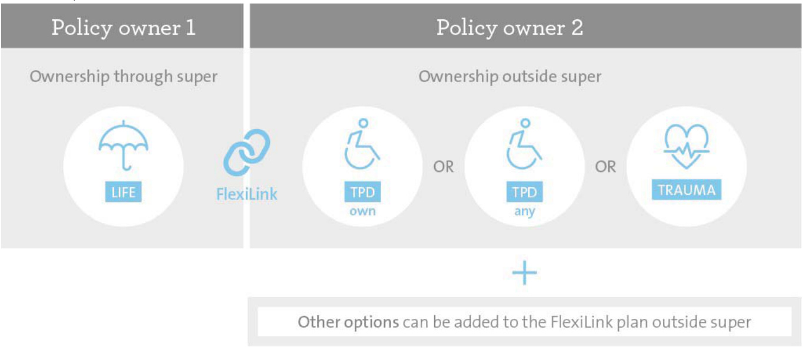  

<html><body><table><tr><td rowspan="2">Benefits</td><td rowspan="2">super. Trauma plans. benefit is outside super and can be paid to you directly, without you having to satisfy a condition of release. - Should you claim under Flexilink, any benefits paid outside of super are usually not tax deductible, meaning you will receive the full value of your benefit. Without FlexiLink, payments within the super environment may</td><td>-The FlexiLink Trauma plan can be linked to the Life Insurance Superannuation Plan or Life Insurance SMSF Plan (this is the only wayTrauma insurance is availablefor theseplans).</td></tr><tr><td>is accepted on one plan, it reduces the sum insured on the other plan. - This allows you to tailor your cover to suit you. - Other extra-cost options that are only available outside super are available on FlexiLink TPD plans and FlexiLink</td></tr><tr><td>Owners</td><td>be subject to taxation, reducing the value of the benefit you receive. Fund. The FlexiLink plan will be owned by individual(s), a company or a trust outside of super</td></tr><tr><td>Premiums</td><td>The premium for the FlexiLink plan will be paid for by you outside super from your nominated payment method (page 110).</td></tr><tr><td>Requirements</td><td>ThesuminsuredoftheTPDoption,FlexiLinkTPDorFlexiLinkTrauma cannotbemore thantheLifeinsurancesum insured.</td></tr><tr><td>Claims</td><td>Note: Trauma is not available as an option when adding FlexiLink to a plan. FlexiLink Trauma plan, your cover in Life insurance is reduced bythe amount ofthe benefit paid. Therefore, Flexilink</td></tr></table></body></html>  

# FlexiLink example  

You have Life insurance cover with a sum insured of \$2 million and a FlexiLink Trauma plan with a sum insured of \$500,000. If you made a Trauma claim under the FlexiLink Trauma plan and were paid the full benefit, your Life insurance and Trauma insurance sums insured would each reduce by \$500,000.  

# How PremierLink TPD works  

The PremierLink TPD option provides flexibility in structuring your TPD insurance.  

The PremierLink TPD option allows you to link a TPD own occupation benefit, along with other benefits which are not available through super, under a separate plan if you purchase:  

– a TPD any occupation option on a Life Insurance Superannuation Plan or a Life Insurance SMSF Plan, or – a TPD Insurance Superannuation Plan or TPD Insurance SMSF Plan.  

Eligibility criteria applies, for further detail see page 27.  

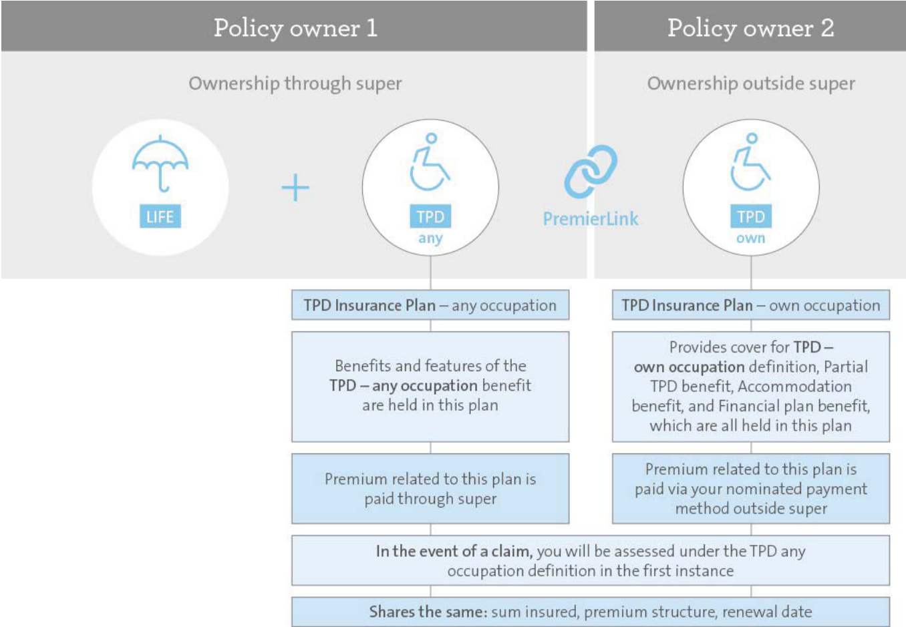  

<html><body><table><tr><td rowspan="3">Benefits</td><td>throughsuper.</td></tr><tr><td>Should you claim a benefit under the PremierLink TPD option, any benefits are paid outside of super and are 一 usually not tax deductible, meaning you will receive the full value of your benefit. Without the PremierLink TPD option, payments within the super environment may be subject to taxation, reducing the value of the benefit youreceive.</td></tr><tr><td>outside of super. If a benefit is paid within super, the benefit will be paid to the Trustees who will then release the benefit in accordance with superannuation law. If a payment is made under the PremierLink TPD option, thebenefitwill bepaidwithout theneedtosatisfya conditionof release.</td></tr><tr><td>Owners</td><td>SmallAPRASuperFund. The PremierLink TPD option outside of super will be owned by individual(s), a company or a trust outside of super. This may include trustees of a SMSF where the option is held personally and not as an asset of the SMSF.</td></tr><tr><td>Premiums</td><td>(page 110).</td></tr></table></body></html>  

<html><body><table><tr><td></td><td>The Life insurance and TPD any occupation premiums are paid from money in the super fund or contributions to it.</td></tr><tr><td>Requirements</td><td>sThe following details must be the same for both the TPD any occupation option or plan and the PremierLink TPD option: - sum insured (this amount cannot exceed the sum insured of the life insurance plan or TpD insurance plan to which theyarelinked), - premium structure, and - renewal date. If an increase or reduction is made to the sum insured of the TPD any occupation option or plan, the alteration will</td></tr><tr><td>Claims amountofthebenefitpaid.</td><td>Ifyou wishto have a highersum insured for TPDinsurance than the linked Life insurance plan,a separate standalone TPDinsuranceplanmaybeissued. If you claim a benefit for TPD,your claim will first be assessed under the criteria of the TPD any occupation definition or plan held through super. If you satisfy this criteria, the benefit will be paid to the Trustee. If your claim is not approved under this criteria,it will then be assessed under the criteria of the PremierLink TPD option held outside theownerofthePremierLinkTPDoption. If a benefit is paid under a TPD option (either your TPD any occupation option or PremierLink TPD option), your Life</td></tr></table></body></html>  

# PremierLink TPD examples  

On submission of a TPD claim, one of the following scenarios may apply:  

<html><body><table><tr><td colspan="3">Scenario 1</td></tr><tr><td>TPD any occupation definition is met</td><td>Plan held through super TPD any occupation benefit is paid to the TrusteeNo benefit is paid under this plan. who can then release the benefit to you in accordance with superannuation law. The Life insurance or TPD insurance sum insured,under the plan held through super. and the sums insured of all linked options, are reduced by the amount of the benefit paid.</td><td>Plan held outside super The sum insured of thePremierLink TPD option is also reduced by the amount of the TPD benefit paid receive the followingbenefits: - Accommodation benefit (page 50)</td></tr><tr><td colspan="3">- Financial plan benefit (page 51) Scenario 2</td></tr><tr><td>TPD any occupation definition is not met definition TPD own occupation definition is met</td><td>Plan held through super No benefit is paid under this plan. Claim willthen be assessed The Life insurance or TPD insurance sum insured, The sum insured of the PremierLink TPD option is under TPD own occupation and the sums insured of all linked options, are reduced by the amount of the benefit paid under Depending on eligibility, the policy owner may also the plan held outside super.</td><td>Plan held outside super The TPD benefit is paid to the policy owner. reducedbythe amountof theTPDbenefitpaid. receive the following benefits: -Accommodation benefit (page 50)</td></tr><tr><td colspan="3">Plan held through super Plan held outside super</td></tr><tr><td>Scenario 3 Criteria for Partial TPD benefit (page 52) is met</td><td>No benefit is paid under this plan. The Life insurance or TPD insurance sum insured, The sum insured of the PremierLink TPD option is and the sums insured of all linked options, are reduced by the Partial TPD benefit paid under the plan held outside super.</td><td>- Financial plan benefit (page 51) Partial TPD benefit is paid to the policy owner. reduced by the Partial TPD benefit paid.</td></tr></table></body></html>  

# How PremierLink IP and StandardLink IP work  

The PremierLink IP option and StandardLink IP option provide flexibility in structuring your Income insurance. When you purchase an Income Insurance SMSF Plan or Income Insurance Superannuation Plan, two flexible linking options are available:  

–PremierLinkIPoption .Ifpurchased,thisoptioncoversyouforadditionalbenefitsnotavailablethroughsuperwhich brings your overall benefits in line with those available under the Income Insurance Premier Plan. –StandardLink IP option . If purchased, this option covers you for additional benefits not available through super which brings your overall benefits in line with those available under the Income Insurance Plan.  

The additional benefits not available through super under the PremierLink IP and StandardLink IP options are held on a separate plan outside super that is linked to your Income Insurance Superannuation Plan or Income Insurance SMSF Plan.  

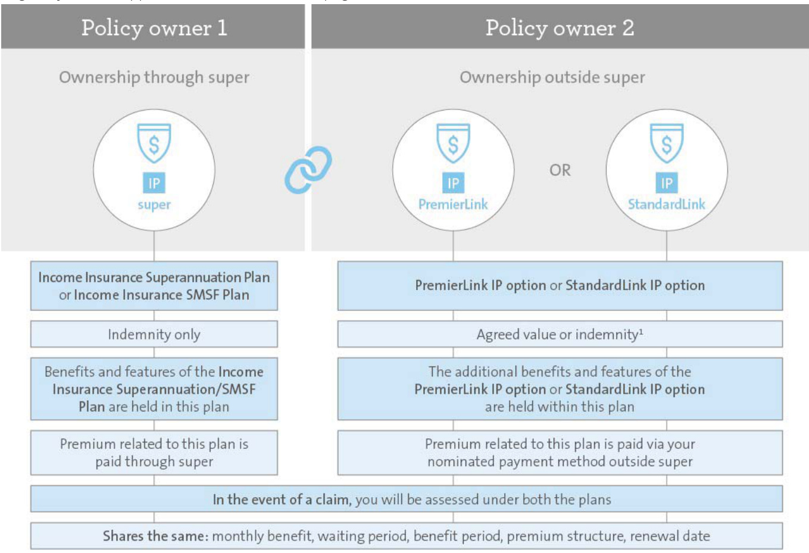  
Eligibility criteria applies, for further detail see page 28.  

<html><body><table><tr><td>Benefits</td><td>- The PremierLink/StandardLink IP option can provide you with more features which are not available when insuranceisheldthroughsuper. a benefit is paid within super, the benefit will be paid to the Trustees of the super fund who can only release the benefit to you in accordance with superannuation law. However, if a payment is made under the PremierLink/StandardLink IP option, the benefit will be paid without the need to satisfy a condition of release.</td></tr><tr><td>Owners</td><td>The PremierLink/StandardLink IP option and additional benefits are held on a separate plan outside of super. This means that you'll have two plans with two different owners. Insurance taken through super is owned by NM Super apnpui eu sui adns yo apisnoisnn eno uedon e no a paumo aa lm uodo diuiepuesuaaid u trustees of a SMSF where the option is held personally and not as an asset of the SMSF.</td></tr><tr><td>Premiums</td><td>The premium for the PremierLink/StandardLink IP option will be paid by you outside super from your nominated paymentmethod(page11o). The premiums for your Income Insurance Superannuation Plan or Income Insurance SMsF Plan can be paid from money inthesuperfund or contributions toit.</td></tr><tr><td>Requirements</td><td>The following details must be the same for both the income insurance plan and the PremierLink/StandardLink IP option: - monthly benefit,</td></tr></table></body></html>  

# –waiting period ,  

–benefit period ,  

– premium structure, and –renewal date .  

The income insurance plan held through super is available on an indemnity basis only, whereas the following types of cover are available on the option held outside super:  

<html><body><table><tr><td rowspan="5"></td><td>Option outside super</td><td>Agreedvalue</td><td>Indemnity</td></tr><tr><td>PremierLink IP option</td><td></td><td></td></tr><tr><td>StandardLink IP option PremierLink/StandardLinkIPoption.</td><td></td><td></td></tr><tr><td>paid inside and/or outside super equal to the Total disability or Partial disability benefit.</td><td></td><td></td></tr><tr><td colspan="3">increase orreduction will automaticallybe applied to thePremierLink/StandardLink IP option. Claims If you claim abenefitforIncomeinsurance,yourclaimwillbe assessed underthe criteriaofyourincome insurance your claim will also be assessed under the criteria on your PremierLink/StandardLink IP option held outside super.If you satisfy this criteria but not the criteria under the income insurance plan held through super, a benefit will be The amount paid throughthePremierLink/StandardLinkIPoptionisatop-up amountthatwill bringthetotalamount</td></tr></table></body></html>  

# PremierLink IP and StandardLink IP examples  

On submission of an Income insurance claim, one of the following scenarios may apply:  

<html><body><table><tr><td colspan="3">Scenario 1 (Indemnity)</td></tr><tr><td>Total disability definition on income insurance plan is met within super</td><td>Plan held through super Total disability benefit is paid to the Trusteewhocanthenreleasethe benefit to you in accordance with</td><td>Plan held outside super No Total disability benefit is payable in this scenario.However, if eligible,the additional benefits outlined on page 66 will be paid to</td></tr><tr><td>Scenario 2</td><td>superannuation law.</td><td>the policy owner.</td></tr><tr><td>Total disability definition on income insurance plan inside super is not met Claim will be assessed under Total disabilityunder this plan. definition outside super Total disability definition on</td><td>Plan held through super No Total disability benefit is payable</td><td>Planheldoutsidesuper Total disability benefit is paid directly to the policy owner. Depending on eligibility,the policy owner may also receive additional benefits outlined on</td></tr><tr><td>PremierLink/StandardLinkIP outside super is met</td><td></td><td>page 66.</td></tr><tr><td>Scenario 3 (Agreed value) Total disability definition on income insurance plan inside super is met</td><td>Plan held through super Total disability benefit (indemnity) is Claim will also be assessed under the Total paid to the policy owner, either NM</td><td>Planheld outside super Total disability benefit (agreed value) is paid directlyto policy owner. The amount paid here</td></tr><tr><td>disability definition outside super Total disability definition on PremierLink/StandardLinkIP outside super accordance with superannuation law. is met</td><td>Super or the trustees of the SMSF who  is a top-up amount that will bring the total can then release the benefit to you in</td><td>amount paid inside and outside super equal to the Total disability benefit amount on the PremierLink/StandardLink IP option.</td></tr><tr><td>Example $10,000. monthly benefit of the PremierLink IP</td><td>Total disability definition is metinside policy owner of the plan held through owner of the plan held outside super. The total amount paid cannot exceed thesuper.</td><td>Total disability definition is met outside</td></tr></table></body></html>  

# What can you apply for?  

# How much can you insure?  

You’ll need to decide how much cover suits your needs.  

The amount that you’re insured for is known as the sum insured for a lump sum payment or the monthly benefit for Income insurance or Business expenses insurance. This amount is fixed and will only change if your cover is increased to keep up with inflation (see page 48 or 72), or you later apply to increase or decrease your cover.  

This section shows the maximum and minimum sum insured or monthly benefit amounts that you can apply for.   
Subject to underwriting, we may offer you cover on the terms you have applied for or on different terms.  

# Insurance that pays a lump sum  

AMP Elevate’s Life, TPD and Trauma insurance pays a lump sum for a claimable event .  

A minimum annual premium is also applicable, please see page 31 for more information.  

<html><body><table><tr><td colspan="4">Sum insured</td></tr><tr><td>Plan or option type</td><td>Minimum</td><td>Maximum</td><td>Other conditions</td></tr><tr><td>Life insurance</td><td>$50,000</td><td>No limit-subject to underwriting</td><td>N/A</td></tr><tr><td>TPD insurance</td><td>$50,000</td><td>$5,000,000</td><td>The maximum sum insured for TPD is $5,0o0,0o0 for income-earning applicants (from all sources, includinginsurance cover of a similar type issued by any insurer, including us) and includes any ADL TPD.</td></tr><tr><td>Activities of Daily Living (ADL)TPDinsurance</td><td>$50,000</td><td>$2,000,000</td><td>The maximum sum insured for ADL TPD is $2,000,0o0 for income-earning applicants and may be used toincrease the total TPDcoverto$5,000,000.</td></tr><tr><td>Trauma insurance</td><td>$50,000</td><td>$2,000,000</td><td>The standard maximum sum insured is$2 million(from all sources, including insurance cover of a similar type issued by any insurer, including us) for income-earning applicants. Non-income earning applicants are generally restricted to $750,ooo (from all sources, including insurance cover of a similar type issued by any insurer, including us).</td></tr></table></body></html>  

For Trauma options ,FlexiLink plan or PremierLink options, the sum insured of the option cannot exceed the sum insured of the plan to which they are linked.  

# Insurance that pays a monthly benefit  

Income insurance plans and the Business Expenses Insurance Plan pay a monthly benefit for a claimable event .  

When selecting your monthly benefit , the maximum that you can apply for will be based on your occupation category, type of plan and your income (you can insure up to 75% of your income ).  

A minimum annual premium is also applicable, please see page 31 for more information.  

<html><body><table><tr><td colspan="6">Maximummonthlybenefitamountonentry</td></tr><tr><td>Occupationcategory</td><td colspan="5">Occupation categories and descriptions are explained in further detail on page 68.</td></tr><tr><td>Plan type</td><td>MP, AA, A</td><td>B, C</td><td>D</td><td>F</td><td>BY, CY, DY</td></tr><tr><td>Income Insurance Premier Plan PremierLink IP option</td><td>$60,00o(i)</td><td>$30,00o(i)</td><td>N/A</td><td>N/A</td><td>N/A</td></tr><tr><td>Income InsurancePlusPlan</td><td>$60,000(i)</td><td>$30,000(i)</td><td>$30,000</td><td>N/A</td><td>N/A</td></tr><tr><td>IncomeInsurancePlan StandardLinkIPoption</td><td>$60,00o(i)</td><td>$30,00o(i)</td><td>$30,000</td><td>$3,500o(ii</td><td>$30,000 $6,500 for DY mining (ii)</td></tr></table></body></html>  

<html><body><table><tr><td colspan="6">Maximum monthly benefit amount on entry</td></tr><tr><td>Occupation category</td><td colspan="5">Occupation categories and descriptions are explained in further detail on page 68.</td></tr><tr><td>Plan type</td><td>MP, AA, A</td><td>B, C</td><td>D</td><td>F</td><td>BY, CY, DY</td></tr><tr><td>IncomeInsurance</td><td>$60,000(i)</td><td>$30,000(iv)</td><td>$30,000</td><td>$3,500l(i)</td><td>$30,000</td></tr><tr><td>Superannuation Plan Income Insurance SMsF Plan</td><td></td><td></td><td></td><td></td><td>$6,500 for DY mining</td></tr><tr><td></td><td></td><td></td><td></td><td></td><td></td></tr><tr><td>Income Insurance SeniorPlan</td><td>$30,000(v)</td><td>N/A</td><td>N/A</td><td>N/A</td><td>N/A</td></tr><tr><td>Business ExpensesInsurance Plan</td><td>$40,000</td><td>$40,000</td><td>$40,000</td><td>N/A</td><td>N/A</td></tr></table></body></html>

(i) Amounts in excess of \$30,000 per month will only have a two year benefit period. (ii) For C rated mining industry occupations, restrictions will apply to the maximum monthly benefit and/or the amount of cover on an agreed value basis. (iii) Indemnity basis only. (iv) For C rated mining industry occupations, restrictions will apply to the maximum monthly benefit. (v) \$6,000 per month for AMP plans (IP Premier plans issued after September 1996) with the right to convert to SeniorGuard.  

# At what age can the insured person apply?  

Life, TPD and Trauma insurance   

<html><body><table><tr><td colspan="7">Entry age of the insured person</td><td colspan="2">Expiry age ofthe Other conditions insured person()</td></tr><tr><td></td><td>Plan or option type</td><td></td><td>Stepped</td><td>Level premiums premiums (i)</td><td>Blended premiums 25-50</td><td></td><td>For the Life Insurance</td></tr><tr><td>Life insurance</td><td>Life Insurance Plan Life Insurance Superannuation Plan Life Insurance SMSF Plan</td><td>NS s SMSF</td><td>11-70 next birthday</td><td>11-65 next birthday</td><td>next birthday</td><td>Age 99 Or earlier if selected(i(i) Age 75 Or earlier if selected(i(i)</td><td>Superannuation/SMSF Plan,ifyou cease to be eligible to contribute to superannuation over age 65 due to superannuation age restrictions and your plan is with: Super DirectionswithNM Super as the Trustee, your plan will cease. WealthSuperwithNMSuper as the Trustee, your cover will continue ifthere are sufficient funds in your super account to pay the premiums. an SMSF astheTrustee,your cover will continue ifthere are sufficient fundsin the SMSF</td></tr><tr><td>TPD insurance</td><td>TPD insurance plans TPD options</td><td>NS ②</td><td>16-60 next birthday</td><td>16-60 next birthday</td><td>25-50 next birthday</td><td>Age 99 Or earlier if selected(i(i)</td><td>to pay the premiums. Forfurtherinformation on making contributions refer to the Holding your plan in super section on page 103. FlexiLinkTPD and thePremierLink TPD option will end at age 75 if linked to aLife Insurance Superannuation Plan, Life Insurance SMSF Plan,TPD Insurance Superannuation Plan or TPD Insurance SMSF Plan. On the first renewal date after age 65 only the specific loss, future care and significant cognitive impairment definitions apply.</td></tr></table></body></html>  

<html><body><table><tr><td colspan="6">Entry age of the insured person</td><td colspan="2">Expiry age ofthe Other conditions insured person()</td></tr><tr><td></td><td>Plan or option type</td><td></td><td>Stepped premiums premiums(i)</td><td>Level</td><td>Blended premiums</td><td></td><td></td></tr><tr><td rowspan="5">Trauma insurance </td><td>TPDinsurance plans</td><td>s SMSF</td><td></td><td></td><td></td><td>Age 75 Or earlier if selected(i</td><td>On the first renewal date after age 65 only the specific loss, future care and significant cognitive</td></tr><tr><td>TPD options ADL TPD</td><td>NS</td><td>16-65</td><td>16-60 next</td><td>25-50</td><td>Age 99</td><td>impairment definitions apply. N/A</td></tr><tr><td>ADL TPD option</td><td></td><td>next birthday</td><td>birthday</td><td>next birthday</td><td>Or earlier if selected(i) Age 75</td><td>N/A</td></tr><tr><td>Trauma Insurance</td><td>SMSF</td><td>16-65</td><td>16-60 next</td><td>25-50</td><td>Or earlier if selected(i) Age 99</td><td>On the first renewal date after age</td></tr><tr><td>Plan Trauma insurance option Trauma Insurance Plus Plan Trauma insurance plus option</td><td>NS NS</td><td>next birthday 16-60 next birthday</td><td>birthday</td><td>next birthday</td><td>Or earlier if selected(i(i</td><td>70 only the Loss of capacity for independent living Trauma condition applies. When FlexiLinked to the Life Insurance Superannuation Plan/Life Insurance SMSF Plan,this option expires at age 75.</td></tr></table></body></html>

(i) Plan expires on the date of the insured person's birthday at the expiry ages set out in the above table. (ii) For Life, TPD and Trauma insurance plans and options on level premiums, the level premiums will change to stepped premiums from the first renewal date after age 70 or after an earlier age requested by you. (iii) For Life, TPD and Trauma insurance plans and options on blended premiums, the blended premiums will change to stepped premiums from the first renewal date after age 60.  

Income insurance and Business expenses insurance   

<html><body><table><tr><td colspan="3"></td><td>Entry age of the insured person</td><td>Expiry age of the insured person(i)</td><td>Other conditions</td></tr><tr><td colspan="3">Plan or option type</td><td colspan="3">Stepped premiums Level premiums</td></tr><tr><td>Income insurance</td><td>Income Insurance Premier Plan</td><td>NS</td><td></td><td></td><td></td></tr><tr><td></td><td>Income InsurancePlus Plan</td><td>NS</td><td>Where an age 60 benefit is selected:</td><td>Age 70,</td><td></td></tr><tr><td></td><td>IncomeInsurancePlan</td><td>NS</td><td>18-55 next birthday</td><td rowspan="3">Age 65, or Age 60 the benefit</td><td>Refer notes</td></tr><tr><td></td><td>Income Insurance Superannuation Plan</td><td>s</td><td>Where an age 65, age 70, 2 year or 5 year benefit period is selected:</td><td>(depending on below</td></tr><tr><td></td><td>Income Insurance SMsF Plan</td><td>SMSF</td><td>18-60 next birthday</td><td>period selected)</td></tr><tr><td></td><td>PremierLinkIP option StandardLinkIP option</td><td></td><td></td><td></td><td></td></tr><tr><td></td><td>IncomeInsuranceSeniorPlan</td><td>NS</td><td>Only available as a conversion from</td><td>Age 70</td><td>N/A</td></tr><tr><td>Business expenses insurance</td><td>Business Expenses Insurance Plan</td><td>NS</td><td>eligible plans 18-60 next birthday</td><td>Age 65</td><td>N/A</td></tr></table></body></html>

(i) Plan expires on the date of the insured person's birthday at the expiry ages set out in the above table.  

# Notes:  

# Under income insurance plans for the Age 70 benefit period :  

– Only available to occupation categories MP, AA and A.   
– For the Income Insurance Superannuation Plan, your plan may expire earlier if you cease to be eligible to contribute to superannuation over age 65 due to superannuation age restrictions, or there are insufficient funds in your superannuation account to pay your premiums. For further information on eligibility to make contributions please refer to the Holding your plan in super section on page 103.  

# Eligibility criteria for options  

The options described below can only be purchased with specific plans . Please refer to the Options you can add table for each insurance type in AMP Elevate insurance in detail starting on page 37. The options can be added to your plan for an additional premium.  

Options for Life, TPD and Trauma insurance   

<html><body><table><tr><td>Options</td><td></td><td>Entry age of the insured person</td><td>Expiry age of the insured person</td><td>Minimum sum insured</td><td>Maximum sum insured which may be purchased</td></tr><tr><td>Business solutions option - Life(i)</td><td>snS SMSF</td><td>18-60 next birthday</td><td>65</td><td>$50,000</td><td>The lower of: － four times the Life insurance sum insured, and - $15,000,000 less the total sumsinsured under anylife insuranceplansheldwith us or another companyunder which you are covered.</td></tr><tr><td>Business solutions option ()dl -</td><td>SNS SMSF</td><td>18-60 next birthday</td><td>65</td><td>$50,000</td><td>The lower of: - four times the TPD insurance sum insured, and $5,000,000 less the total sumsinsured under anyTPD insuranceplansorTPD options held with us or anothercompanyunderwhich you are covered.</td></tr></table></body></html>  

<html><body><table><tr><td>Options</td><td></td><td>Entry age of the insured person</td><td>Expiry age of the insured person</td><td>Minimum sum insured</td><td>Maximum sum insured whichmay be purchased</td></tr><tr><td>Business solutions option</td><td>NS@</td><td>18-60 next birthday</td><td>65</td><td>$50,000</td><td>The lower of: － four times the Trauma insurance sum insured, and -$2,000,000less the total sums insured under any traumainsuranceplansor trauma options held with us or another company under</td></tr><tr><td> Premium waiver(i)</td><td>SnS SMSF</td><td>16-60 next birthday</td><td>65orwhen N/A the plan ends, whichever</td><td></td><td>which you are covered. N/A</td></tr><tr><td>TPD option(i) FlexiLink TPD(i)</td><td>sns SMSF</td><td>16-60 next birthday</td><td>is earlier 99(i)</td><td>$50,000</td><td>$5,000,0o(ii)</td></tr><tr><td> Double TPD option(i)</td><td>snS SMSF</td><td>16-60 next birthday</td><td>(!)66</td><td>$50,000</td><td>$5,000,00o(i)</td></tr><tr><td>Life buy back - TPD option(i)</td><td>s NS SMSF</td><td>16-60 next birthday</td><td>65</td><td>$50,000</td><td>$5,000,0o(i)</td></tr><tr><td>PremierLink TPD option(i)</td><td></td><td>16-60 next birthday</td><td>(!)66</td><td colspan="2">The sum insured must be the same amount as the TPD any occupation option, TPD Insurance Superannuation Plan or TPD Insurance SMSF Plan to which it is linked.</td></tr><tr><td>Activities of Daily Living (ADL) TPD option(i)</td><td>SMSF</td><td>16 next birthday to: - 60 next birthday for level premiums - 65 next birthday for stepped premiums.</td><td>(!)66</td><td>$50,000</td><td>$2,000,00o(i)</td></tr><tr><td>Trauma option(i) FlexiLink Trauma(i)</td><td>NS@</td><td>16 next birthday to: - 60 next birthday for level premiums - 65 next birthday for stepped premiums.</td><td>(!)66</td><td>$50,000</td><td>$2,000,00ol(i)</td></tr><tr><td>Double trauma option(i)</td><td>NS</td><td>16 next birthday to: - 60 next birthday for level premiums - 65 next birthday for</td><td>99</td><td>$50,000</td><td>$2,000,00ol(i)</td></tr><tr><td>Trauma Plus option(i) FlexiLink Trauma Plus(i)</td><td>NS@</td><td>stepped premiums. 16-60 next birthday</td><td>9g(i)</td><td>$50,000</td><td>$2,000,00ol(i)</td></tr><tr><td>Double Trauma Plus ()uodo</td><td>NS</td><td>16-60 next birthday</td><td>66</td><td>$50,000</td><td>$2,000,0oo(i)</td></tr><tr><td>Life buy back - Trauma option(i)</td><td>NS</td><td>16-60 next birthday</td><td>65</td><td>$50,000</td><td>$2,000,0o(i)</td></tr><tr><td>Trauma reinstatement option(i)</td><td>NS</td><td>16-60 next birthday</td><td>70</td><td>$50,000</td><td>$2,000,00o(ii)</td></tr><tr><td>Children's trauma option</td><td>NS</td><td>3-16 next birthday</td><td>21</td><td>$10,000</td><td>$200,000</td></tr></table></body></html>  

For blended premiums, the minimum entry age is 25 next birthday and the maximum entry age is 50 next birthday.   
When linked to the Life Insurance Superannuation Plan/Life Insurance SMSF Plan, this option expires at age 75.   
The maximum sum insured which may be purchased at commencement but may increase with Automatic inflation (page 48).  

Options for Income insurance and Business expenses insurance   

<html><body><table><tr><td>Options</td><td></td><td>Entry age</td><td>Expiry age</td><td>benefit</td><td>Minimum monthly Maximum monthly benefit</td></tr><tr><td>Accelerated accident option</td><td>sns SMSF</td><td>18-60 next birthday(i)</td><td>The expiry age of the plan  N/A</td><td></td><td>N/A</td></tr><tr><td>Accident lump sum option</td><td>Ns@</td><td>18-60 next birthday(i)</td><td>The expiry age of the plan $1,000</td><td></td><td>$250,000</td></tr><tr><td>Cover boost option(i)</td><td>sns SMSF</td><td>18-52 next birthday</td><td>The earlier of: - age 55, and -having utilised the maximum number of increase dates.</td><td>N/A</td><td>N/A</td></tr><tr><td>Increasing claim option</td><td>s NS SMSF</td><td>18-60 next birthday(i)</td><td>The expiry age of the plan  N/A</td><td></td><td>N/A</td></tr><tr><td>Occupationally acquired HIV, Hepatitis B and C option(li)</td><td>NS@</td><td></td><td>18-60 next birthday()The expiry age ofthe plan S50,000</td><td></td><td>The lower of: - 60 times the monthly benefit,</td></tr><tr><td>Superannuation contributions option</td><td>sns</td><td></td><td>18-60 next birthday(i) The expiry age of the plan N/A</td><td></td><td>and －$500,000. N/A</td></tr><tr><td>PremierLink IP option</td><td>SMSF</td><td></td><td></td><td></td><td></td></tr><tr><td></td><td></td><td>section on page 26.</td><td></td><td></td><td></td></tr><tr><td>StandardLink IP option</td><td></td><td>RefertoAtwhatagecantheinsuredperson apply section on page 26.</td><td></td><td>which it is linked. Themonthlybenefitmustbethesame which it is linked.</td><td>amountastheincomeinsuranceplanto amount astheincomeinsuranceplanto</td></tr></table></body></html>

(i) Where the benefit period selected is age 60, the maximum entry age is 55 next birthday. (ii) Occupation categories MP, AA and A only. (iii) Only available to medical occupation categories MP or AA.  

# Cost of insurance  

# What are insurance premiums?  

Your insurance premiums are the cost you pay for your insurance cover and depend on many factors. You need to pay your insurance premiums by the due date from when your cover starts until it stops.  

There are fees, charges and discounts that may apply to your plan. Please see page 31 for further detail.  

When you apply for insurance cover, you will have a choice regarding how to structure your insurance premium. AMP Elevate offers stepped, level and blended premium structures, providing you with flexibility and control. Each premium structure works differently and will likely result in you paying a different amount overall.  

There are also different ways to pay your insurance premium and how often you’d like to pay it. You can find the full details on page 110.  

# How we work out your insurance premium  

We work out your insurance premium based on what cover you select, the sums insured you’ve chosen and other factors, including but not limited to:  

– age   
– gender   
– smoking status   
– medical history   
– occupation   
– general health   
– premium structure and payment frequency selected   
– stamp duty  

Depending on your circumstances, each of these factors may affect the amount you need to pay.  

For income insurance plans and the Business Expenses Insurance Plan, your premium is also affected by the waiting period and benefit period you choose.  

We may review premium rates from time to time, full details can be found on page 32.  

You can get a copy of our standard premium rate tables by contacting your financial adviser or our Customer Contact Centre on 131 267.  

Premium structures  

Depending on the plan you purchase, there are up to three premium structures available to you – stepped, level and blended.  

The figure below shows how the premium changes as the insured person's age increases under each of the premium structures. You should consider this section carefully before applying for a plan.  

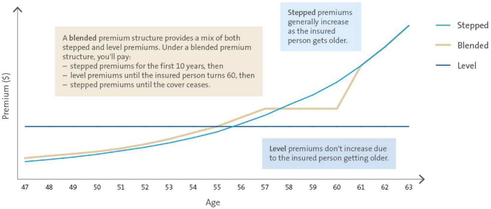  

# Stepped premiums  

Steppedpremiumschangeeveryyearontheplan renewal date according to the insured person's age .Generally, premiums increase as the insured person gets older. This is in addition to premium changes due to automatic inflation increases.  

From time to time we may perform a general review of our premium rates, and any changes that we make will apply to all owners of a similar type of plan. For more details, please refer to Variations on page 32. You can also choose to freeze your premiums at any time. If you do this your sum insured will reduce each year accordingly. Refer to Premium freeze on pages 55 and 91.  

# Level premiums  

Level premiums don’t increase each year as the insured person gets older, and as such they generally stay the same for each layer of cover 1 during the term of your plan. However, they are not guaranteed. For example, level premiums will increase if you selected to keep up with increases in inflation or you increase the sum insured .  

From time to time we may perform a general review of our premium rates, and any changes that we make will apply to all owners of a similar type of plan. For more details, please refer to Variations on page 32.  

When you apply for Life, Trauma and TPD insurance cover, you can select a premium switch age, which is the age at which your level premium will move to a stepped premium (see Stepped premiums section above). Your premium switch age may be less than your cover cease age, which determines when your plan expires. Your premiumswillswitchautomaticallyfromlevelpremiums to stepped at the switch age you have chosen. Your insurance schedule will show the age you’ve selected to switch the premium structure as well as the overall cover cease age.  

The level premium rate charged will be based on the insured person's age when each layer of cover starts. For our Life, Trauma and TPD insurance plans, level premiums will only change if:  

– the insured person is over age 70 (or the nominated switch age you have chosen). When this happens, we’ll change your level premiums to stepped premiums on the renewal date after the insured person turns70ortheirswitchage(whicheveroccurs first), or earlier if requested. This is known as the level premium cease age.   
– you ask us to change your sum insured (including by exercising an option) or make an alteration to the plan which impacts the premium,  

– you choose to have your sum insured increased to keep up with increases in inflation, or – we review the premium rates for all plans of this type. See Variations on page 32.  

For our income insurance plans and the Business ExpensesInsurancePlan,levelpremiumswillonlychange if:  

– you ask us to change your monthly benefit or make analterationtotheplanwhichimpactsthepremium   
– you choose to have your monthly benefit increased to keep up with increases in inflation   
– we review the premium rates for all plans of this type, see Variations on page 32, or   
– we review the insured person's occupation category.  

# Blended premiums  

# (Available on Life, TPD and Trauma insurance plans only)  

Under a blended premium structure, you’ll pay stepped premiums for the first 10 years followed by level premiums until the insured person turns 60, and then stepped premiums until the cover cease age.  

For each layer of cover 1 , we adjust your premiums each year for the first 10 years of your cover according to the insured person's age, just like stepped premiums. During this time, the premium will normally increase each year as the insured person gets older.  

Following the first 10 years and until age 60, your premiumswon’tchangeaccordingtothe insuredperson's age, like level premiums. After he or she turns 60, the premiums switch back to stepped premiums.  

During the time that level premiums apply, premiums will only change if:  

– you ask us to change your sum insured (including by exercising an option) or make an alteration to the plan which impacts the premium,   
– you choose to have your sum insured increased to keep up with increases in inflation,   
– we review the premium rates for all plans of this type.  

# Combining stepped and level premiums for different options  

If you purchase a life insurance plan , you have the flexibility to choose between stepped and level premium structures across your plan and the different options you’ve chosen.  

For example, you can purchase a Life Insurance Plan on level premiums with a linked TPD option on stepped premiums.  

These options include Trauma, Trauma Plus, Double Trauma, Double Trauma Plus, TPD, Double TPD, ADL TPD, FlexiLink Trauma, FlexiLink Trauma Plus and FlexiLink TPD.  

If your plan is on a blended premium, these options must also be on a blended premium structure.  

# Fees, charges and discounts  

# Minimum premium  

Aminimumyearlypremiumof\$250applies.Thisincludes the plan fee and other charges.  

The minimum premium applies to the sum of premiums for:  

– an individual's linked plans (please refer to We may waive the plan fee if you have additional plans section below for more information), and – plans linked by way of family relationship and/or business partner relationship.  

# Fees and charges  

All charges (other than the cost of providing the insurance) for the plan are described in this section. We won't apply any other charges without your consent.  

# Plan fee  

The plan fee pays for the establishment and administration of your plan.  

In certain circumstances only one plan fee will be applicable. The conditions for this are outlined in the We may waive the plan fee if you have additional plans section below.  

The plan fee as at 10 June 2017 for each particular payment frequency is outlined below.  

Plan fee payments   

<html><body><table><tr><td>Paymentfrequency</td><td>Plan fee per payment ($)</td></tr><tr><td>Fortnightly</td><td>2.82</td></tr><tr><td>Monthly</td><td>5.88</td></tr><tr><td>Quarterly</td><td>17.64</td></tr><tr><td>Half-yearly</td><td>35.28</td></tr><tr><td>Yearly</td><td>67.56</td></tr></table></body></html>  

On the renewal date following 1 January each year, the plan fee will rise by any increase in the Consumer Price Index (CPI or Index). For the purpose of calculating increases in CPI, we use the last published Index for the 12 months ending 30 September each year. However, we may use the Index published for a more recent 12 month period and/or another index or rate which we believe more fairly and accurately reflects changes in the cost of living.  

The increase we make will normally be based on the Australian National All Groups Consumer Price Index weighted average of eight capital cities combined.  

# We may waive the plan fee if you have additional plans  

If you have other plan(s) from this PDS or from another insurance product series, these may be considered as linked plans. We may waive the plan fee on these linked plans. We may also waive the plan fee in instances where your spouse or other family member, or your business partner, has a plan with us.  

If you do not nominate a plan, we will determine which plan the plan fee waiver will apply to.  

The plan fee waiver provides you with only one plan fee and reduced minimum premiums for linked plans. The plan fee waiver is available for a maximum of 19 plans.  

The insurance schedule shows which plan is a primary plan and which plan(s) have had the plan fees waived.  

# Instalment loading  

An instalment loading applies if you pay more frequently than yearly; this is in addition to the plan fee payments described above. As at 10 June 2017, the instalment loading is 3.5% of the annual premium for half-yearly payments and 7% for all other premium payment frequencies.  

# Government stamp duty  

A government stamp duty is imposed on most of the plans and options outlined in this document, based on the state in which the insured person lives. The stamp duty rates and how they are charged vary from state to state and depend on the type of insurance cover that has been purchased.  

The stamp duty will be included in, or in addition to, the insurance premium. If the stamp duty is charged in addition to the insurance premium, it will be shown as a separate item on the insurance schedule .  

State governments may change the rate of stamp duty or method of calculation from time to time, and any change may affect the amount you pay.  

# Discounts  

# Business rewards discount  

This discount is available where two or more clients are in a business relationship and submit new business to AMP. A 5% discount is available on the premiums for Life, TPD and Trauma insurance plans /options and on the plan fee. If you are replacing an existing AMP insurance policy, this discount is not available. To see whether you qualify for the discount please contact your financial adviser .  

# Trauma overlap discount  

Where TPD (including ADL TPD ) insurance is purchased as an option on a plan that includes Trauma cover, a 7.5% discount is applied to the premium of the TPD option .  

# Large case discount  

We may apply discounts to the premiums for Life insurance, TPD insurance, Trauma insurance, Income insurance and Business expenses insurance plans based on the size of the sum insured or monthly benefit . These discounts are not guaranteed. To see whether you qualify for the large case discount please contact your financial adviser .  

# Multi plan discount  

We may apply a discount to the Life insurance, TPD insurance and Trauma insurance premium depending on the number of plans and/or options you have with us. The amount of discount will vary from time to time.  

To be eligible for a multi plan discount:  

– you must hold Life, TPD or Trauma insurance with an income insurance plan and/or the Business Expenses Insurance Plan, and   
– the start date for at least one of the plans and/or options must be on or after 23 November 2015, subject to the following minimum sum insured :– \$2,000permonthfor incomeinsuranceplans or the Business Expenses Insurance Plan – \$350,000 for Life insurance – \$200,000 for TPD insurance – \$100,000 for Trauma insurance.  

Additional eligibility criteria and some exclusions apply. To see if you qualify for this discount please contact your financial adviser .  

# Other discounts  

We reserve the right to apply discounts to selected plans and/or options at our discretion.  

# Variations  

# We can change your premium  

We work out premiums based on a number of factors (see page 29), including by reference to our standard premium rate tables. Those tables show, for each premium structure, factors and premium rates for each age, based on a person's gender, occupation and smoking status. We reserve the right to change the standard premium rate tables. Any such changes will apply to all owners of plans or options of the same type. If we do this, we'll notify you in writing before the changes come into effect.  

# We can change the fees and charges  

We can change the fees or charges which apply to the plan.  

If there’s a material change to fees and charges, we’ll tell you before the change takes place as required by law at the time. All other changes, including those due to automatic inflation or market variations, will be advised in writing following the change.  

# Taxation  

We can change the standard premium tables, fees or charges at any time to reflect any change to taxation or revenue laws.  

# Our approach to claims  

We'll be there to help you live the best life you can, should something happen  

# Our commitment to you  

We recognise that your situation is unique. We’ll work with you and your loved ones transparently, fairly, and with respect and empathy.  

# Providing more than financial support  

We provide more than just financial assistance. We partner with you and a range of specialists to help you return to work and your usual lifestyle, wherever we can.  

# Offering tailored solutions  

We’ll help develop the best solution for you based on your individual situation, providing the right support and management, at the right time.  

# Claims expertise  

Our highly experienced claims teams are supported by internal and third party expertise, best-in-class tools and an ongoing focus on professional development.  

# Our customers' claims experiences  

#  

#  

# How to claim  

We understand you will be going through a difficult time if you need to claim. So we’ve made the claiming process as simple as we can.  

<html><body><table><tr><td rowspan="2">1 as it happens</td><td>Notifyusassoon</td><td>Tell us about your event/situation as soon aspossible.We'll explain what you need to doandwhatwill happennext. Ifthereisadelayinmakingyourclaimorprovidinginformation,thismaydelaythe</td></tr><tr><td></td><td>payment of yourbenefit orwemayreducethe amount wepay(whichmaybetonil) to theextent thatwe havebeenprejudicedbythedelay.</td></tr><tr><td>2 3</td><td>Help us understand your situation Yourcase manager</td><td>teamwillaskyouforinformationtostartyourclaim. A dedicatedcasemanagerwillbeintouchtotalkyouthroughtheclaimsprocess,</td></tr><tr><td>4</td><td>will contact you Informationrequired</td><td>andletyouknowaboutanyfurtherinformationweneedtoprogressyourclaim. Youmustprovideuswithinformationthatisreasonablynecessaryforthe assessmentofyourclaim.Thismayincludemedical,financial,occupationaland</td></tr><tr><td></td><td></td><td>functionalinformation.We'llexplainwhyweneedtheinformationwerequest.lIn somecases,wemayaskyoutoseeamedicalorrehabilitationprofessionalorspeak withyouinpersontobetterunderstandyoursituation. We may also review previous medical history and financial information to ensure theinformationwehad atthecommencementofyourplanwasaccurate.Therefore it'simportantforyoutocompletetheapplicationformandPersonalStatement</td></tr><tr><td>5</td><td>Arranging help as quickly as possible</td><td>accuratelyasthismayimpactyoureligibilityforbenefitslateron. If appropriate,wellarrangeshort-termhelpwhileweassessyourclaim.</td></tr><tr><td>6</td><td colspan="2">We'll reviewyourclaim,keepingyouinformed alongtheway</td></tr><tr><td>7 8</td><td rowspan="3">We'll letyouknowthe outcomeofyourclaim Supportingyour recoverywherepossible</td><td>Based on your situation and planwe'll letyou know the outcomeof your claim.lf yourclaimisaccepted,paymentwillbemade. Where a death benefit is payable under a super plan,well pay the sum insured to</td></tr><tr><td></td><td>theTrustee. -If thisisNMSuper,theproceedsoftheplanwillbepaid to oneormoreofyour</td></tr><tr><td>dependantsortoyourlegalpersonalrepresentative. ifappropriate,developatailoredrecoveryplan.</td><td>-Ifthisisa trusteeofanSMSForsmallAPRASuperFund,thiswillbemanagedas perthetrustdeed.Assuch,nominationsofpreferred dependantsareunavailable. Foranyotherclaimunderasuperplan,theTrusteewillneed tobesatisfied that you'vemet thecondition of releasebeforemakinganypayment to you. Yourcasemanagerandrecoveryspecialistwill discussrecoveryoptionswithyouand Researchhasshown thatthere aremanybenefitstorecoveringinasafeand supportiveworkplace.AMPwill helpyoureturntoworkwiththenecessarysupport</td></tr></table></body></html>  

#  

# Customer satisfaction and complaint resolution  

# We’re here to help  

If you have any questions, please contact your financial adviser or our Customer Contact Centre on: 131 267 Monday to Friday, 8.30am to 7.00pm  

# Complaint resolution  

We aim to provide products and services that exceed your expectations. We hope to resolve any issues straight away. If we can’t, we’ll acknowledge receipt of your complaint and then aim to give you a response as soon as possible and within the time limits as set out below.  

The way that complaints must be dealt with differs depending on whether the complaint relates to a plan that is held outside or through super. This is because the owner of the plan is different and the external body who you may contact in relation to a complaint is different. Each external body has a different set of rules with which we and you must comply.  

For non-superannuation and SMSF plans For superannuation plans If you have a complaint please write to our Customer Contact Centre, stating what your complaint is about and the name and number of the plan.  

If you have a complaint, please write to the Trustee, stating what your complaint is about and the name and number of the plan.  

To contact our Customer Contact Centre:   
Phone 131 267   
Fax 1800 674 684   
Email askamp@amp.com.au   
Address AMP Customer Service PO Box 14330 MELBOURNE VIC 8001   
To contact our Customer Contact Centre:   
Phone 131 267   
Fax 1800 674 684   
Email askamp@amp.com.au   
Address AMP Customer Service PO Box 14330 MELBOURNE VIC 8001  

We'll confirm in writing that we received your complaint. We'll also do this for any complaint received over the telephone, unless we can quickly resolve it for you.  

We'll review your complaint and send you our response within 45 days from when we received it.  

If after 45 days, you're not satisfied with the way your enquiry or complaint was handled or with our response, you can contact theFinancial Ombudsman Service (FOS). The FOS is governed by anindependentcouncilthatreportsdirectlytotheFederalMinister for Consumer Affairs.  

You can contact the FOS on 1800 367 287 or write to:   
Financial Ombudsman Service   
GPO Box 3   
MELBOURNE VIC 3001   
Fax: (03) 9613 6399   
Email: info@fos.org.au   
Website: fos.org.au   
All correspondence to the FOS should include the reference A-164  

The Trustee has a formal process to deal with any enquiries and complaints.  

We'll confirm in writing that we received your enquiry or complaint. We'll also do this for any complaint received over the telephone, unless we can quickly resolve it for you.  

The Trustee will review your inquiry or complaint and send you their response within 90 days from when they received it. If after 90 days, you're not satisfied with the way your enquiry or complaint was handled or with the response you received, you can contact the Superannuation Complaints Tribunal (SCT). The SCT is an independent body set up by the Federal Government to help members or dependants to resolve superannuation complaints. Time limits apply to certain complaints to the SCT. So if you're not satisfied with our response, you should contact the SCT immediately to find out if a time limit applies.  

You can contact the SCT on 1300 884 114 or write to:   
Superannuation Complaints Tribunal   
Locked Bag 3060   
MELBOURNE VIC 3001   
Email: info@sct.gov.au   
Website: sct.gov.au  

# AMP Elevate insurance in detail  

In this section we'll discuss:  

More about AMP Elevate Life, TPD, Trauma insurance Life, TPD, Trauma insurance benefits and features in detail  

More about AMP Elevate Income insurance and Business expenses insurance  

Income insurance and Business expenses insurance benefits and features in detail  

# AMP Elevate insurance in detail – Life, TPD & Trauma insurance  

This section outlines the features, benefits and options of AMP Elevate insurance plans. This section contains terms and conditions which apply to your contract of insurance. The cover that is available under your contract of insurance is limited to the selected plan and, if applicable, any options linked to that plan , as shown in your insurance schedule .It's important you read this section carefully.  

# About AMP Elevate Life insurance  

Protecting your life  

Lifeinsuranceisintendedhelpyourlovedonesadjustto,andmanage,lifewithoutyouifsomethingunexpectedoccurs. AMP Elevate Life insurance can pay a lump sum benefit if the insured person dies or if they're diagnosed with a terminal illness.  

# Life insurance as a plan  

Life insurance can be purchased as a plan only. The three plans available are:  

– Life Insurance Plan   
– Life Insurance Superannuation Plan – Life Insurance SMSF Plan.  

Benefits and features at a glance  

# Included benefits and features  

The following table outlines the benefits that are included for each plan at no additional cost. Full detail of these benefits can be found on the pages indicated below.  

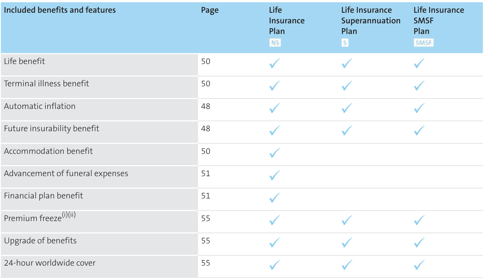  
(i) Not available for blended premiums. (ii) Not available on FlexiLink plans , PremierLink TPD option or the plan /options to which they are linked.  

Life Insurance Superannuation Plan/Life Insurance SMSF Plan  

You should be aware that should you choose to purchase an insurance product through super, any benefit payment is made to the Trustee . The Trustee can then release the benefit to you or your dependants in accordance with superannuation law.  

For the Life Insurance Superannuation Plan, please refer to the Holding your plan in super section on page 103 for more information on:  

– Plan membership   
– Taxation Information   
– Eligibility to make contributions – Cancelling your plan   
– Nomination of dependant.  

# Options you can add  

The following table outlines the options that can be added to the plan at an additional cost. Full detail of these benefits can be found on the pages indicated below.  

An option only applies if it's specified in the insurance schedule . Where an option or FlexiLink plan is specified in the insurance schedule , the option and/or FlexiLink plan forms part of the plan to which it is linked.  

<html><body><table><tr><td>Options</td><td>Page</td><td>Life Insurance Plan NS</td><td>Life Insurance Superannuation Plan</td><td>LifeInsurance SMSF Plan SMSF</td></tr><tr><td>Business solutions option - Life</td><td>55</td><td></td><td></td><td></td></tr><tr><td>Premium waiver option</td><td>57</td><td></td><td></td><td></td></tr><tr><td>Total and permanent disability (TPD) option</td><td>51 (TPD benefit)</td><td></td><td></td><td></td></tr><tr><td>Double TPD option</td><td>57</td><td></td><td></td><td></td></tr><tr><td>Life buy back - TPD option</td><td>58</td><td></td><td></td><td></td></tr><tr><td>Business solutions option - TPD</td><td>55</td><td></td><td></td><td></td></tr><tr><td> Premierlink TPD option()</td><td>58</td><td></td><td>@</td><td>②</td></tr><tr><td>FlexiLink TPD(i)</td><td>61</td><td>②</td><td></td><td></td></tr><tr><td>Life buy back - TPD option</td><td>58</td><td></td><td></td><td>②</td></tr><tr><td>Business solutions option - TPD</td><td>55</td><td>②</td><td>②</td><td>②</td></tr><tr><td>Children's trauma option</td><td>60</td><td></td><td></td><td></td></tr><tr><td>Activities of Daily Living (ADL) TPD option</td><td>51 (TPD benefit)</td><td></td><td></td><td></td></tr><tr><td>Trauma option</td><td>53 (Trauma benefit)</td><td></td><td></td><td></td></tr><tr><td>Double trauma option</td><td>59</td><td></td><td></td><td></td></tr><tr><td>Life buy back - Trauma option</td><td>59</td><td></td><td></td><td></td></tr><tr><td>Trauma reinstatement option</td><td>59</td><td></td><td></td><td></td></tr><tr><td>Business solutions option - Trauma</td><td>55</td><td></td><td></td><td></td></tr></table></body></html>  

<html><body><table><tr><td>Options</td><td>Page</td><td>Life Insurance Plan NS</td><td>LifeInsurance Superannuation Plan s</td><td>LifeInsurance SMSF Plan SMSF</td></tr><tr><td>FlexiLinkTrauma (i)</td><td>61</td><td></td><td></td><td></td></tr><tr><td>Life buy back - Trauma option</td><td>59</td><td></td><td></td><td></td></tr><tr><td>Trauma reinstatement option</td><td>59</td><td></td><td></td><td></td></tr><tr><td>Business solutions option - Trauma</td><td>55</td><td></td><td></td><td></td></tr><tr><td>Children's trauma option</td><td>60</td><td></td><td></td><td></td></tr><tr><td>Children'straumaoption</td><td>60</td><td></td><td></td><td></td></tr></table></body></html>  

(i) Can be linked to a TPD any occupation benefit under any of the life insurance plans or TPD insurance plans through super. (ii) FlexiLink plans and options can be linked to the Life Insurance Superannuation Plan or Life Insurance SMSF Plan; however, they will be held on a separate plan outside super.  

# We guarantee to continue your cover  

We guarantee to continue your cover until it ends (page 99) or you cancel it, regardless of changes to your health, occupation or pastimes, as long as the premiums are paid on time. Refer to page 98 for further detail.  

# Claimingunderalinkedoptionmayimpactother cover  

If we pay a benefit under a linked option , the sum insured of each remaining linked cover ( plans and options ) for that insured person is reduced by the amount we pay, unless we state otherwise in this PDS . If the life insurance plan is reduced to nil, the plan will cease.  

# About AMP Elevate Total and Permanent Disability insurance  

Protection in the event of permanent disability  

The AMP Elevate Total and Permanent Disability (TPD) insurance plans provide a lump sum benefit to help you cope financially if you are unlikely to work again, suffer a specific loss, require future care, are unlikely to perform domestic work or suffer significant cognitive impairment (see pages 119 to 120 for the definitions).  

# TPD insurance  

AMP Elevate has the following TPD insurance types:  

– TPD own occupation   
– TPD any occupation   
– Activities of Daily Living TPD (ADL TPD).  

# TPD insurance as a plan  

The TPD (own and any occupation) and ADL TPD insurance can be purchased independently of Life insurance through the TPD Insurance Plan and the ADL TPD Insurance Plan outside super.  

The TPD Insurance Superannuation Plan and TPD Insurance SMSF Plan allows you to purchase TPD (any occupation) independently of Life insurance.  

# TPD insurance as an option  

TPD insurance (own and any occupation) can be purchased as an option linked to Life insurance or Trauma insurance. ADL TPD insurance can only be purchased as an option on Life insurance.  

# FlexiLink TPD  

FlexiLink TPD (own and any occupation) can be linked to Life insurance. FlexiLink TPD works in a similar way to a TPD insurance option with regards to how they are priced and how they function.  

Certain parameters of the FlexiLink TPD Insurance Plan must match the life insurance plan to which it is linked. For example, where automatic inflation increases are accepted on one plan, this increase must be accepted on the linked plan(s).  

# PremierLink TPD option  

The PremierLink TPD option (own occupation) can be linked to a TPD any occupation option held on any of the life insurance plans , or linked to a TPD Insurance Superannuation Plan or TPD Insurance SMSF Plan. The PremierLink TPD option has the same structure as the linked TPD any occupation insurance. For example, they will have the same sum insured , which cannot exceed the sum insured of the life insurance plan or TPD insurance plan to which they are linked. The PremierLink TPD option has the same premium structure and the same renewal date as the TPD any occupation option. If an increase or reduction is made to the TPD any occupation insurance, the alteration will automatically be applied to the PremierLink TPD option.  

# TPD types  

The definition of TPD varies according to the type of plan you have. You may want to consider how specialised your occupation is and how important it is to you to return to the same role.  

TPD insurance can be purchased as one of the following types:  

<html><body><table><tr><td>TPD types</td><td>Whatyouneedtoconsider</td><td></td></tr><tr><td>TPDownoccupation</td><td>NS</td><td>Theinsuredpersonwillbeassessed againsttheirabilitytoreturntotheirown occupation,whichisanarrowersetofcriteria.</td></tr><tr><td>TPDanyoccupation</td><td>NS SMSF</td><td>Theinsuredpersonwillbeassessedagainsttheirabilitytoreturntoanyoccupation within their education, training or experience, which includes jobs other than whattheywere doingbeforebecomingdisabled.</td></tr><tr><td>Activitiesof DailyLivingTPD (ADLTPD)</td><td>NSSMSF</td><td>Theinsuredpersonwillbe assessed againsthowtheirdisabilityhasresulted in theinabilitytoperformkey activitiesofdailylivingorwhethersignificantcognitive impairment requires them tobe under continuous supervision.</td></tr></table></body></html>  

# Benefits and features at a glance  

# Included benefits and features  

The following table outlines the benefits that are included at no additional cost. Full detail of these benefits can be found on the pages indicated below.  

<html><body><table><tr><td colspan="6">TPD insurance</td><td colspan="3">ADL TPD insurance</td></tr><tr><td>Included benefits and features</td><td>Page</td><td>TPD Insurance Plan TPD option</td><td>TPD Insurance Superannuation or SMSF Plan TPD option</td><td>FlexiLink TPD</td><td>PremierLink TPD option</td><td>ADL TPD Insurance Plan ADL TPD</td><td>ADL TPD option</td></tr><tr><td></td><td></td><td>NS</td><td>S SMSF</td><td></td><td></td><td>option NS</td><td>s SMSF</td></tr><tr><td>TPD benefit (Any and Own occupation)</td><td>51</td><td></td><td>(Any only)</td><td></td><td>(Own only)</td><td></td><td></td></tr><tr><td>ADL TPD</td><td>51 (TPD benefit)</td><td></td><td></td><td></td><td></td><td></td><td></td></tr><tr><td>Day One TPD</td><td>52</td><td></td><td></td><td></td><td></td><td></td><td></td></tr><tr><td>Partial TPD benefit</td><td>52</td><td></td><td></td><td></td><td>()</td><td></td><td></td></tr><tr><td>Automatic inflation</td><td>48</td><td></td><td></td><td></td><td></td><td></td><td></td></tr><tr><td>Future insurability benefit</td><td>48</td><td></td><td></td><td></td><td></td><td></td><td></td></tr><tr><td>Accommodation benefit</td><td>50</td><td></td><td></td><td></td><td>()</td><td></td><td></td></tr><tr><td>Financial plan benefit</td><td>51</td><td></td><td></td><td></td><td>()</td><td></td><td></td></tr><tr><td>Death benefit</td><td>53</td><td></td><td>(i)</td><td></td><td></td><td></td><td></td></tr><tr><td>12-month Life buy back(i)</td><td>53</td><td></td><td></td><td></td><td></td><td></td><td></td></tr><tr><td>Premium freeze(i)(t)</td><td>55</td><td></td><td></td><td></td><td></td><td></td><td></td></tr><tr><td>Upgrade of benefits</td><td>55</td><td></td><td></td><td></td><td></td><td></td><td></td></tr><tr><td>24-hour worldwide cover</td><td>55</td><td></td><td></td><td></td><td></td><td></td><td></td></tr></table></body></html>  

(i) When a PremierLink TPD option is linked to TPD any occupation insurance, this benefit will be paid under the PremierLink TPD option only.   
(ii) Only available on the TPD Insurance Superannuation Plan or the TPD Insurance SMSF Plan.   
(iii) Only available when a TPD option or FlexiLink TPD plan is linked to a life insurance plan .  
(iv) Not available for blended premiums.   
(v) Not available on a FlexiLink TPD plan /PremierLink TPD option and the plans/options to which they are linked.  

# Options you can add  

The following table outlines the options that can be added to the plan at an additional cost. Full detail of these benefits can be found on the pages indicated below.  

An option only applies if it's specified in the insurance schedule . Where an option or FlexiLink plan is specified in the insurance schedule , the option and/or FlexiLink plan forms part of the plan to which it is linked.  

There are no options available for ADL TPD.   

<html><body><table><tr><td>Options</td><td>Page</td><td>TPD Insurance Plan</td><td>TPD option</td><td>TPD Insurance Superannuation or SMSF Plan</td><td>TPD option</td><td>FlexiLink TPD</td></tr><tr><td></td><td></td><td>NS</td><td>NS</td><td>S SMSF</td><td>s SMSF</td><td></td></tr><tr><td>Business solutions option - TPD</td><td>55</td><td></td><td></td><td></td><td></td><td></td></tr><tr><td>Double TPD option</td><td>57</td><td></td><td>()</td><td></td><td>()</td><td></td></tr><tr><td>Life buy back - TPD option</td><td>58</td><td></td><td>(i)</td><td></td><td></td><td></td></tr><tr><td>PremierLinkTPD</td><td>58</td><td></td><td></td><td></td><td></td><td></td></tr><tr><td>Business solutions option -TPD</td><td>55</td><td></td><td>(i)</td><td>(i)</td><td>(i)</td><td></td></tr><tr><td>Life buy back - TPD option</td><td>58</td><td></td><td>(i)</td><td></td><td>(i)</td><td></td></tr><tr><td>Children's trauma option</td><td>60</td><td></td><td>(iv)</td><td></td><td></td><td></td></tr></table></body></html>  

(i) The Double TPD option is not available on a FlexiLink TPD plan /PremierLink TPD option or the plans /options to which they are linked.   
(ii) This option is not available where TPD insurance is purchased as an option on a trauma insurance plan .  
(iii) If this option is purchased under the TPD any occupation option or plan to which the PremierLink TPD option is linked, it will automatically be applied to the PremierLink TPD option as well but will only be paid out once.   
(iv) Children’s trauma may be purchased as an option on a life insurance plan or on a trauma insurance plan to which the TPD option is linked.  

# We guarantee to continue your cover  

We guarantee to continue your cover until it ends (page 99) or you cancel it, regardless of changes to your health, occupation or pastimes, as long as the premiums are paid on time. Refer to page 98 for further detail.  

# Claimingunderalinkedoptionmayimpactother cover  

If we pay a benefit under a linked option , the sum insured of each remaining linked cover ( plans and options ) for that insured person is reduced by the amount we pay, unless we state otherwise in this PDS . The plan will cease if it's reduced to nil.  

# About AMP Elevate Trauma insurance  

Protection in the event of serious illness or injury Most of us know someone who has suffered a life-changing trauma – heart attacks and cancer can affect the healthiest people we know. While you may be covered for the loss of income if you've purchased income insurance, what about the extra costs you may face for your treatment, rehabilitation and recovery?  

AMP Elevate Trauma insurance pays a lump sum amount if you suffer one of a list of defined serious illnesses or injuries. The conditions we cover under Trauma insurance are listed on pages 44 to 46 and full details of can be found in the Glossary of medical conditions starting on page 120. These definitions generally describe the severity of a condition and any specific criteria for relevant treatments or procedures.  

Our definitions for medical conditions can be different to the clinical definitions that doctors use to make a diagnosis and determine treatment options. That's because our definitions take into account the time it may take you to recover and how you may be financially affected.  

# Trauma insurance  

AMP Elevate has the following types of Trauma insurance available:  

– Trauma Insurance   
– Trauma Insurance Plus, which provides cover for up to an extra 11 conditions.  

# Trauma insurance as a plan  

  

Trauma insurance can be purchased independently of a life insurance plan through the Trauma Insurance Plan and Trauma Insurance Plus Plan.  

# Trauma insurance as an option  

  

Trauma insurance can be purchased as an option linked to a life insurance plan through the Trauma insurance option or the Trauma insurance plus option.  

# FlexiLink Trauma  

TheFlexiLinkTraumaInsurancePlanandFlexiLinkTrauma Insurance Plus Plan can be linked to a life insurance plan .These FlexiLink Trauma plans work in a similar way to a trauma option with regards to how they’re priced and how they function. Certain rules of the FlexiLink Trauma plan must match the life insurance plan to which it's linked. For example, where automatic inflation is accepted on one plan, automatic inflation must also be accepted on the linked plan(s).  

# Benefits and features at a glance  

# Included benefits and features  

Thefollowingtableoutlinesthebenefitsthatareincluded at no additional cost. Full detail of these benefits can be found on the pages indicated below.  

<html><body><table><tr><td></td><td colspan="3">Trauma Insurance and Trauma InsurancePlus</td></tr><tr><td>Included benefitsPage and features</td><td>Trauma Insurance Plan Trauma Insurance</td><td>Trauma option</td><td>FlexiLink Trauma</td></tr><tr><td></td><td>NS</td><td>Plus Plan NS</td><td>②</td></tr><tr><td>Trauma conditions</td><td>44-46 and 53</td><td></td><td></td></tr><tr><td>Automatic inflation</td><td>48</td><td></td><td></td></tr><tr><td>Future insurability benefit</td><td>48</td><td></td><td></td></tr><tr><td>Accommodation benefit</td><td>50</td><td></td><td></td></tr><tr><td>Financial plan benefit</td><td>51</td><td></td><td></td></tr><tr><td>Premium freeze(i)</td><td>55</td><td></td><td></td></tr><tr><td>Upgrade of benefits</td><td>55</td><td></td><td></td></tr><tr><td>24-hour worldwidecover</td><td>55</td><td></td><td></td></tr></table></body></html>  

# Options you can add  

The following table outlines the options that can be added to the plan at an additional cost. Full detail of these benefits can be found on the pages indicated below.  

An option only applies if it's specified in the insurance schedule . Where an option or FlexiLink plan is specified in the insurance schedule , the option and/or FlexiLink plan forms part of the plan to which it is linked.  

<html><body><table><tr><td colspan="2">Options</td><td colspan="3">Trauma Insuranceand Trauma InsurancePlus</td></tr><tr><td></td><td colspan="2">Page</td><td>Trauma Trauma Insurance option Plan Trauma Insurance Plus Plan</td><td>FlexiLink Trauma</td></tr><tr><td colspan="2"></td><td>NS</td><td>NS</td><td></td></tr><tr><td>BusinessSolutions option - Trauma</td><td>55</td><td></td><td></td><td></td></tr><tr><td>Double trauma option</td><td>59</td><td></td><td></td><td></td></tr><tr><td>Life buy back - Trauma option</td><td>59</td><td></td><td></td><td></td></tr><tr><td>Trauma reinstatement option</td><td>59</td><td></td><td></td><td></td></tr><tr><td>Total and permanent disability (TPD) option</td><td>51 (TPD benefit)</td><td></td><td></td><td></td></tr><tr><td>Business Solutions option - TPD</td><td>55</td><td></td><td></td><td></td></tr><tr><td>Children's trauma option</td><td>60</td><td></td><td>()</td><td></td></tr></table></body></html>

(i) Children’s trauma may be purchased as an option on a life insurance plan to which the trauma option is linked.  

# We guarantee to continue your cover  

We guarantee to continue your cover until it ends (page 99) or you cancel it, regardless of changes to your health, occupation or pastimes, as long as the premiums are paid on time. Refer to page 98 for further detail.  

# Claimingunderalinkedoptionmayimpactother cover  

If we pay a benefit under a linked option , the sum insured of each remaining linked cover ( plans and options ) for that insured person is reduced by the amount we pay, unless we state otherwise in this PDS . The plan will cease if it's reduced to nil.  

# Trauma conditions  

# Trauma Insurance  

Trauma insurance covers the trauma conditions as set out in the tables below. However, from the first renewal date after age 70, only the trauma condition for Loss of capacity for independent living will apply.  

In the event that a claim is payable, the following trauma conditions pay the sum insured in full. The definitions for the trauma conditions can be found in the Glossary of medical conditions starting on page 120.  

<html><body><table><tr><td>Benefit (full payment) Provides a full benefit if you suffer from oneofthefollowingtrauma conditions</td><td>Definition diagnosis, or the insured person mustmeet certain</td><td>Definition is based on is based on severity, impairment, or permanent loss</td></tr><tr><td>Heartrelatedconditions</td><td>criteria</td><td></td></tr><tr><td>Cardiac arrest</td><td></td><td></td></tr><tr><td>Cardiomyopathy</td><td></td><td></td></tr><tr><td></td><td></td><td></td></tr><tr><td>Heart attack(i)</td><td></td><td></td></tr><tr><td>Heartvalve surgery</td><td></td><td></td></tr><tr><td>Primary pulmonary hypertension</td><td></td><td></td></tr><tr><td>Surgeryofthe aorta</td><td></td><td></td></tr><tr><td>Triple vessel angioplasty</td><td></td><td></td></tr><tr><td>Cancerandothertumourconditions</td><td></td><td></td></tr><tr><td>Benign brain tumour</td><td></td><td></td></tr><tr><td>Cancer(i)</td><td></td><td></td></tr><tr><td>Neurological and degenerative disorders</td><td></td><td></td></tr><tr><td>Alzheimer's disease and other dementias</td><td></td><td></td></tr><tr><td>Coma</td><td></td><td></td></tr><tr><td>Encephalitis</td><td></td><td></td></tr><tr><td>Major head injury</td><td></td><td></td></tr><tr><td>Motorneuronedisease</td><td></td><td></td></tr><tr><td>Multiple sclerosis</td><td></td><td></td></tr><tr><td>Muscular dystrophy</td><td></td><td></td></tr><tr><td>Parkinson's disease</td><td></td><td></td></tr><tr><td>Stroke(i)</td><td></td><td></td></tr></table></body></html>  

<html><body><table><tr><td>Benefit (full payment) Provides a full benefit if you suffer from one of the following trauma conditions</td><td>Definition diagnosis, or the insured person must meet loss</td><td>Definition isbased onis based on severity, impairment, or permanent</td></tr><tr><td>Organrelated conditions</td><td></td><td>certain criteria</td></tr><tr><td>Chronic kidney failure</td><td></td><td></td></tr><tr><td>Chronicliver disease</td><td></td><td></td></tr><tr><td>Chronic lung disease</td><td></td><td></td></tr><tr><td>Major organ transplant</td><td></td><td></td></tr><tr><td>Pneumonectomy</td><td></td><td></td></tr><tr><td></td><td></td><td></td></tr><tr><td>Mobility and sensory conditions Blindness</td><td></td><td></td></tr><tr><td>Deafness</td><td></td><td></td></tr><tr><td>Diplegia</td><td></td><td></td></tr><tr><td>Hemiplegia</td><td></td><td></td></tr><tr><td>Paraplegia</td><td></td><td></td></tr><tr><td>Quadriplegia (also defined as tetraplegia)</td><td></td><td></td></tr><tr><td>Loss of limbs</td><td></td><td></td></tr><tr><td>Loss of limbs and sight</td><td></td><td></td></tr><tr><td>Loss of speech</td><td></td><td></td></tr><tr><td>Severerheumatoid arthritis</td><td></td><td></td></tr><tr><td>Diabetes</td><td></td><td></td></tr><tr><td>Advanceddiabetes</td><td></td><td></td></tr><tr><td>Other</td><td></td><td></td></tr><tr><td>Aplasticanaemia</td><td></td><td></td></tr><tr><td>Loss of capacity forindependent</td><td></td><td></td></tr><tr><td>Medically acquired HiV infection</td><td></td><td></td></tr><tr><td>Occupationally acquired HIV infection</td><td></td><td></td></tr><tr><td>Severe burns</td><td></td><td></td></tr></table></body></html>  

In the event that a claim is payable, the following trauma conditions pay a partial payment of the sum insured . The definitions for the trauma conditions can be found in the Glossary of medical conditions starting on page 120.  

<html><body><table><tr><td>Benefit (partial payment) Providesapartial benefit if you suffer from one of the following trauma conditions</td><td>Definition is based on isbased on diagnosis, or the insured person</td><td>Definition severity, impairment or permanent mustmeet loss</td></tr><tr><td colspan="3">Heartrelatedconditions</td></tr><tr><td>Angioplasty</td><td>certain criteria</td><td></td></tr><tr><td colspan="3">Mobility and sensory conditions</td></tr><tr><td>Blindness</td><td></td><td></td></tr><tr><td>Deafness</td><td></td><td></td></tr><tr><td>Diabetes</td><td></td><td></td></tr><tr><td colspan="3">Adult insulin dependent diabetes(i)</td></tr><tr><td colspan="3">Other</td></tr><tr><td colspan="3">Medical condition requiring life</td></tr><tr><td colspan="3">support (i) Subject to a 90 day qualifying period.Refer to When trauma insurance starts on page 54 for further detail.</td></tr></table></body></html>  

# Trauma Insurance Plus  

The definitions for the trauma conditions can be found in the Glossary of medical conditions starting on page 120.  

Trauma Insurance Plus covers the following trauma conditions in addition to the events covered by Trauma Insurance (as set out above):  

<html><body><table><tr><td>Benefit Provides a benefit if you suffer from one of the following trauma conditions</td><td>Definition isbasedonisbasedon diagnosis, or the insured person must meet certain</td><td>Definition severity, impairment or permanent tloss</td></tr><tr><td>Cancerandothertumours</td><td>criteria</td><td></td></tr><tr><td>Cancer early payment(i) Melanomas Prostate tumours Carcinomainsitu of: - the penis</td><td></td><td></td></tr><tr><td>one or both testes the perineum the breast vulva, vagina,or fallopian tube the cervix</td><td></td><td></td></tr><tr><td>- the ovary -the uterus</td><td></td><td></td></tr><tr><td>Mobilityandsensoryconditions Partial payment - Loss of a limb(i)</td><td></td><td></td></tr></table></body></html>  

(i) Subject to a 90 day qualifying period. Refer to When trauma insurance starts on page 54 for further detail.   
(ii) In the event you are eligible to claim under both a TPD option and Trauma Insurance Plus and they are linked to the same plan, we will only pay the higher of: – Partial TPD, or – Loss of a limb.  

In the event that a payment is made under any of the partial payment trauma conditions, your plan will not end. However, the Trauma insurance sum insured will be reduced by the amount we pay.  

# About AMP Elevate Children’s trauma option  

# Protection for an insured child on your plan  

AMP Elevate’s Children’s trauma option can be added to the Life, TPD and Trauma insurance plans at an additional cost.  

This option allows you to cover up to five of your children for any amount between \$10,000 and \$200,000.  

The Children’s trauma option provides cover for:  

– death,   
– terminal illness, and   
– if the insured child suffers from one of the trauma conditions listed below.  

This option is explained in detail on pages 60 to 61.  

# Trauma conditions for the nominated child  

The trauma conditions covered by the Children’s trauma option are listed in the table below. The definitions for the trauma conditions can be found in the Glossary of medical conditions starting on page 120.  

<html><body><table><tr><td>Benefit (full payment) Provides a full benefit if you suffer from one of thefollowing trauma conditions</td><td>Definition isbased onisbased on diagnosis, or the insured person must meet loss certain criteria</td><td>Definition severity, impairment or permanent</td></tr><tr><td colspan="2">Heartrelated conditions</td></tr><tr><td>Cardiac arrest</td><td></td></tr><tr><td>Cardiomyopathy</td><td></td></tr><tr><td>Coronary artery bypass surgery</td><td></td></tr><tr><td>Heart attack(i)</td><td></td></tr><tr><td>Heartvalve surgery</td><td></td></tr><tr><td>Primary pulmonary hypertension</td><td></td></tr><tr><td>Surgeryofthe aorta</td><td></td></tr><tr><td>Triple vessel angioplasty</td><td></td></tr><tr><td></td><td></td></tr></table></body></html>

(i) Subjecttoa90dayqualifyingperiod.Pleasereferto When Traumainsurancestarts onpage54formoreinformation.  

<html><body><table><tr><td>Benefit (full payment) Provides a full benefit if you suffer from one of the following trauma conditions</td><td>Definition diagnosis, or the insured person must meet certain criteria</td><td>Definition is based on is based on severity, impairment or permanent t loss</td></tr><tr><td colspan="3">Cancerandothertumours</td></tr><tr><td>Benign brain tumour Cancer(i)(i)</td><td></td><td></td></tr><tr><td>Neurological and degenerative disorders</td><td></td><td></td></tr><tr><td colspan="3">Alzheimer'sdisease and other</td></tr><tr><td>dementias</td><td></td><td></td></tr><tr><td>Coma Encephalitis</td><td></td><td></td></tr><tr><td>Major head injury</td><td></td><td></td></tr><tr><td>Motorneuronedisease</td><td></td><td></td></tr><tr><td></td><td></td><td></td></tr><tr><td>Multiple sclerosis Muscular dystrophy</td><td></td><td></td></tr><tr><td></td><td></td><td></td></tr><tr><td>Parkinson's disease</td><td></td><td></td></tr><tr><td>Stroke(i)</td><td></td><td></td></tr><tr><td>Subacute sclerosing panencephalitis(i</td><td></td><td></td></tr><tr><td>Viral encephalitis(i)</td><td></td><td></td></tr><tr><td>Organ related conditions</td><td></td><td></td></tr><tr><td>Chronic kidney failure</td><td></td><td></td></tr><tr><td>Chronic liver disease</td><td></td><td></td></tr><tr><td>Chronic lung disease</td><td></td><td></td></tr><tr><td>Major organ transplant(i)</td><td></td><td></td></tr><tr><td>Pneumonectomy</td><td></td><td></td></tr><tr><td>Mobility and sensory conditions</td><td></td><td></td></tr><tr><td>Blindnesi)</td><td></td><td></td></tr><tr><td>Deafnes(i)</td><td></td><td></td></tr><tr><td>Diplegia</td><td></td><td></td></tr><tr><td>Hemiplegia</td><td></td><td></td></tr><tr><td>Paraplegia</td><td></td><td></td></tr><tr><td>Quadriplegia (also defined as</td><td></td><td></td></tr><tr><td>tetraplegia)</td><td></td><td></td></tr><tr><td>Loss of limbs</td><td></td><td></td></tr></table></body></html>  

<html><body><table><tr><td>Benefit (full payment) Provides a full benefit if you suffer from one of the following trauma conditions</td><td>Definition isbasedonisbasedon diagnosis, or the insured person must meet certain</td><td>Definition severity, impairment or permanent loss</td></tr><tr><td>Loss of limbs and sight</td><td>criteria</td><td></td></tr><tr><td>Loss of speech</td><td></td><td></td></tr><tr><td>Severerheumatoid arthritis</td><td></td><td></td></tr><tr><td>Other</td><td></td><td></td></tr><tr><td>Aplastic anaemia(i)</td><td></td><td></td></tr><tr><td>MedicallyacquiredHIVinfection</td><td></td><td></td></tr><tr><td>Occupationally acquired HIV infection</td><td></td><td></td></tr><tr><td>Severeburns</td><td></td><td></td></tr><tr><td>(i) (i) Early payments for these trauma conditions are not</td><td>Subject to a 90 day qualifying period. Please referto When Trauma insurance starts on page54for moreinformation.</td><td></td></tr></table></body></html>  

available for this option.  

The nominated child under this option is not eligible for any other options.  

# Life, TPD and Trauma insurance benefits and features in detail  

Please take the time to read the details about the benefits the plans provide. This section will provide you with the terms and conditions of each benefit and is an important part of this PDS . Your insurance schedule will show you which plan(s) and option(s) apply to you. Please contact us or speak to your financial adviser if you would like any of the details explained to you.  

Please use the symbols below to assist you in identifying which benefits are available for the different plans and options .  

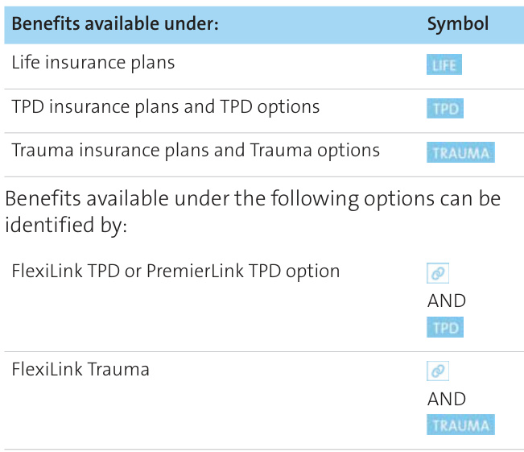  

# Automatic inflation  

To protect your benefit against the effects of inflation, up until age 65 your sum insured is automatically increased each year on the renewal date by the greater of 5% or the increase in the Consumer Price Index (CPI).  

Your premium will increase as a result of this increase in the suminsured .Youmaydeclinetheincreaseinthe sum insured for any particular year or for all years by writing to us.  

The increase to your sum insured only applies to a claim you make under the plan that happens after the date of the increase.  

If you hold the Life Insurance Superannuation Plan or Life Insurance SMSF Plan and the premiums are paid by your employer you must get agreement from your employer to allow Automatic inflation to be applied to your plan.  

We won’t increase the sum insured :  

– after the insured person's 65th birthday, or   
– where a loading exceeding 100% is applied to your premium, or   
– on a Business solutions option (page 55), or   
– on a Children’s trauma option (page 60), or   
– while Premium freeze (page 55) or the Premium waiver option (page 57) is exercised.  

For all TPD options, trauma options and FlexiLink plans We won’t increase the sum insured for a TPD option ,trauma option or FlexiLink plan by any amount which would cause the sum insured to exceed that of the plan or option to which these options are linked.  

Any revised terms applicable to your plan will also apply to increases exercised under this benefit.  

# The CPI information we use  

The increase we make to the sum insured will normally bebasedontheAustralianNationalAllGroupsConsumerPrice Index weighted average of eight capital cities combined. We use the last published Index for the 12 months ending 30 September each year. Any increase will be applied on the next renewal date on or after 1 January of the following year. However, we may use the Index published for a more recent 12 month period and/or another index or rate which we believe more fairly and accurately reflects changes in the cost of living.  

This benefit is not available where the plan is established by the exercise under another plan of a:  

– 12-month Life buy back (page 53), or – Life buy back - TPD option (page 58), or – Life buy back - Trauma option (page 59), or – Trauma reinstatement option (page 59).  

# Future insurability benefit  

This benefit allows you to increase your sum insured once in any 12 month period without the need to provide further health evidence when one or more specified personal or business events occurs.  

You must apply for the increase within 12 months after the date the specified event occurs.  

You will be required to provide evidence that is acceptable to us and supports the increase to your sum insured .  

# How much additional cover you can purchase  

The maximum amount of increase for any one event will be limited to the lowest of:  

– 25% of the sum insured   
– \$200,000   
– where the increase relates to a mortgage, the amount of the mortgage or the increase to the mortgage, or   
– where the increase relates to a promotion or commencementofanewemploymentarrangement, 10 times the salary increase.  

The maximum amount of increase in the sum insured in total over the life of the plan for each cover type is the original sum insured, up to a maximum of \$1,000,000.  

You'll need to provide certified copies of evidence of one of the following events:  

<html><body><table><tr><td>Events covered underspecified personal events:</td><td>Examplesofevidenceneeded (certifiedcopies)</td></tr><tr><td>Theinsured person gets</td><td>Marriage certificate</td></tr><tr><td>married orregistersa defacto</td><td></td></tr><tr><td>relationship</td><td></td></tr></table></body></html>  

<html><body><table><tr><td colspan="2">Eventscovered underspecifiedExamplesofevidence needed personalevents: (certified copies)</td></tr><tr><td>On the first anniversary of a defactorelationshipwhere</td><td>Registration certificate of a defactorelationship -Signed Statutory Declaration confirming the de facto relationship Registration certificate of</td></tr><tr><td>that anniversary occurs on or afterthedatetheinsured person was covered bythis plan</td><td>a defactorelationship -Signed Statutory Declaration confirming theinsured person isin a de factorelationship where the first anniversary occurs on or afterthe commencement date shown in the insuranceschedule.</td></tr><tr><td>Divorce or registering a separationfrom amarriage or registered de facto relationship</td><td>Divorce order - Separation certificate of a marriage or a de facto relationship Signed Statutory Declaration confirming themarriageordefacto relationship separation</td></tr><tr><td>Onthefirst anniversaryof separating from a marriage or defactorelationshipwhere thatanniversaryoccursonor afterthedatetheinsured person was covered bythis plan</td><td>Separation certificateof a marriage or a de facto relationship Signed Statutory Declaration confirming the first anniversary of theseparationfromthe marriage orthe defacto relationship occurred on or after the commencement date shownin theinsurance</td></tr><tr><td>Death of a spouse or de facto partner</td><td>schedule - Death certificate Marriage certificate Relationship certificate</td></tr><tr><td>Effecting a mortgage for the first time orincreasinga mortgage Completing first</td><td>- Mortgage papers -Bankconfirmation of settlement -Degree certificate</td></tr><tr><td>undergraduate degree at an Australian University recognised by us</td><td></td></tr><tr><td>Birth or adoption of a child Theinsuredperson'schildfirst startssecondaryschool</td><td>-Birth certificate -Certificateofenrolment</td></tr><tr><td>Becoming a carer forthe first time</td><td>- Statutory Declaration confirming the carer status and date commenced</td></tr><tr><td>Promotionorcommencement ofanewemployment arrangementwhere theinsuredperson'sbase</td><td>Centrelinkcarer'scard - Pay slips showing previousincome and letter of offer from employerorletterof</td></tr></table></body></html>  

<html><body><table><tr><td>Eventscoveredunderspecified personalevents:</td><td>Examplesofevidenceneeded (certifiedcopies)</td></tr><tr><td>salary (excluding salary packaging arrangements)</td><td>salaryincreaseornew</td></tr><tr><td>increases by atleast$10,000 or10%</td><td>employmentcontract</td></tr></table></body></html>  

<html><body><table><tr><td>Eventscoveredunderspecified businessevents:</td><td>Examplesofevidenceneeded (certified copies)</td></tr><tr><td>Businesssuccessionplanning -increasein thevalue ofthe businessorintheinsured person'sshareholding</td><td>Partnershipagreement Executivepackageletter showingincrease</td></tr><tr><td>Keypersoninsurance- increaseinthevalueofthekey persontothebusiness</td><td>Letterfromthebusiness accountant</td></tr><tr><td>Loan guarantee-increase in businessloans</td><td>一 Loandocumentation Revaluationcertificate</td></tr></table></body></html>  

# When the Future insurability benefit does not apply  

The Future insurability benefit cannot be exercised if at the time of your application:  

– the insured person has previously been accepted by us with a medical loading greater than 50% under a plan held with us, or – the insured person is currently entitled to make, or has made, a claim for a terminal illness, TPD or Trauma benefit under a plan held with us.  

# Restrictions on the increased sum insured  

For the first six months from the date of the increase, we will only pay the amount of the increase in the sum insured in the event of:  

– accidental death,   
– accidental total and permanent disability (caused by violent, accidental, external and visible means), or   
– the insured person suffering an accidental trauma condition .  

This benefit will expire on the insured person's 55th birthday. The specified event for which you are applying for an increase must occur prior to the insured person's 55th birthday.  

# How to exercise the Future insurability benefit  

You can exercise the Future Insurability benefit by completing the "Future Insurability Benefit for Life, Total and Permanent Disability (TPD) and Trauma insurance" form with the evidence required for the specified event as listed in this section.  

# Life benefit  

#  

If the insured person dies we’ll pay the Life insurance sum insured . This amount is paid once only as a lump sum. The Life insurance sum insured is specified on the insurance schedule .  

# Terminal illness benefit  

If the insured person becomes terminally ill, you may ask us to pay the Life insurance sum insured . This amount is paid once only as a lump sum and is an advance payment of the Life benefit (see above). The Life insurance sum insured is specified on the insurance schedule .  

We’ll only pay if the insured person becomes terminally ill:  

– after this plan commences,   
– before this plan ends, and   
– before the insured person reaches the benefit expiry age for the plan.  

The Terminal illness benefit is not payable under a plan which has lapsed, been cancelled or is otherwise not in force prior to the date the insured person becomes terminally ill.  

For the Life Insurance Plan, terminally ill means: – a medicalpractitioner hascertifiedthatthe insured person suffers from an illness, or has incurred an injury, that is likely to result in the insured person's death within 12 months, and – we agree with that prognosis.  

For the Life Insurance Superannuation Plan or Life   
Insurance SMSF Plan, – terminally ill means: – two medical practitioners have certified, jointly or separately, that the insured person suffers from an illness, or has incurred an injury, that is likely to result in the insured person's death within 12 months of the date of certification – at least one of the medical practitioners is a specialist practising in an area related to the illness or injury, and – for each of the certificates, the certification period has not ended. – If a terminal illness claim is admitted, we'll pay the sum insured to the Trustee . If the Trustee is satisfied that the insured person's situation meets the condition of release, they will make the proceeds available to you.  

We may ask you to provide additional evidence that we require in order to agree with the prognosis. This may include providing information through medical practitioners we choose.  

The amount of the Terminal illness benefit we’ll pay is theamountoftheLifeinsurance suminsured thatapplies when the insured person becomes terminally ill. On payment of the Terminal illness benefit, the Life benefit will cease.  

The certifying medical practitioner cannot be the insured person's familymember,businesspartner,youremployee or employer.  

A Terminal illness benefit is only payable if the insured person holds a life insurance plan .  

# Accommodation benefit  

We'll pay for the accommodation costs of the insured person's immediate family member , if we pay 100% of the sum insured under the Terminal illness benefit (page 50), TPD benefit (page 51) or Trauma benefit (page 53), and a medical practitioner certifies that the insured person must remain confined to bed due to the reason for which we paid the Terminal illness/TPD/Trauma benefit, and:  

– the insured person is more than 100km from his or her home, or needs to travel to a place that is more than 100km from his or her home for medical treatment , and an immediate family member is required to stay with the insured person , or – an immediatefamilymember isrequiredtostaywith the insuredperson andmusttravelmorethan100km from his or her home to do so.  

We’ll pay up to a maximum of\$150 per day for each day that the insured person remains confined to bed and his or her immediate family member remains away from their home, for a maximum of 14 days.  

Thisbenefitmustbeclaimedwithinsixweeksfromwhen we pay the Terminal illness/TPD/Trauma benefit. You mustsendusevidencethatthe insuredperson isconfined to bed and payment of the accommodation costs which is acceptable to us.  

The Accommodation benefit will only be paid once across all plans or options you have with us under which the insured person is covered.  

The amount we pay under the Accommodation benefit won’t reduce any other benefit that’s payable under your plan .  

If a TPD any occupation plan/option and PremierLink TPD option are both purchased, this benefit will be paid under the PremierLink TPD option held outside of superannuation.  

This benefit is not payable under the Partial TPD benefit (page52)oranyofthePartialpayment traumaconditions (page 54).  

# Advancement of funeral expenses benefit  

This benefit provides an advance payment for funeral expenses on receipt of the death certificate or other proof of death of the insured person which is acceptable to us.  

The amount payable is the Life insurance sum insured, up to a maximum of \$20,000.  

If we pay this benefit, then the Life insurance sum insured will be reduced by the amount we pay.  

This benefit is not payable if the insured person's death is due to suicide within the first 13 months from the commencement or reinstatement of cover.  

Any payment of this benefit is not an admission of liability to pay the full Life benefit (page 50). Please note that nominating a beneficiary may enhance the timeliness with which this benefit can be paid.  

# Financial plan benefit  

If we pay 100% of the sum insured , we'll reimburse the recipient of the benefit, up to \$2,000 for the cost of financial planning advice.  

The advice must be received within six months of us paying the sum insured . The advice must be from a representative of an Australian Financial Services Licensee.  

We’ll only pay the Financial plan benefit once regardless of the number of plans or options held with us under whichthe insured person iscovered.  

If a TPD any occupation and PremierLink TPD option are both purchased, this benefit will be paid under the PremierLink TPD option held outside of superannuation.  

The payment of the Financial plan benefit will not reduce any other benefit payable under the plan.  

# TPD benefit  

If the insured person is totally and permanently disabled (TPD), we'll pay the TPD insurance sum insured as specified on the insurance schedule . The definition of TPD varies according to the type of plan you have and whether your TPD plan is TPD own occupation ,TPD any occupation or TPD ADL .  

If we pay a TPD benefit under a TPD option , the sum insured of the linked plan and any linked trauma insurance will be reduced by the amount we pay.  

The definitions below need to be considered with the TPD definitions in the Glossary of Total and Permanent Disability (TPD) insurance definitions (pages 119 to 120).  

# For TPD any occupation  

The insured person is totally and permanently disabled if he or she:  

A. is unlikely to work (any occupation), or   
B. suffers a specific loss, or   
C. requires future care, or   
D. is unlikely to perform domestic work and the TPD insurance plan or TPD option is held outside super, or E. suffers significant cognitive impairment.  

# For TPD own occupation  

The insured person is totally and permanently disabled if he or she:  

A. is unlikely to work (own occupation), or B. suffers a specific loss, or   
C. requires future care, or   
D. is unlikely to perform domestic work, or E. suffers significant cognitive impairment.  

# For TPD ADL Plan or TPD ADL option  

The insured person is totally and permanently disabled if he or she:   
C. requires future care, or   
E. suffers significant cognitive impairment.  

# Specific rules for TPD definitions  

There are specific rules for each of the definitions. These should be read in conjunction with Glossary of Total and Permanent Disability (TPD) insurance definitions on pages 119 to 120.  

<html><body><table><tr><td>For TPD definitions:</td><td>Specific rules</td></tr><tr><td>A (unlikely to work) and D (unlikely to perform domesticwork)</td><td>The definitionsA and D only apply until the first renewal date after the insured person turns 65,or until the plan ends,whichever occurs first. Definition D does not apply to TPD insurance plans and TPD options held through super.</td></tr><tr><td>B (suffers a specific loss) and C (requires future care)</td><td>The definitions B and C only apply until the insuredpersonturns: -99 for TPD insurance plans and TPD options held outside super, or 75 for TPD insurance plans and TPD optionsheld throughsuper, or until the plan ends,whicheveroccurs first. If theTPD insuranceplansor TPD option isheld through super, the insured person is also required to be considered as suffering from permanent incapacity.</td></tr><tr><td>E (suffers significant cognitive impairment)</td><td>The definition E only applies from the first renewal date aftertheinsured person turns 65 until he or she turns: -99forTPDinsuranceplansand TPD optionsheld outside super,or 75 for TPD insurance plans and TPDoptions held throughsuper, or until theplan ends,whicheveroccurs first. If the TPDinsuranceplan or TPDoption is held through super, the insured person is also required to be considered as suffering from permanentincapacity.</td></tr></table></body></html>  

# Survival period  

If a TPD option is linked to a life insurance plan or a FlexiLink TPD plan, there is no survival period requirement. We'll pay the TPD benefit as soon as the insured person meets the definition of total and permanent disability.  

# If you purchase a:  

– TPD Insurance Plan (Any or Own)   
– TPD Insurance Superannuation Plan (Any), or   
– TPD Insurance SMSF Plan (Any), or   
–TPD option linked to a trauma insurance plan , or –Double TPD option ,  
and the insured person is classified as totally and   
permanently disabled, an eight day survival period applies. We'll only pay the TPD benefit upon the insured person's survival of eight days from the date the insured person becomes eligible for a TPD benefit.  

# Day one TPD benefit  

If the insured person has been diagnosed by a medical practitioner as suffering from one of the listed medical conditions below, we'll waive the requirement to be unable to work for three months when assessing a claim made under:  

– definition A - unlikely to work   
– definitionD-unlikelytoperformdomesticwork(only available for TPD insurance plans and TPD options held outside super)  

outlined in the TPD benefit (page 51).  

The medical conditions are:   
– Alzheimer’s disease and other dementias   
– Blindness (Full payment)   
– Cardiomyopathy   
– Chronic lung disease   
– Deafness (Full payment)   
– Diplegia   
– Hemiplegia   
– Loss of speech   
– Major head injury   
– Motor neurone disease   
– Multiple sclerosis   
– Muscular dystrophy   
– Paraplegia   
– Parkinson’s disease   
– Primary pulmonary hypertension   
– Quadriplegia (also defined as tetraplegia)   
– Severe rheumatoid arthritis  

Each of the listed medical conditions are defined in Glossary of medical conditions starting on page 120.  

# Partial TPD benefit  

We’ll pay part of the TPD benefit (page 51) if the insured person suffers the total and permanent loss of the use of:  

– one hand, or   
– one foot, or   
– the entire sight in one eye.  

We’ll only pay once under this benefit.  

The Partial TPD benefit is not available if TPD is purchased as an option on the Life Insurance Superannuation Plan or Life Insurance SMSF Plan.  

# How much we will pay  

We’ll pay 25% of the TPD insurance sum insured, up to a maximum of \$500,000.  

Any payment made under the Partial TPD benefit won't be considered a payment of the TPD benefit (page 51).  

If you have purchased both TPD Insurance and Trauma Insurance Plus on the same plan (or they are linked through a FlexiLink plan or PremierLink TPD option), and if you’re eligible to claim under both benefits, we’ll only pay the higher of:  

–the Partial TPD benefit under this benefit, or – the benefit for Loss of a limb under the Trauma Insurance Plus Plan.  

# What happens to the balance of the TPD benefit?  

In the event that a payment is made under the Partial TPD benefit, your plan will not end, however the TPD insurance sum insured will be reduced by the amount we pay. If you have purchased a TPD option (excluding the Double TPD option ) or FlexiLink TPD plan , the sum insured of the remaining linked cover ( plans and options )for that insured person is reduced by the amount we pay.  

# Death benefit  

We'll pay the Death benefit if the insured person dies. This benefit must be claimed within 12 months of the insured person’s death.  

We'll pay the TPD insurance sum insured , up to a maximum of \$10,000.  

This benefit is not payable if:  

– you make a fraudulent claim, or   
– the insured person commits suicide within 13 months of the commencement date or the date the plan was restored.  

The Death benefit is only available if the insured person does not have Life insurance cover under this plan or any other plan where AMP Life is the insurer.  

# ₁₂ -month Life buy back  

If we pay 100% of the TPD benefit under the TPD option, and this leads to a decrease in the Life benefit on the life insurance plan , you may choose to buy another plan providing life insurance on the life of that insured person (the new plan). The new plan can be purchased without the need to provide us with any health or other evidence.  

# How to exercise this option  

You can buy the new plan by submitting to us the required form, plus the appropriate premium, one year after the TPD benefit was paid. If we do not hear from you within 30 days of that date, you will lose the right to buy the new plan and this option will cease.  

# How much cover can I apply for?  

The maximum amount of life insurance you can apply for under the new plan is the lower of:  

– the sum insured of the TPD option , and – the amount of the decrease in the Life benefit that occurred under the life insurance plan due to any TPD benefit payment.  

The new plan must be an equivalent plan that AMP is issuing at the time the feature is available to exercise. If we have a number of life insurance plans on-sale, we’ll decide which plan or plans are available for purchase under this option.  

The premium payable for the new plan will be based on the premium rates and plan terms and conditions applicable at the time the new plan is applied for. The new plan will be subject to any revised terms such as exclusions and loadings that applied to the original plan.  

Any exclusion periods, qualifying periods or duty of disclosure requirements on the new plan will be regarded as having applied from the time of taking out the original plan.  

Increases to the sum insured under Automatic inflation (page 48) and the Future insurability benefit (page 48) will not be available on the new life insurance plan .This option can only be exercised once.  

If you have exercised Life buy back - TPD option (page 58) or Double TPD option (page 57), then you cannot exercise this option.  

This benefit cannot be exercised if a benefit for Terminal Illness has been paid previously for that insured person .  

This option will expire if not excercised prior to insured person's 65 th birthday.  

# Trauma benefit  

We’ll pay the Trauma insurance sum insured if the insured person suffers a trauma condition . The trauma conditions covered are listed on pages 44 to 46 and defined in the Glossary of medical conditions starting on page 120.  

If we pay a Trauma benefit under a trauma option , the sum insured of the linked plan and any linked TPD insurance will be reduced by the amount we pay.  

# Specific rules  

– The trauma condition (except loss of capacity for independent living) must have occurred before the first renewal date after the insured person turns 70. After the insured person turns 70, they may be covered for loss of capacity for independent living which occurred before they turn 99. – Where the trauma condition definition refers to a diagnosis, the diagnosis must be based on clinical, radiological, histological and laboratory evidence which is acceptable to us. A suitable medical practitioner must make the diagnosis. – Where the trauma condition definition refers to a 25% impairment of whole body function, we’ll rely on the latest published edition of American Medical Association (AMA) Guides to the Evaluation of PermanentImpairment.Assessmentmustbecarried out by a medical practitioner accredited in the evaluation of permanent impairment.  

# How much we'll pay  

In the case of all trauma conditions , except those listed in the Partial payment trauma conditions section below, we’ll pay 100% of the Trauma insurance sum insured as it appears in the insurance schedule .  

Partial payment trauma conditions   

<html><body><table><tr><td>Partial payment traumaconditions</td><td>Partial payment amount and special rules</td></tr><tr><td>Adult insulin dependent diabetes partial payment</td><td>We'll pay 10% of the Trauma insurance suminsured,uptoamaximumof$25,0oo.</td></tr><tr><td>Angioplasty partial payment</td><td>We'll pay abenefitfor angioplasty on more than one occasion provided that the procedures occur at least six months apart. We'llpay25%oftheTraumainsurance sum insured, up to a maximum of $100,000.</td></tr><tr><td>Blindness partial payment Cancer early</td><td>We'll pay 10% of the Trauma insurance sum insured,uptoa maximum of$25,000. In the case of cancerearly payment</td></tr><tr><td>payment (only applicable under trauma plus)</td><td>conditions eligiblefora partial payment, we'llpay20%oftheTrauma insurancesum insured or$10,000,whicheveristhehigher (up to a maximum of $100,000). We'll pay a partial benefit once only for each cancer early payment condition. We will however,makesubsequent partial payments for cancer early payment conditions, as long as we have not already made a payment for the same condition. The total of all claim payments must not exceedtheTraumainsurancesuminsured. The following are excluded: -tumoursthatoccurwithinthe90 day qualifying period, and tumoursthatrecuroutsidethe 90 day qualifying period unless the</td></tr><tr><td>Deafness partial payment Loss of a limb partial payment</td><td>recurrencecanbeshowntobe unrelated. We'll pay1o%oftheTrauma insurance sum insured,uptoa maximum of$25,000. We'll pay 25% of the Trauma insurance</td></tr><tr><td>(only applicable under trauma plus)</td><td>sum insured, up to a maximum of $100,000. IfbothTPDinsuranceand Trauma InsurancePlusarepurchasedonthesame plan (or they're linked through a FlexiLink plan or PremierLink TPD option), and if you're eligible to claim under both benefits, we'll only pay the higher of: -the Partial TPD benefit(page 52) underTPDinsurance,or</td></tr><tr><td>benefit. MedicalconditionWe'll pay1o%oftheTrauma insurance requiring life support partial</td><td>this Loss of a limb partial payment suminsured,uptoamaximumof$25,000.</td></tr></table></body></html>  

# When trauma insurance starts  

For most of the trauma conditions covered, Trauma insurance starts upon commencement of your plan. However, some of the trauma conditions are subject to a qualifying period. These are identified in the tables on pages 44 to 46.  

For trauma conditions that are not subject to a qualifying period  

Trauma insurance starts on:   
– The commencement date of the trauma insurance plan or trauma option specified on the insurance schedule   
– Thedatethe traumainsuranceplan or trauma option is restored   
– The effective date of any increase in your Trauma insurance sum insured (except for any increases under the Business solutions option on page 55 and Automatic inflation on page 48).   
For trauma conditions that are subject to a 90 day   
qualifying period   
Trauma insurance starts 90 days after:   
– The commencement date of the trauma insurance plan or trauma option specified on the insurance schedule   
– Thedatethe traumainsuranceplan or traumaoption is restored   
– The effective date of any increase in your Trauma insurance sum insured (except for any increases under the Business solutions option on page 55 and Automatic inflation on page 48).   
Further to the above, we won't pay a Trauma benefit if   
the insuredperson developsevidenceof,orseesa medical   
practitioner for, that condition within 90 days of any of   
the following:   
– The commencement date of the trauma insurance plan or trauma option specified on the insurance schedule   
– The date the trauma insurance plan or trauma option is restored   
– The effective date of any increase in your Trauma insurance sum insured (except for any increases under the Business solutions option on page 55 and Automatic inflation on page 48).  

The trauma conditions table on pages 44 to 46 lists all of the trauma conditions and specifies which conditions are subject to a qualifying period.  

# If you’re paid a Trauma benefit  

If we pay 100% of the Trauma insurance sum insured for a trauma insurance plan , the trauma insurance plan and any linked options will cease and you won’t be entitled to any more benefits. If we pay 100% of the Trauma insurance sum insured for a trauma option or FlexiLink trauma plan (other than where a Double trauma option has been purchased):  

– the trauma option or FlexiLink trauma plan and any options l inked to them will cease, and – the benefit of any plan that the trauma option or FlexiLink trauma plan is linked (including linked TPD option or FlexiLink TPD plan ) will be reduced by the benefit we pay for trauma.  

If the sum insured of that plan is reduced to nil by this, that plan and all linked options will cease and you won't be entitled to any more benefits, otherwise that plan will continue with the reduced sum insured .  

If a payment is made under a partial payment trauma condition , including cancer early payment, the plan won’t end, however the Trauma insurance sum insured and any linked TPD insurance will be reduced by the amount we pay.  

Where the insurance schedule shows a Double trauma option (page 59) and 100% of the Trauma insurance sum insured is paid, any life insurance plan to which this option is linked won't reduce. However, any linked TPD option or FlexiLinkTPDplan willbereducedbythebenefit we pay for Trauma insurance.  

Where the insurance schedule shows a Children’s trauma option (page 60) and a benefit is paid, the Children's trauma option will cease but it won’t reduce the sum insured of the plan it is linked to or the sum insured for any other Children’s trauma option.  

# Survival period  

If you purchase a trauma option linked to a life insurance plan , or a FlexiLink trauma insurance plan, and you suffer a trauma condition (outlined in the trauma conditions table on pages 44 to 46) and the insured person meets the definition, there is no survival period requirement.  

If you purchase a:  

–trauma insurance plan , or –Double trauma option , and the insured person suffers a trauma condition (outlined in the trauma conditions table on pages 44 to 46) and meets the definition, a 14 day survival period applies from the date the insured person becomes eligible for a Trauma benefit.  

# Premium freeze  

# This option is only available for stepped premiums.  

Exercising this option allows you to maintain your current premium at the time this option is exercised. Your sum insured will reduce each year that this option is applied.  

If you choose to cancel Premium freeze, your sum insured current at that time will not reduce anymore and Automatic inflation (page 48) will recommence without further health evidence. Premiums will then increase each year according to your age.  

You can request to exercise Premium freeze or cancel it at any time, which will take effect from the next renewal date of the plan .  

If you wish to request a Premium freeze, you must let us knowinwriting.Anyspecialconditionssuchasexclusions and loadings will still apply.  

Automatic inflation (page 48) will not apply while Premium freeze is exercised. Premium freeze is not available on a FlexiLink plan , PremierLink TPD option or the plans/options to which they are linked.  

# Upgrade of benefits  

If we make future improvements to your plan , and such improvements would not result in an increase in premium rates, we’ll pass these changes on to you without you having to provide us with any medical evidence or evidence regarding the insured person's occupation, pastimes or place of residence.  

Upgrades provide improvements to your plan including additional benefits and improved definitions. You will still retain your existing terms, conditions and premium rates for your plan .  

Any improvements and/or changes to your plan definitions will always be reviewed at claim time to ensurethe insuredperson isassessedusingthedefinition that benefits them the most. This means that should a definition or benefit from the original plan be more beneficial, you’ll still be eligible to claim under your original plan definitions.  

If the insured person is suffering a pre-existing condition at the time the improvement is provided, the improvement will not apply when assessing any claim affected by that pre-existing condition .  

# ₂₄ -hour worldwide cover  

We’ll cover the insured person 24 hours a day anywhere in the world, subject to the terms and conditions of the plan. If he or she is sick or injured outside Australia or New Zealand, we may require additional medical documentation and/or medical examinations by a medical practitioner chosen by us to support the claim.  

# Options  

This section outlines the options that can be added to the plan at an additional cost. An option only applies if it's specified in your insurance schedule .  

# Business solutions option – Life, TPD or Trauma  

Unless otherwise specified, all parts of this section apply to the following options:  

– Business solutions option – Life   
– Business solutions option – TPD   
– Business solutions option – Trauma (this option is not available on plans through super)  

# General  

This option allows you to apply each year for an increase to your sum insured in line with:  

– the value of the insured person's business , or – the value of the insured person to the business , or – the value of the relevant business loan at the time of the increase.  

During the initial application the insured person will be fully medically underwritten for the potential sum insured . This option is only available to lives that are accepted for cover on standard premium rates, terms and conditions. Financial requirements at application stage will be based on the initial sum insured and the reason for cover.  

Ifyouchoosetoexercisethisoption,we'llrequirefinancial evidence and possibly other additional information that supports the increase to the benefit. The amount we pay will be inclusive of the total of the sums insured under any plans held by us or another insurer on the insured person that provide the cover.  

How much cover can I purchase?   

<html><body><table><tr><td>Type of Business solutionsoption</td><td>Maximumsuminsured thatcanbe purchased</td></tr><tr><td>Business solutions optionpurchased is the lower of: - Life</td><td>The maximum sum insured that may be -fourtimestheLifeinsurance sum insured benefit amount before the increase,or $15,0oo,oo0 less the total sums insured under any other plans held with us or another company that provides cover</td></tr><tr><td>Business solutions optionpurchased is the lower of: - TPD</td><td>for life insurance. Themaximum sum insured that may be -four times theTPDinsurance sum insured before theincrease,or $5,0oo,ooo less the total sums insured under any other plans held with us or another company that provides cover for TPDinsurance.</td></tr><tr><td>Business solutions option purchased is the lower of: -Trauma</td><td>The maximum sum insured that may be -fourtimestheTraumainsurance sum insured benefit amount before the increase,or $2,0oo,oo0 less the total sums insured under any other plans held with us or another company that provides cover for trauma insurance.</td></tr></table></body></html>  

# Conditions that apply  

The following conditions apply:   
– The sum insured will not be increased by Automatic inflation (page 48) under any plans or options covered by this option.   
– The maximum increase to the sum insured allowed under this option is the amount shown in the insurance schedule .  
– Any increase applied for must meet our minimum and maximum sum insured increase requirements.   
– The sum insured cannot be increased to an amount that exceeds the value of the business ,value of the insured person to the business or the value of the relevant loan at the time of the increase.   
– If the original sum insured was less than 100% of the value of the business , the value of the insured person to the business or the value of the relevant loan at that time, then the sum insured can only be increased under this option to an equivalent percentage of the value of the business , the value of the insured person to the business or the value of the relevant loan at the time of the application to increase the sum insured .  

# How to apply for an increase  

You must complete and forward to us the current Application form. Your financial adviser will be able to assist in completing this form. You are required to provide details of the insured person's occupation, pastimes, residence, travel and any other insurance.  

You must provide us with financial and supporting evidence to our satisfaction. The person providing the evidence cannot be you or the insured person or a family member, business partner, employee or employer of you or the insured person .  

# When is medical evidence required when applying for an increase?  

You won’t be required to provide medical evidence about the insured person's health when you apply for an increase in the sum insured unless you’ve received, are receiving or are eligible to receive any benefit for the insured person under a plan held by us or another company.  

# When does the option end?  

In addition to the circumstances detailed in the section for When the plan will end (page 99), this option will also end as soon as:  

– a claim has been made, or there is an entitlement to make a claim, under the plan to which this option is linked,   
– when the insured person turns 65,   
– the sum insured has increased to the maximum amount permitted under this option, or   
– the start of any period for which you haven’t paid premiums for the plan to which this option is linked.  

Refer to the Eligibility criteria for options table on pages 26to27forentryrequirements,expiryageandmaximum limits on this option.  

# Premium waiver option  

We’ll waive your premiums while the insured person is: – totally disabled, or   
–involuntarily unemployed .  

# Premium waiver while totally disabled  

If the insured person is totally disabled for greater than 90 consecutive days, you won’t have to pay any further premium for the life insurance plan (including the plan fee and any linked options or FlexiLink plans while the insured person remains totally disabled until he or she reaches age 65.  

For the purpose of this option only, the insured person is totally disabled if, because of an injury or sickness, he or she is:  

– not capable of doing the important duties of his or her occupation   
– not working in any occupation (whether paid or unpaid), and   
– under medical care .  

We won’t waive any premium if the insured person's total disability was caused directly or indirectly by the insured person or you performing an act or omission with the intention or likely outcome of causing harm to the insured person .  

# Premium waiver while involuntarily unemployed  

Ifthe insuredperson becomes involuntarilyunemployed and you let us know in writing within three months of the date this took place, you don’t have to pay your premium for the life insurance plan (including the plan fee and any linked options or FlexiLink plans ) for three months from the date the insured person became involuntarily unemployed or until the insured person isemployed, whichever is shorter. This option only applies if:  

– your plan has been in force for six months in a row atthetimethe insuredperson becomes involuntarily unemployed ,  
– the insured person registers with an employment agencyapprovedbyAMPwithin30daysofbecoming involuntarily unemployed , and   
– the insured person demonstrates that he or she is actively seeking employment.  

Under this option, we’ll waive premiums due or paid for all involuntary unemployment periods for a cumulative period of up to 12 months during the life of the plan.  

# We won’t increase the benefit under Automatic inflation while premiums are waived  

While we waive premiums under this option, we won’t increase any benefits by Automatic inflation (page 48) .  

However, if we’re no longer waiving premiums under this option and you’re required to resume premium payments, we’ll recommence increases to the benefits under Automatic inflation (page 48).  

# Not included in the premium waived  

The premium waived does not include:  

– any premium increases, as a result of an increase in the sum insured , purchasing a new option or increasing the sum insured of an option linked to the life insurance plan . An exception to this is due to a change in the insured person's age after the commencement of the premium waiver, or – anypartofthepremiumthatisapplicabletochanges in the benefit resulting from you exercising an option after the commencement of the premium waiver.  

Refer to the Eligibility criteria for options table on pages 26to27forentryrequirements,expiryageandmaximum limits on this option.  

# Double TPD option  

  

Until the first renewal date after the insured person turns 65, this option has all the benefits of the relevant TPD option , plus the following additional benefits.  

# If we pay a TPD benefit  

If we pay 100% of the TPD benefit (page 51) under this option, the sum insured of the life insurance plan this option is linked to won’t reduce. However, the sum insured of any linked option or FlexiLink plan (if applicable) will be reduced the TPD benefit (page 51) we pay. If the sum insured reduces to nil, these options/plans will cease.  

If we a TPD benefit (page 51) under this option that is equalto the Life benefit(page 50) underthe lifeinsurance plan to which this option is linked, you won’t be required to pay any future premiums for the life insurance plan or any linked options or FlexiLink plans.  

Where we pay a TPD benefit (page 51) that is less than the Life benefit (page 50), you won’t be required to pay the proportionate amount of future premiums for the life insurance plan plus any linked options or FlexiLink plans.  

Additionally, you won’t be required to pay the plan fee .  

Where we’re waiving future premiums, increases under Automatic inflation (page 48) and the Future insurability benefit (page 48) will not be available on the life insurance plan and any linked options .  

After the first renewal date after the insured person turns 65, the additional benefits of this Double TPD option no longer applies.  

Refer to the Eligibility criteria for options table on pages 26to27forentryrequirements,expiryageandmaximum limits on this option.  

# Life buy back – TPD option  

If we pay 100% of the sum insured for a TPD benefit (page 51) under a TPD option , and this leads to a decrease in the Life insurance sum insured , this option allows you to buy another plan providing life insurance on the life of the insured person (the new plan) without the need to provide us with any health or other evidence.  

# How to exercise this option  

You can buy the new plan by submitting to us the required form, plus the appropriate premium, immediately from the date the TPD benefit (page 51) was paid. If we do not hear from you within 60 days of that date, you will lose the right to buy the new plan and this option will cease.  

# How much cover can I apply for?  

The maximum amount of life insurance you can apply for under the new plan is the lower of:  

– the sum insured of the TPD option , and – the amount of the decrease in the Life insurance sum insured that occurred due to any payments for TPD.  

The new plan must be a plan on-sale from us at that time and must be of a similar design and benefit structure to the life insurance plan whose benefit was decreased. Where we have a number of life insurance plans on-sale, we’lldecidewhichplanorplansareavailableforpurchase under this option.  

The premium payable for the new plan will be based on the premium rates and plan terms and conditions applicable at the time the new plan is applied for. The premium payable and conditions for the new plan will includeany revisedterms suchasexclusionsand loadings that applied to the original plan.  

Any exclusion periods, qualifying periods or duty of disclosure requirements on the new plan will be regarded as having applied from the time of taking out the original plan.  

Increases to the sum insured under Automatic inflation (page 48) and the Future insurability benefit (page 48) will not be available on the new life insurance plan.This option can only be exercised once.  

Refer to the Eligibility criteria for options table on pages 26to27forentryrequirements,expiryageandmaximum limits on this option.  

# PremierLink TPD option  

If this option is selected, a TPD own occupation option will be issued with ownership outside of super.  

This option links a TPD own occupation benefit to:  

– a TPD any occupation option held on a Life Insurance Superannuation Plan or Life Insurance SMSF Plan, or – a TPD Insurance Superannuation Plan (Any) or TPD Insurance SMSF Plan (Any).  

If a TPD claim is lodged, it will be assessed against a TPD any occupation definition in the first instance. If the insured person meets this definition, the benefit will be paid to the relevant Trustee . If the insured person does not meet the TPD any occupation definition, they will be assessed under the TPD own occupation definition under the PremierLink TPD option . If the insured person meets this definition,the benefit will be paid directly to you. The definitions for TPD any occupation and TPD own occupation can be found in the Glossary of Total and Permanent Disability (TPD) insurance definitions on pages 119 to 120.  

If you're also eligible for the Accommodation benefit (page 50) and/or the Financial plan benefit (page 51), then these benefits will be paid to you directly under the PremierLink TPD option held outside of super.  

If you're eligible for the Partial TPD benefit (page 52), this will be paid directly to you under the PremierLink TPD option.  

If we pay a benefit under this option it will reduce the sum insured of the life insurance plan or TPD insurance plan to which it is linked, the linked TPD any occupation benefit and any other linked options by the amount we pay. Similarly, if we pay a benefit under any plan or option to which the PremierLink TPD option is linked, the sum insured under the PremierLink TPD option will reduce.  

# General  

– This option is held on a separate insurance schedule to the life insurance plan or TPD insurance plan, and TPD any occupation benefit to which it is linked.   
– When both a TPD any occupation option or plan and PremierLink TPD option are purchased, they will have thesame suminsured (whichcannotexceedthe sum insured of the life insurance plan or TPD insurance plan to which they are linked).   
– If an increase or reduction is made to the TPD any occupation option or plan , the alteration will automatically be applied to the TPD own occupation cover held under the PremierLink TPD option.   
– A payment of 100% of the TPD benefit under either the TPD any occupation option or plan, or the PremierLink TPD option will automatically cancel both options.   
– If you cancel the TPD any occupation option or plan ,the PremierLink TPD option will automatically be cancelled. However, if you cancel the PremierLink TPD option , the TPD any occupation option or plan can continue.   
– If the Business solutions option - TPD (page 55) and/or the Life buy back - TPD option (page 58) are purchased they will be applied to both the TPD any occupation option or plan and the PremierLink TPD option . If they are cancelled, they will be cancelled from both the TPD options/plans .  
– When the PremierLink TPD option is purchased, FlexiLink TPD plans and Double TPD options won't be available on the life insurance plan and any other linked options .  

For further information on the PremierLink TPD option, refer to How PremierLink TPD works section on page 19.  

Refer to the Eligibility criteria for options table on pages 26to27forentryrequirements,expiryageandmaximum limits on this option.  

# Double trauma option  

  

Until the first renewal date after the insured person turns 70, this option has all the benefits of the trauma insurance option or trauma insurance plus option (as appropriate), plus the following additional benefits.  

# If we pay a trauma benefit  

If we pay 100% of the Trauma benefit (page 53) under this option, the sum insured of the life insurance plan this option is linked to won't reduce. However, any benefit under any linked option or FlexiLink plan (if applicable) will be reduced by the Trauma benefit (page 53) we pay. If this reduces the sum insured to nil, these options /plans will cease.  

The Future insurability benefit (page 48) will not be available on the life insurance plan or any linked TPD option once the Double trauma option has been activated.  

If we pay a Trauma benefit (page 53) under this option that is equal to the Life benefit (page 50) under the life insurance plan to which this option is linked, you won’t be required to pay any future premiums for the life insurance plan or any options linked to the life insurance plan (including a FlexiLink plan ).  

Where we have paid a Trauma benefit (page 53) that is less than the Life benefit (page 50), you won’t be required to pay the proportionate amount of future premiums for the life insurance plan or any linked options.  

Additionally, you won’t be required to pay the plan fee .  

Where we’re waiving future premiums, increases under Automatic inflation (page 48) will no longer be applied to the sum insured of the life insurance plan and any linked options .  

After the first renewal date after the insured person turns 70, the additional benefits of this Double trauma option no longer apply.  

Refer to the Eligibility criteria for options table on pages 26to27forentryrequirements,expiryageandmaximum limits on this option.  

# Life buy back – Trauma option  

If we pay 100% of the sum insured for a Trauma benefit (page 53) under a trauma option , and this leads to a decrease in the Life insurance sum insured , you may choose to buy another plan providing life insurance on the life of the insured person (the new plan) without the need to provide us with any health or other evidence.  

# How to exercise this option  

This benefit can only be exercised from the later of:   
– 12 months after we receive the trauma insurance claim form, or   
– the date the claim is paid.  

To exercise this benefit, you’ll need to submit to us the required form plus the appropriate premium. You’ll still be eligible even if the trauma option expires, as long as trauma insurance claim is lodged before the insured person's 65th birthday.  

From the date you are eligible to exercise this benefit, you have 60 days to apply for the new life insurance cover. If we don’t hear from you within 60 days of that date, the right to exercise this benefit will cease.  

# How much cover can I apply for?  

The maximum amount of life insurance you can apply for under the new plan is the lower of:  

– the sum insured of the trauma option , and – the amount of the decrease in the Life insurance sum insured due to any payments for trauma.  

The new plan must be a plan on-sale from us at that time and must be of a similar design and benefit structure to the life insurance plan whose benefit was decreased. Where we have a number of life insurance plans on-sale, we’lldecidewhichplanorplansareavailableforpurchase under this option.  

The premium payable for the new plan will be based on the premium rates and plan terms and conditions applicable at the time the new plan is applied for. The premium payable and conditions for the new plan will includeany revisedterms suchasexclusionsand loadings that applied to this plan.  

Any exclusion periods, qualifying periods or duty of disclosure requirements on the new plan will be regarded as having applied from the time of taking out the original plan.  

Increases to the sum insured under Automatic inflation (page 48) and the Future insurability benefit (page 48) won’t be available on the new life insurance plan.This option can only be exercised once.  

Refer to the Eligibility criteria for options table on pages 26to27forentryrequirements,expiryageandmaximum limits on this option.  

# Trauma reinstatement option  

If we pay 100% of the sum insured for a Trauma benefit (page 53), you may choose to buy another plan providing trauma insurance for the insured person (the new plan) without the need to provide us with any health or other evidence. The option to buy a new plan may be exercised once only.  

When the claim is for a related trauma condition We’ll pay a reduced benefit for a cancer or heart attack trauma condition that is related to the original claim under the plan. In this case we’ll pay 10% of the Trauma insurance sum insured under the new plan, up to a maximum of \$50,000.  

For all trauma conditions other than cancer or heart attack, we won’t pay a benefit under the new plan for a trauma condition that is related to, or caused by, the medical condition resulting in the original claim under the original plan .  

# How to exercise this option?  

This benefit can only be exercised from the later of:   
– 12 months after we receive the trauma insurance claim form, or   
– the date the claim is paid.  

To exercise this benefit, you’ll need to submit to us the required form plus the appropriate premium. You’ll still be eligible even if the trauma option expires, as long as youlodgeyourtraumainsuranceclaimbeforethe insured person's 70th birthday.  

From the date you're eligible to exercise this benefit, you have 60 days to apply for the new trauma insurance cover. If we don’t hear from you within 60 days of that date, the right to exercise this benefit will cease.  

# How much cover can I apply for?  

The amount of trauma insurance you can have under the new plan can be up to the sum insured under the trauma insurance plan , as shown in the insurance schedule .  

The new plan must be a plan on-sale from us at that time. Where we have a number of trauma insurance plans on-sale, we’ll decide which plan or plans are available for purchase under this option.  

The premium payable for the new plan will be based on the premium rates and plan terms and conditions applicable at the time the new plan is applied for. The premium payable and conditions for the new plan will also include any revised terms such as exclusions and loadings that applied to the plan.  

Increases to the sum insured under Automatic inflation (page 48) and the Future insurability benefit (page 48) will not be available on the new trauma plan.  

Any exclusion periods, qualifying periods or duty of disclosure requirements on the new plan will be regarded as having applied from the time of taking out the original plan.  

Refer to the Eligibility criteria for options table on pages 26to27forentryrequirements,expiryageandmaximum limits on this option.  

# Children’s trauma option  

Any references to insured person in the definitions of trauma conditions covered under this option relate to the nominated child , for the purposes of this option.  

If a nominated child dies or suffers a trauma condition If a nominated child dies or suffers one of the trauma conditions listed on pages 46 to 47, we’ll pay you the benefit. The death or trauma condition must have occurred before the earlier of:  

– the nominated child’s 21st birthday, and – the first renewal date after the policy owner turns 65.  

Where the trauma condition definition refers to a diagnosis, the diagnosis must be based on clinical, radiological, histological and laboratory evidence which is acceptable to us. A medical practitioner must make the diagnosis.  

Where the trauma condition definition refers to a 25% impairment ofwholebodyfunction,wewillplacereliance on the latest published edition of American Medical Association(AMA)GuidestotheEvaluationofPermanent Impairment.Assessmentmustbecarriedoutbya medical practitioner accredited in the evaluation of permanent impairment.  

# If a nominated child becomes terminally ill  

We’ll only pay the benefit if a nominated child becomes terminally ill:  

– after this option commences   
– before this option ends, and   
– before the nominated child’s 21st birthday.  

For this option, terminally ill means:  

– a medical practitioner has certified that the nominated child suffers from an illness, or has incurred an injury, that is likely to result in the nominated child’s death within 12 months, and – we agree with that prognosis. We may require additional evidence in order to agree with the prognosis. This may include providing information through medical practitioners we choose.  

No benefit will be paid if this option has lapsed, been cancelled, or is otherwise not in force prior to the date the nominated child becomes terminally ill.  

# How much we’ll pay  

The maximum we’ll pay under this option for each nominated child is 100% of the Children’s trauma sum insured as it appears in the insurance schedule . On payment of 100% of the Children's trauma benefit, this option will cease.  

Payment of this benefit will not reduce the sum insured on any plan that this option is linked to.  

Automatic Inflation (page 48) does not apply to the sum insured of this option.  

# When we’ll pay  

Subjecttoanyqualifyingperiod,we’llpayyoutheamount as soon as possible after we are satisfied that a death, terminal illness or trauma condition has occurred. The date the death or trauma condition occurs is the date medical evidence, acceptable to us, shows it to have occurred.  

# When we won’t pay  

We won’t pay a benefit if:  

– the nominated child’s death, terminal illness or trauma condition is attributable to or consequential upon intentional self-injury, or – the nominated child’s death, terminal illness or trauma condition was caused directly or indirectly by the insured person or you on purpose.  

# In some cases, a qualifying period applies  

For the trauma conditions listed on pages 46 to 47 which are subject to a qualifying period, we won’t pay if the trauma condition occurs within 90 days of either of the following dates:  

– the commencement date of this option, or – the date the plan is restored.  

If the trauma condition occurs within 90 days from the date of any increase in the sum insured of the Children's traumaoption,wewon’tpaytheamountofthatincrease.  

# When the option ends  

In addition to the circumstances detailed in When the plan will end (page 99), this option will also end for each nominated child as soon as:  

– the nominated child turns 21, or   
– the insured person or the nominated child dies, or   
– we pay you the full benefit under this option because the nominated child dies, has a terminal illness or suffers a trauma condition , or   
– the cover is continued for the nominated child under a new plan .  

# You can take out a new plan for your nominated child between ages 16 and 21  

You can continue your nominated child’s trauma cover, if he or she is between the ages of 16 and 21, by purchasing any of the following plans without the need to provide us with any health evidence:  

– Trauma Insurance Plan   
– Life Insurance Plan, Life Insurance Superannuation Plan or Life Insurance SMSF Plan   
– Life Insurance Plan with Trauma Insurance Option, or   
– Life Insurance Plan, Life Insurance Superannuation Plan or Life Insurance SMSF Plan with FlexiLink Trauma Insurance Plan.  

You must complete and forward to us the current Application form. You are required to provide details of the nominated child’s occupation, smoking status, sports and pastimes, residence and travel details and any other insurance. Your financial adviser will be able to assist you in completing this form.  

The maximum amount of cover you can apply for under the new plan is the sum insured for that nominated child under this Children’s trauma option. The new plan must meet the minimum premium requirements on-sale from us at that time.  

The premium payable for the new plan will be based on the premium rates and plan terms and conditions applicable at the time the new plan is applied for. The premium payable and conditions for the new plan will includeany revisedterms suchasexclusionsand loadings that applied to this option.  

# FlexiLink  

If you purchase a FlexiLink plan , it is linked to a life insuranceplan butheldonaseparate insuranceschedule .Changes to the benefits in the life insurance plan can affect the benefits of the FlexiLink plan . If the life insurance plan to which the FlexiLink plan is linked is cancelled, the FlexiLink plan will automatically be cancelled.  

# FlexiLink TPD plan  

FlexiLink TPD links TPD insurance to a life insurance plan .It works similarly to a TPD option , except that it enables you to have a different plan owner than the plan to which it is linked.  

Where TPD insurance is purchased as FlexiLink TPD plan linked to a life insurance plan , the TPD insurance will operate as an option linked to that plan . Therefore, the Life insurance sum insured will be reduced by the amount of any TPD insurance we pay.  

# FlexiLink Trauma plan  

FlexiLink Trauma links Trauma insurance to a life insurance plan . It works similarly to a trauma option ,except that it enables you to have a different plan owner than the plan to which it is linked.  

Wheretraumainsuranceispurchasedas FlexiLinktrauma plan linked to a life insurance plan , the trauma insurance will operate as an option linked to that plan . Therefore the Life insurance sum insured will be reduced by the amount of any Trauma insurance we pay.  

For further information on FlexiLink, refer to How FlexiLink works section on page 18.  

Refer to the Eligibility criteria for options table on pages 26to27forentryrequirements,expiryageandmaximum limits on this option.  

# When we pay  

  

<html><body><table><tr><td>Typeofinsurance</td><td>Whenwepay</td></tr><tr><td>Lifeinsurance</td><td>We'llpayabenefitforclaimableeventsthatareapplicableforthelifeinsuranceplan. We only pay a benefit under Lifeinsurance ifthe claimable event happens afterthe plan starts and before it ends.</td></tr><tr><td>TotalandPermanentDisability (TPD) insurance</td><td>We'llpayabenefitforclaimableeventsthatareapplicablefortheTPDinsuranceplanand/orTPD option. We only pay a benefit under TPDinsurance ifthe claimable event happens afterthe plan starts and</td></tr><tr><td rowspan="3">Traumainsurance</td><td>before it ends.</td></tr><tr><td>We'll pay a benefit for claimable events that are applicablefor the trauma insurance plan and/or trauma option. WeonlypayabenefitunderTraumainsuranceiftheclaimableeventhappensaftercoverstarts</td></tr><tr><td>and before cover ends, and subject to any qualifying period. We'll paythe benefit as soon as possible afterwearesatisfiedthatatraumaconditionhasoccurred.Thedatethetraumaconditionoccurs is the datemedical evidence,acceptable to us,showsittohave occurred.</td></tr></table></body></html>  

We won’t pay a benefit under Life, TPD or Trauma insurance in some circumstances as set out in When we won’t pay (pages 62 to 64). Also, you must satisfy our claim requirements before we pay a benefit (page 34).  

# When we won’t pay  

# If the insured person had a medical condition, injury or sickness before the plan began  

We won't pay a benefit for a medical condition, injury or sickness that occurred before the Commencement date unless you or the insured person told us in writing about the medical condition, injury or sickness , and we agreed to accept it, when you or the insured person applied :  

– for the plan , or  

– tohavethe plan increased(exceptwheretheincrease was due to exercising an option), or   
– to have the plan restored under Restoring the plan on page 101.  

For the purposes of this clause only, the insured person had a medical condition, injury or sickness if:  

– a medical practitioner or other health professional gave the insured person , or recommended that he or she receive advice, care or treatment, or – the insured person had symptoms of a medical condition, injury or sickness for which a reasonable person would have tried to receive advice, care or treatment from a medical practitioner or other health professional unless:  

– the insured person was not aware of, and – a reasonable person in the circumstances could not be expected to have been aware of, the medical condition, injury or sickness at the time.  

Medical practitioner means a registered medical practitioner who is appropriately qualified to treat the insured person for a medical condition, injury or sickness. For the purposes of this clause only, the medical practitioner can be you or the insured person or a family member, business partner, employee or employer of you or the insured person . For all other clauses in this plan, the definition of medical practitioner is contained in Glossary of general terms starting on page 115.  

Other health professional means a physiotherapist, chiropractor, occupational therapist, practitioner of Chinese medicine, herbal therapies or any other such person.  

# Where this plan has been set up by exercising an option  

For the purpose of this clause only, where this plan has been set up by exercising an option under another plan through a:  

– Life buy back - TPD option (page 58), or – Life buy back - Trauma option (page 59), or – Trauma reinstatement option (page 59),  

then the Commencement date is that of the other plan.  

When we won’t pay if you have Life, TPD or Trauma insurance   

<html><body><table><tr><td>Type of insurance</td><td>When we won't pay or subject to full underwriting),</td></tr><tr><td>Life insurance of:</td><td>We won't paya benefit oran increasein the benefit ifthe insured person dies as a result of suicide within 13 months - the Commencement date, -the date the plan was restored (page 101), or -the date of any increase, in which case we'll only pay the amount of the benefit in place before the increase (this does not include any increases due to Automatic inflation as set out on page 48). Replacementplans,conversionsandtakeoverfromusoranotherinsurer Subject to the how the 13 month suicide exclusion applies below, we'll waive the 13 month suicide exclusion if: - we've agreed to replace a previous life benefit held by either us or another insurer(via takeoverterms, conversions</td></tr><tr><td>Total and</td><td>- the previous life benefit was subject to a suicide exclusion, and - the previous life benefit was terminated at the commencement date of this plan How the 13 month suicide exclusion applies If the period forthe suicide exclusion ofthe plan being replaced has not expired, any remaining months of the suicide exclusion period will apply to this plan, to a maximum of 13 months. - If the life benefit being replaced has been restored or increased within 13 months ofthe replacement, and the suicide exclusion period ofthe plan being replaced has not expired, any remaining months of the suicide exclusion period will apply to this plan, to a maximum of 13 months. -Where the life benefit under this plan exceeds the life benefit being replaced, the 13 month suicide exclusion applies to the excess amount. - Where the life benefit being replaced is not subject to a suicide exclusion, the 13 month suicide exclusion period will apply to this plan. We won't pay a benefit if: - the insured person's total and permanent disability was caused directly or indirectly by the insured person or</td></tr><tr><td>permanent disability (TPD) insurance Trauma insurance</td><td>you on purpose, or - for all TPD insurance plans, Double TPD options and TPD options (only applies to TPD options purchased on a eligible for a total and permanent disability (TPD) benefit. We won't pay a benefit if: or</td></tr><tr><td></td><td>date the insured person becomes eligible fora Trauma benefit, or within 90 days ofthe commencement date,the date the plan is restored,or - any trauma conditions covered under the 90 day qualifying period, and the trauma condition occurs within 90 days of any increase in the benefit, not including any Automatic inflation (page 48) increases or from the exercise of a Business solutions option - Trauma (page 55), we won't pay the amount of that increase. Replacement plans,conversionsand takeoverfromusoranotherinsurer being replaced if: -the trauma conditions were subject to a 90 day or longer qualifying period, - the previous trauma plan or options was terminated at the commencement date of this plan, and - the trauma benefit has not increased under this plan. We won't waive the 90 day qualifying period if: circumstance, this plan will be subject to a 90 day qualifying period. any remaining days of the qualifying period will apply to this plan, to a maximum of 9o days.</td></tr></table></body></html>  

<html><body><table><tr><td>Typeof insurance</td><td>Whenwewon'tpay</td></tr><tr><td></td><td>-the trauma plan or option being replaced has been reinstated orincreased within 90 days ofthe replacement, and the 90 day qualifying period of the trauma plan or option being replaced has not expired. In this circumstance, any remaining days of the qualifying period will apply to this plan,to a maximum of 90 days. thetraumabenefit underthis planexceeds the trauma benefit beingreplaced.In this circumstance,the 90 dayqualifyingperiodfortraumaconditions appliestotheexcessamount. thetrauma plan oroptionbeingreplaced is notsubjecttoa qualifyingperiod.Inthiscircumstance,the90 day qualifyingperiodwill applytothisplan.</td></tr></table></body></html>  

# If a fraudulent claim is made  

If you or the insured person makes a fraudulent claim, we may refuse to pay the claim.  

# If the insured person has an exclusion(s)  

We won't pay a benefit if the insured person has a medical condition, injury or sickness that has been excluded based on their health, pastimes or occupation. These additional exclusions will be specified on the insurance schedule .  

# Delay in claim reporting  

The sooner we’re notified of the insured person's death, illness or injury the more effectively we’ll be able to assess the claim. If we’re not notified of the insured person's death, illness or injury as soon as reasonably possible, we may reduce the amount of any benefit paid, to the extent that we’ve been prejudiced by this delay.  

# AMP Elevate insurance in detail – Income & Business expenses  

# About AMP Elevate Income insurance  

Protect your income  

Your income is your financial lifeblood. AMP Elevate Income insurance can help you to keep paying your living expenses and look after your commitments, while you look after your recovery and hopefully your return to work. AMP can work with you to help you get there.  

Elevate your income protection  

AMP Elevate Income insurance offers a range of plans:  

<html><body><table><tr><td>Planname</td><td>Ownership</td><td>Description</td></tr><tr><td>IncomeInsurancePremierPlan</td><td>NS</td><td>OurpremiumplanwhichhasallthefeaturesofourIncomeInsurance Plus Plan with more flexible criteria when assessing your ability to work.</td></tr><tr><td>IncomeInsurancePlusPlan</td><td>NS</td><td>All the benefits of our entry level plan, with added features to help the insured persononthepathtorecovery,such asnursingcare,a rehabilitation program and family carer's income.</td></tr><tr><td>IncomeInsurancePlan</td><td>NS</td><td>OurentrylevelIncomeInsurancePlanheldoutsidesuper.Thisprovides a benefit if you become ill or injured and can't work.</td></tr><tr><td>IncomeInsuranceSeniorPlan</td><td>NS</td><td>YoucanconverteligibleAMPElevateincomeinsuranceplanstoanIncome</td></tr><tr><td>(only available as a conversionfrom eligible plans)</td><td></td><td>have some Total disabilityinsurance cover up to age 70.</td></tr><tr><td>IncomeInsuranceSuperannuationPlan</td><td>S</td><td></td></tr><tr><td></td><td></td><td>Ourentrylevel Incomeinsurancetakenthroughsuper.</td></tr><tr><td>IncomeInsuranceSMsFPlan</td><td>SMSF</td><td></td></tr></table></body></html>  

# PremierLink IP option and StandardLink IP option  

  

The PremierLink IP option or StandardLink IP option can be linked to the Income Insurance Superannuation Plan or the Income Insurance SMSF Plan. The PremierLink IP and StandardLink IP options have the same structure as the linked income insurance plan . For example, they will have the same monthly benefit ,waiting period and benefit period . The PremierLink IP and StandardLink IP option have the same premium structure and the same renewal date as the income insuranceplan .TheIncomeInsuranceSuperannuationPlanandtheIncomeInsuranceSMSFPlanoperateonanindemnity basis; however, the PremierLink IP option can be agreed value or indemnity, and the StandardLink IP option can only be agreed value. If an alteration, increase or reduction is made to the Income Insurance Superannuation Plan or the Income Insurance SMSF Plan, the alteration, increase or reduction will automatically be applied to the PremierLink/StandardLink IP option.  

# Included benefits and features  

The following table outlines the benefits that are included at no additional cost. Full detail of these benefits can be found on the pages indicated below.  

<html><body><table><tr><td>Included benefits and features Page Income</td><td></td><td>Insurance Premier Plan</td><td>Income Income Insurance Plus Plan Plan</td><td>Income Insurance Insurance or SMSF Plan</td><td>IP option Superannuation</td><td>PremierLink StandardLink Income IP option</td><td></td><td>Insurance Senior Plan</td></tr><tr><td></td><td></td><td>NS</td><td>NS</td><td>NS</td><td>s SMSF</td><td>②</td><td></td><td>NS</td></tr><tr><td>Total disability-hours,income and duties based</td><td>73</td><td></td><td></td><td></td><td></td><td></td><td></td><td></td></tr><tr><td>Total disability - duties based</td><td>73</td><td></td><td></td><td></td><td></td><td></td><td></td><td></td></tr><tr><td>Partial disability - hours and duties based</td><td>75</td><td></td><td></td><td></td><td></td><td></td><td></td><td></td></tr><tr><td>Partial disability - duties based</td><td>75</td><td></td><td></td><td></td><td></td><td></td><td></td><td></td></tr><tr><td>Automatic inflation</td><td>72</td><td></td><td></td><td></td><td></td><td></td><td></td><td></td></tr><tr><td>Leave without pay continuation()</td><td>86</td><td></td><td></td><td></td><td></td><td></td><td></td><td></td></tr><tr><td> Premium freeze(i)</td><td>91</td><td></td><td></td><td></td><td></td><td></td><td></td><td></td></tr><tr><td>Recuring disability</td><td>86</td><td></td><td></td><td></td><td></td><td></td><td></td><td></td></tr><tr><td>Right to convert 730 day waiting period to 90 day waiting period</td><td>87</td><td></td><td></td><td></td><td></td><td></td><td></td><td></td></tr><tr><td>Right to take out an lncome Insurance Senior Plan(i)</td><td>87</td><td></td><td></td><td></td><td></td><td></td><td></td><td></td></tr><tr><td>Attempted return to work during waiting period</td><td>84</td><td></td><td></td><td></td><td></td><td></td><td></td><td></td></tr><tr><td>Elective or cosmetic surgery (iv)</td><td>85</td><td></td><td></td><td></td><td></td><td></td><td></td><td></td></tr><tr><td>Return to work bonus</td><td>87</td><td></td><td></td><td></td><td></td><td></td><td></td><td></td></tr><tr><td>Rehabilitation expenses</td><td>86</td><td></td><td></td><td></td><td></td><td></td><td></td><td></td></tr><tr><td>Specific injuries and sicknesses </td><td>88</td><td></td><td></td><td></td><td></td><td></td><td></td><td></td></tr><tr><td>Unemployment continuation benefit()</td><td>90</td><td></td><td></td><td></td><td></td><td></td><td></td><td></td></tr><tr><td>Death</td><td>85</td><td></td><td></td><td></td><td></td><td></td><td></td><td></td></tr><tr><td>Family carer's income Family member's</td><td>85</td><td></td><td></td><td></td><td></td><td></td><td></td><td></td></tr><tr><td>accommodation</td><td>85</td><td></td><td></td><td></td><td></td><td></td><td></td><td></td></tr><tr><td>Home coming costs</td><td>85</td><td></td><td></td><td></td><td></td><td></td><td></td><td></td></tr><tr><td>Nursing care</td><td>86</td><td></td><td></td><td></td><td></td><td></td><td></td><td></td></tr><tr><td>Rehabilitation program</td><td>87</td><td></td><td></td><td></td><td></td><td></td><td></td><td></td></tr><tr><td>Special care</td><td>88</td><td></td><td></td><td></td><td></td><td></td><td></td><td></td></tr><tr><td>Unemployment premium waiver</td><td>90</td><td></td><td></td><td></td><td></td><td></td><td></td><td></td></tr></table></body></html>  

<html><body><table><tr><td>Includedbenefitsandfeatures</td><td>Page</td><td>Income Insurance Premier Plan</td><td>Income Insurance PlusPlan</td><td>Income Insurance Plan</td><td>Income Insurance Superannuation orSMSFPlan</td><td>PremierLink IP option</td><td>StandardLink IP option</td><td>Income Insurance Senior Plan</td></tr><tr><td></td><td></td><td>NS</td><td>NS</td><td>NS</td><td>SMSF</td><td></td><td></td><td>NS</td></tr><tr><td>Fullbenefitwhereno appropriate work is available(c)</td><td>84</td><td></td><td></td><td></td><td></td><td></td><td></td><td></td></tr><tr><td>Upgradeofbenefits</td><td>91</td><td></td><td></td><td></td><td></td><td></td><td></td><td></td></tr><tr><td>Waiverofpremium</td><td>91</td><td></td><td></td><td></td><td></td><td></td><td></td><td></td></tr><tr><td>24-hourworldwidecover</td><td>91</td><td></td><td></td><td></td><td></td><td></td><td></td><td></td></tr></table></body></html>

(i) Not available for occupation category F. (ii) Not available for PremierLink IP, StandardLink IP or the plan to which it is linked. (iii) Occupation categories MP, AA and A only. (iv) Not available for occupation categories BY, CY and DY. (v) Not available for C rated mining industry occupations.  

# Options you can add  

The following table outlines the options that can be added to the plan at an additional cost. Full detail of these benefits can be found on the pages indicated below.  

An option only applies if it's specified in the insurance schedule . Where an option is specified in the insurance schedule ,it forms part of the plan it's linked to.  

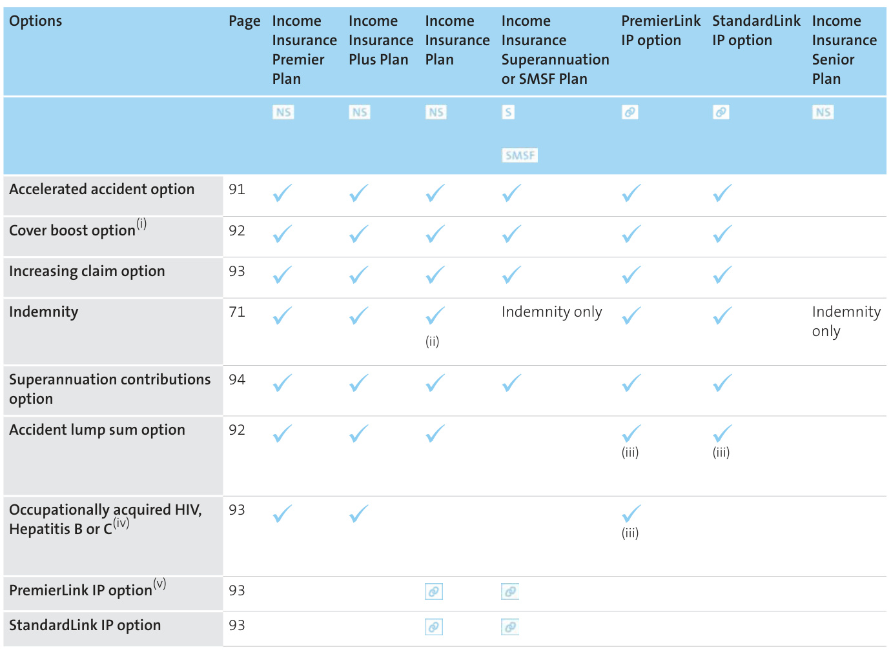  
(i) Occupation categories MP, AA and A only. (ii) Mandatory for StandardLink IP and occupation categories F, BY, CY and DY. (iii) Only available if the PremierLink or StandardLink IP option is linked to the Income Insurance Superannuation or SMSF Plan. (iv) Only available to medical occupation categories MP or AA. (v) Available for occupation categories MP, AA, A, B and C only.  

# Occupation categories  

# Waiting periods (days)  

The following table shows the occupation category that applies to each occupation type.  

Occupation classification is determined by the duties performed not the occupation title. This information will help you identify whether the insured person is eligible for certain AMP Elevate Income insurance products.  

<html><body><table><tr><td>Occupation category</td><td>Description</td></tr><tr><td>MP</td><td>Selected medical professionals. Professionals whose working environment</td></tr><tr><td>AA</td><td>presents minimalaccident/health risk.Includes selected medicalspecialists and dentists.This alsoincludesindividualswhoareinan office-based management role only and are earningin excess of $130,0o0 per annum and are: - Degree qualified, or</td></tr><tr><td>A</td><td>- Individuals who are not degree qualified but have been in their current role for at least two years. Whitecollarworkerswhosedutiesare</td></tr><tr><td>B</td><td>primarily of a sedentary nature with minimal accident/healthrisk. Blue orwhite collarworkerswhose duties</td></tr><tr><td>By(i)</td><td>involve a moderatelevel ofmanualworkwith slight accident/health risk. Blueorwhitecollarworkerswhoseduties</td></tr><tr><td>U</td><td>involveamoderatelevelofmanualworkwith an extra risktoB occupations. Skilled occupationsofapredominantlymanual</td></tr><tr><td>cy(i)</td><td>nature and semi-skilled occupations involving a moderatelevelof manual work,with some accident/health risk. Skilledoccupationsofapredominantlymanual</td></tr><tr><td>D</td><td>nature and semi-skilledoccupationsinvolving amoderatelevelofmanualwork,withanextra risk to C occupations. Predominantly manual labour,physically</td></tr><tr><td>Dy(i)</td><td>strenuousworkwithsignificant accident/healthrisks. Predominantly manual labour, physically</td></tr><tr><td>F farmers.</td><td>strenuousworkwithanextrarisktoD occupations. Farmers who own and work full-time farming on their own properties or full-time share They must have been well established in this mannerforatleastthreeyears.</td></tr></table></body></html>

(i) These occupations are subject to the terms as outlined in Cancellable plans on page 95.  

A waiting period is the period of time that needs to have passed before a benefit is paid. The waiting period starts from the date we agree the insured person is totally or partially disabled from. Other eligibility criteria will apply in the event of a claim.  

<html><body><table><tr><td rowspan="2">Type of plan</td><td colspan="5">Occupation category</td></tr><tr><td>MP, AA, B, C A</td><td></td><td>D</td><td>F</td><td>BY, CY, DY</td></tr><tr><td>Income Insurance Premier Plan PremierLink IP option</td><td>NS ②</td><td>30,60, 30,60, 90,180, ，90,180, 365, 365, 730 730</td><td>N/A</td><td>N/A</td><td>N/A</td></tr><tr><td>Income Insurance Plus Plan</td><td>NS</td><td>30,60, 14, 30, 90,180, 60,90, 365, 180, 730 365, 730</td><td>30, 60, 90, 180, 730</td><td>N/A</td><td>N/A</td></tr><tr><td>Income Insurance Plan StandardLink IP option</td><td>NS ②</td><td>30,60, 14, 30, 90,180, 60,90, 365, 180, 730 365, 730</td><td>30, 60, 90, 180, 730</td><td>14, 30, 60, 90, 180, 730</td><td>14, 30 'DY" 30 only</td></tr><tr><td>Income Insurance Superannuation or SMSF Plan</td><td>s SMSF</td><td>30,60, 14, 30, 90,180, 60,90, 365, 180, 730 365, 730</td><td>30, 60, 90, 180, 730</td><td>14, 30, 60, 90, 180, 730</td><td>14, 30 'DY' 30 only</td></tr><tr><td>Income Insurance Senior Plan</td><td>NS</td><td>30,60 N/A</td><td>N/A</td><td>N/A</td><td>N/A</td></tr><tr><td>Business Expenses Insurance Plan</td><td>NS 30,60, 90</td><td>14, 30, 60,90</td><td>30, 60,90</td><td>N/A</td><td>N/A</td></tr></table></body></html>  

Benefit periods   

<html><body><table><tr><td rowspan="2">Type of plan</td><td colspan="6">Occupation category</td></tr><tr><td>A</td><td>MP, AA, B, C</td><td>D</td><td>F</td><td>BY, CY, DY</td></tr><tr><td>Income Insurance Premier Plan PremierLinkIP option</td><td>NS to age 60,to age 65, to age 70</td><td>2 years, 2 5 years, 5 60 65</td><td>years, years, to age to age</td><td>N/A N/A</td><td>N/A</td></tr><tr><td>Income Insurance Plus Plan</td><td>NS to age 60,to age 65, to age 70</td><td>2 years, 2 5 years, 5 60 65</td><td>2 years, 5 years, to age to age</td><td>N/A years, years</td><td>N/A</td></tr><tr><td>Income Insurance Plan StandardLinkIP option</td><td>NS to age 60,to to age 70</td><td>2 years, 2 5 years, years, 5 years, age 65, 60 65</td><td>5 years to age to age</td><td>2 years， years, 5 to age 60,to age 65</td><td>1 year, 2 years, years</td></tr><tr><td>Income Insurance Superannuation or SMSF Plan</td><td>s SMSF 60,to to age 70</td><td>2 years, 2 5 years, years, to age 5 years, age 65, to age 60 to age 65</td><td>2 years, 5 years</td><td>2 years, 5 to age 60,to age 65</td><td>1 year, 2 years, years</td></tr><tr><td>Income Insurance Senior Plan</td><td>NS</td><td>1year N/A</td><td>N/A</td><td>N/A</td><td>N/A</td></tr><tr><td>Business Expenses Insurance Plan</td><td>NS</td><td>1year</td><td>1 year 1 year</td><td>N/A</td><td>N/A</td></tr></table></body></html>

(i) Not available for some C rated mining industry occupations.  

Please note for the benefit period to age 70, if a claim is paid after age 65, the benefit payable will be reduced each year up to age 70 as set out on page 96.  

The above waiting periods and benefit periods are available; however, there may be instances when not all combinations are available. For eligibility and maximum monthly benefit amounts you should contact your financial adviser .  

# Working in Australia on a temporary visa  

# Occupation categories MP, AA and A only  

The Income Insurance Plus Plan and Income Insurance Plan are available to be purchased while working under a temporary visa. The PremierLink IP option and StandardLink IP option is not available as an option on the Income Insurance Plan in this instance.  

However,duetoimmigrationlawsandrestrictionsplaced on working visas, limitations apply to these contracts.  

Please consult you financial adviser  

# About AMP Elevate Business expenses insurance  

# Cover for your business expenses  

AMP Elevate Business expenses insurance will help to keep your business working, even if you are unable to. We’ll pay some of the fixed costs of running your business if you suffer a sickness or injury that leaves you disabled.  

<html><body><table><tr><td>Planname</td><td>Ownership Description</td><td></td></tr><tr><td>Business</td><td>NS</td><td>Coversomeofyourbusiness</td></tr><tr><td>Expenses Insurance</td><td></td><td>expensesifyou'reunabletowork duetoinjuryorsickness.</td></tr><tr><td>Plan</td><td></td><td>Insure upto100%of your average insurable expenses (see below). Thiswillbeonanindemnitybasis. See more details on page 70 for includedexpenses.</td></tr></table></body></html>  

# Benefits and features at a glance  

# Included benefits and features  

Thefollowingtableoutlinesthebenefitsthatareincluded at no additional cost. Full detail of these benefits can be found on the pages indicated below.  

(i) Not available for occupation categories BY, CY and DY.   

<html><body><table><tr><td>Included benefits and features</td><td>Page</td><td>Business Expenses Insurance Plan NS</td></tr><tr><td>Total disability benefit - duties based</td><td>73</td><td></td></tr><tr><td>Partial disabilitybenefit-duties75 based</td><td></td><td></td></tr><tr><td>Automaticinflation</td><td>72</td><td></td></tr><tr><td>Premiumfreeze</td><td>91</td><td></td></tr><tr><td>Recurring disability</td><td>86</td><td></td></tr><tr><td>Attempted returntowork during waiting period</td><td>84</td><td></td></tr><tr><td></td><td>85</td><td></td></tr><tr><td>Death</td><td>85</td><td></td></tr><tr><td>Upgrade of benefits</td><td>91</td><td></td></tr><tr><td>Waiver of premium</td><td>91</td><td></td></tr><tr><td>24-hourworldwidecover</td><td>91</td><td></td></tr></table></body></html>  

# The business expenses we pay for  

The expenses that we pay for are those that are actually incurred in the operation of the business during the period of the claim and which are essential to producing the income of that business . We will pay:  

– property rates and taxes   
– rent or the regular instalment payment of any loan or mortgage which solely relates to the conduct of the business   
– electricity, gas and water rates, general insurance premiums, cleaning, laundry, heating and telephone accounts, leasing of equipment or motor vehicles, dues to professional bodies   
– salaries of employees who do not contribute directly to the insured person's earnings or the earnings of his or her business and costs directly related to those salaries (eg superannuation)   
– net cost of a medical locum (where fees incurred for the locum exceed the income generated by the locum), and   
– other fixed expenses which are normal and customary in the conduct and operation of the insured person's business .  

# What we won't pay for  

# We won't pay for:  

– goods, wares or merchandise or stock in trade, or   
– depreciation of real estate, or   
– remuneration, however paid, to the insured person or to any other person who directly contributes to the earnings of the insured person or earnings of the business (unless it is for the net cost of a locum detailed above), or   
– remuneration, however paid, to members of the insured person's family unless they were full-time employed at least 30 days prior to the insured person's total disability and they did not directly contribute to the earnings of the insured person or earnings of the business , or   
– any expenses which are not regularly paid or payable, or   
– taxes levied in respect of the expenses or outgoings of business , (including taxes levied pursuant to the Income Tax Assessment Act), or in respect of benefits payable under the plan.  

# Joint business expenses  

If the insured person is a co-owner of the business , we'll calculate, at our discretion, a fair and reasonable share of the business expenses. We will have regard to the ordinary manner in which profits and any losses of the business are allocated between insured person and the other co-owners.  

# Selecting your level of Income insurance and Business expenses insurance  

<html><body><table><tr><td>insurance</td><td>AMP Elevate Income insurance and Business expenses</td><td>AMP Elevate Income Insurance Superannuation Plan and Income Insurance SMsF Plan</td></tr><tr><td>Agreed value or</td><td>NS</td><td>SSMSF</td></tr><tr><td rowspan="4">indemnity</td><td>Whether Income insurance is purchased as an agreed value plan orindemnity plan determinestheway the Total disabilitybenefit andthePartial disabilitybenefit arecalculated. Agreedvalue nsui aosui au l alqee pou siane paa wie e jo juaa au u ued ane paie ue aseuind no</td><td>Agreed value Superannuation Plan or Income Insurance SMsF Plan.</td></tr><tr><td>we'll pay an amount based on the monthly benefit on your insuranceschedule. Agreed valueisnot available foroccupation categories BY, CY, DY, F, the Income Insurance Senior Plan and the Business</td><td></td></tr><tr><td>Expenses Insurance Plan. Indemnity will automatically be offered for these categories/plans. Indemnity</td><td></td></tr><tr><td>If you purchase an indemnity plan, in the event of claim we'll calculate your benefit by taking into account your pre-disability income. The indemnity plan has a lower premium than agreed value plans. The Income Insurance Superannuation Plan, the Income Insurance SMsF Plan and the Income Insurance Senior Plan we'll calculate your benefit by taking into account your actual business expenses incurred.</td><td></td></tr><tr><td>Waiting period</td><td>The waiting period determines how long the insured personThe waiting period determines how long the insured must have been disabled before we start payingyou a benefit. person must have been disabled before we start paying Depending on the plan you choose and the insured person's the Trustee a benefit. occupation classification, you can choose from a waiting period of 14 to 730 days. See page 68 for further detail.</td><td>Depending on the plan you choose and the insured person's occupation classification, you can choose from a waiting period of14to 730 days. See page 68 for further detail.</td></tr><tr><td>Benefit period</td><td>The benefit period determines how long the claim canbe paid for as long as theinsured person is totally or partially disabled. Depending on the plan you choose and the insured person's occupation category, you could choose from a benefit period of 1 year up to a benefit period to age 70. See page 69 for further detail.</td><td></td></tr><tr><td>Occupation category</td><td>ed lm no sunaid au oy dde ue no ueid o ad au edu! lm oae uoednno suosiad pansui au occupations. The key features of the plan that will change based on the insured person's occupation category are: - The total and partial disability definition Your eligibility for a Partial disability benefit - How the Partial disability benefit is calculated - Offset amounts - When your benefit is reduced</td><td></td></tr><tr><td>Premium structure</td><td>- Unemployment and leave without pay provisions. Where the operation of this plan differs depending on the occupation category, the difference will be specified. withtheexception oftheIncome InsuranceSeniorPlanwhichisonlyavailablewith a steppedpremiumstructure. For furtherinformation on premium structures referto the Cost of insurance section on page 29.</td><td></td></tr></table></body></html>  

# Income insurance and Business expenses insurance benefits and features in detail  

Please take the time to read the details about the benefits your income insurance plan or Business Expenses Insurance Plan provides. This section will provide you with the terms and conditions of each benefit and is an important part of this PDS . Your insurance schedule will show you which plan and option(s) apply to you. Please contact us or speak to your financial adviser if you would like any of the details explained to you.  

Please use the symbols below to assist you in identifying which benefits are available for the different terms and conditions.  

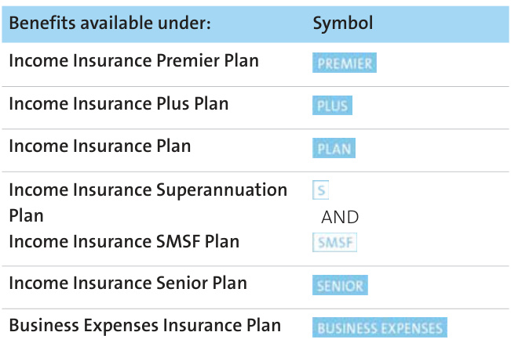  

<html><body><table><tr><td>PremierLink IP option</td><td>PREMIER</td><td>AND</td></tr><tr><td>StandardLinkIP option</td><td>PLAN</td><td>AND</td></tr></table></body></html>

Benefits available under the following options can be identified by:  

# Included benefits  

The benefits explained in this section are included in your plan at no additional cost. A summary is set out in Benefits and features at a glance on page 66 for income insurance plans and on page 70 for the Business Expenses Insurance Plan.  

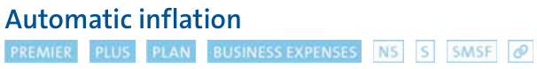  

To protect your benefit against the effects of inflation, up until age 65, your monthly benefit is automatically increased each year on the renewal date by the greater of 3% or the Consumer Price Index (CPI).  

Your premium will increase as a result of this increase in the monthly benefit . You may decline the monthly benefit increase for any particular year or for all years by writing to us.  

The increase to the monthly benefit on the schedule only applies to a claim you make under the plan that happens after the date of the increase. If insured person suffers the injury or sickness before the increase, or are on a claim at the time of the increase, the monthly benefit on the insurance schedule at the start of the claim will apply.  

The increased monthly benefit on the insurance schedule will only apply for any later and separate claims. The increased monthly benefit will be reflected in your premiums.  

These increases only occuruntil the insured person's 65th birthday.  

Automaticinflationwillnotbepermittedwherealoading exceeding 100% is applied to your premium. Any revised terms applicable to your policy will also apply to increases exercised under this benefit.  

# ForIncomeInsuranceSuperannuationPlansandIncome Insurance SMSF plans  

If your premiums are paid by your employer, you must get agreement from your employer to allow indexation to be applied to your plan.  

# The CPI information we use  

The increase we make to the monthly benefit on the schedule will normally be based on the Australian National All Groups Consumer Price Index weighted average of eight capital cities combined. We use the last published Index for the 12 months ending 30 September each year. Any increase will be applied on the next renewal date on or after 1 January the following year. However, we may use the Index published for a more recent 12 month period and/or another index or rate which we believe more fairly and accurately reflects changes in the cost of living.  

# Total disability benefit  

  

If the insured person is totally disabled (defined below), we’ll pay the Total disability benefit.  

The Total disability benefit amount is calculated and paid monthly. If a Total disability benefit amount is paid, we’ll pay half in arrears and half in advance. If a benefit is paid under the Business Expenses Insurance, we'll pay the Total disability benefit amount at the end of each month in arrears.  

What it means to be totally disabled depends on which plan you hold. Except in relation to the Income Insurance Senior Plan and the Business Expenses Insurance Plan, the definition of totally disabled also depends on the occupation category (see page 68).  

The insured person must meet the requirements for making a claim as set out in How to claim on page 34.  

<html><body><table><tr><td>Plan or option</td><td>Total disability definition</td></tr><tr><td>Income Insurance</td><td>Total disability-Hours,income and dutiesbased definition</td></tr><tr><td>Premier Plan PremierLink IP option</td><td>For all occupations except C rated mining industry occupations</td></tr><tr><td></td><td>The insured person is totally disabled if, because of an injury or sickness, he or she is: - under medical care, and</td></tr><tr><td></td><td>- not working in any occupation (whether paid or unpaid), and</td></tr><tr><td></td><td>- unable to do one or more duties that are important and essential in producing income of his or her occupation, or</td></tr><tr><td></td><td>- unable to do the duties that are important and essential in producing income of his or her</td></tr><tr><td></td><td>occupation for more than 10 hours per week, or - unable to generate more than 20% of his or her pre-disability income.</td></tr><tr><td>OR</td><td></td></tr><tr><td></td><td>- under medical care, and</td></tr><tr><td></td><td>- working less than 1o hours per week and unable to do the duties that are important and essential</td></tr><tr><td></td><td></td></tr><tr><td></td><td>For Cratedminingindustry occupations The insured person is totally disabled if, because of an injury or sickness, he or she is:</td></tr><tr><td></td><td>- under medical care, and</td></tr><tr><td></td><td>pue (iedun so pied sauaum) uonednono Kue ui uyom ou - - not capable of doing one or more duties that are important and essential in producing income</td></tr><tr><td></td><td>of his or her occupation, or</td></tr><tr><td></td><td>or her occupation for more than 1o hours per week, or</td></tr><tr><td></td><td>-not capable of generating more than 20% of his or her pre-disability income.</td></tr><tr><td></td><td>OR － under medical care, and</td></tr><tr><td></td><td>- working less than 10 hours per week and not capable of doing the duties that are important and essential in producing income of his or her occupation for more than 10 hours per week.</td></tr><tr><td>Income Insurance Plus</td><td>Total disability-dutiesbased definition</td></tr><tr><td>Plan</td><td></td></tr><tr><td>Income Insurance Plan</td><td>Occupation categories MP, AA,A,B, C,BY, CY and DY</td></tr><tr><td>Income Insurance Senior</td><td></td></tr><tr><td>Plan</td><td>－ under medical care, and</td></tr><tr><td>Income Insurance</td><td>ue (piedun o pied lauaum) uoednoo Kue ui usyom pou -</td></tr><tr><td>Superannuation Plan</td><td>- not capable of doing one or more duties that are important and essential in producing income of his</td></tr><tr><td>Income Insurance SMSF</td><td>or her occupation. Occupation category D</td></tr><tr><td>Plan StandardLink IP option</td><td>For the first two years of a claim the insured person is totally disabled if, because of an injury or sickness,</td></tr><tr><td></td><td>he or she is:</td></tr><tr><td></td><td>- under medical care, and pue (piedun o pied sauaym) uoednoo Kue ui usyom pou -</td></tr><tr><td></td><td>- not capable of doing one or more duties that are important and essential in producing income of his</td></tr><tr><td></td><td>or her occupation.</td></tr><tr><td></td><td>After the first two years of a claim, the insured person is totally disabled if, because of an injury or sickness,</td></tr><tr><td></td><td>he or she is:</td></tr><tr><td></td><td>- under medical care, and</td></tr><tr><td></td><td>- not working in any occupation (whether paid or unpaid), and</td></tr><tr><td></td><td>not capable of performing any occupation (whether paid or unpaid) for which he or she isreasonably fitted by education, training or experience.</td></tr></table></body></html>  

How much we pay for Total disability   

<html><body><table><tr><td>Plan or option</td><td>Total disability definition OccupationcategoryF</td></tr><tr><td></td><td>For the first two years of a claim the insured person is totally disabled if, because of an injury or sickness, he or she is: - under medical care, and - not capable of doing normal farming duties. Afterthefirst two years ofa claim,the insured person is totally disabled if, because of an injury orsickness, he or she is: - under medical care, and - not working in any occupation (whether paid or unpaid), and</td></tr><tr><td>BusinessExpenses Insurance Plan</td><td>fitted by education, training or experience. A benefit will only be paid if the insured person owns a business immediatelybefore and during his or her total disability, and he or she was actively managing that business immediately before his or her total disability. The insured person is totally disabled if, because of an injury or sickness, he or she is: - under medical care, and ue (iedun o pied auaum) uonedno Kue ui usom ou - not capable of doing one or more duties that are important and essential in producing income of his or her occupation.</td></tr></table></body></html>  

The amount we pay depends on the plan , the plan type and occupation category (see page 68) specified in the insurance schedule.  

Please note for the benefit period to age 70, and if the insured person is age 65 and above, the monthly benefit will reduce each year as set out in the section for If your benefit period is to age 70 on page 96.  

<html><body><table><tr><td>Plan or option</td><td>Plan type</td><td>Totaldisabilitybenefitamount</td></tr><tr><td>Income Insurance Premier Plan Income Insurance PlusPlan Income InsurancePlan PremierLink/StandardLink IP option</td><td>Agreed value</td><td>TheTotal disabilitybenefit amount is themonthlybenefit as setout inthe insurance schedule.TheTotal disability benefit amount may beadjusted if you receive income from other sources (page 74). Agreed value is not available for income insurance plans through super, unless it is selected through the plan held outside super issued underthePremierLink IP or StandardLink IP option (page 93).</td></tr><tr><td>IncomeInsurancePremierPlan IncomeInsurancePlusPlan IncomeInsurancePlan Income Insurance Senior Plan Income Insurance Superannuation Plan IncomeInsuranceSMsFPlan PremierLink IP option</td><td>Indemnity</td><td>For all occupation categories except for F TheTotaldisabilitybenefitamountisthelowerof: -the monthly benefit set out in the insurance schedule, and - 75% of the insured person's pre-disability income. OccupationcategoryF The Total disability benefit amount is the lower of: -the monthlybenefit set out in the insurance schedule,and - 30% of the insured person's pre-disability income.</td></tr><tr><td>BusinessExpensesInsurancePlan</td><td>IndemnityThe Total disability benefit amount is the lower of:</td><td>- the monthly benefit amount set out in the insurance schedule, and -theinsuredperson'sshareofthebusinessexpenses actuallyincurred while on claim in the operation oftheirbusiness. We'll paythe insured person's business expenses (page 7o) up to the Total disability benefit amount for which he or she is insured. The amount we pay is also subject to the maximum Total disability benefit amount limits applicable at the time you applied for this plan. The maximum we pay is 12 times the Total disability benefit amount. Whenever payment in any particular month during the benefit period is less than the Totaldisabilitybenefitamount,we'llextend thebenefitperiod attheendof the 12 month period until we have paid a total amount equalto 12 times the Total disability benefit amount. For part of a month, we pay 1/30th of the Total disability benefit amount for each day you are entitled to be paid.</td></tr></table></body></html>  

Rehabilitation expenses under the Income Insurance Superannuation Plan and the Income Insurance SMSF Plan If the insured person is totally disabled for at least the waiting period , we may require the insured person to undergo, at our expense (up to a maximum amount of six times the Total disability benefit amount ), rehabilitation that is designed to assist the insured person in returning to full-time work provided that a medical practitioner states in writing that they have the capacity to participate in the rehabilitation .  

# Partial disability benefit  

#  

  

If the insured person is partially disabled, we may pay a reduced benefit as a Partial disability benefit. We’ll pay monthly in arrears.  

What it means to be partially disabled depends on the plan, plan type and the occupation category (see page 68).  

<html><body><table><tr><td>Plan or option</td><td>Partial disability definition</td></tr><tr><td>Income Insurance Premier Plan</td><td>Hoursanddutiesbaseddefinition For all occupations except C rated mining industry occupations</td></tr><tr><td>PremierLink IP option</td><td>entire duration of the waiting period, he or she has returned to work and, solely because of injury or sickness, he or she is: - not able to do one or more duties that are important and essential in producing income of his or her occupation, or</td></tr><tr><td></td><td>- able to do one or more duties that are important and essential in producing income of his or her occupation, but in a reduced capacity, AND - earning less than:</td></tr><tr><td></td><td>- 75% of his or her pre-disability income (for an indemnity plan), AND</td></tr><tr><td></td><td></td></tr><tr><td></td><td>- under medical care.</td></tr><tr><td></td><td>If he or she meets the above definition and is unable to work for more than 10 hours per week, we'll pay</td></tr><tr><td></td><td>a benefit equal to the Total disability benefit amount (page 74).</td></tr><tr><td></td><td>For Crated miningindustry occupations</td></tr><tr><td></td><td></td></tr><tr><td></td><td>entire duration of the waiting period, he or she has returned to work or is capable of returning to work</td></tr><tr><td></td><td>as determined by us based on medical evidence and, solely because of injury or sickness, he or she is:</td></tr><tr><td></td><td>- not capable of doing one or more duties that are important and essential in producing income of his</td></tr><tr><td></td><td>or her occupation, or</td></tr><tr><td></td><td>- capable of doing one or more duties that are important and essential in producing income of his or</td></tr><tr><td></td><td>her occupation, but in a reduced capacity,</td></tr><tr><td></td><td>AND</td></tr><tr><td></td><td>－ earning less than:</td></tr><tr><td></td><td>- his or her pre-disability income (for an agreed value plan), or</td></tr><tr><td></td><td>- 75% of his or her pre-disability income (for an indemnity plan), AND</td></tr><tr><td></td><td>- under medical care.</td></tr><tr><td></td><td>If he or she meets the above definition and is not capable of working for more than 10 hours per week,</td></tr><tr><td>Income Insurance Plus</td><td>we'll pay a benefit equal to the Total disability benefit amount (page 74).</td></tr><tr><td>Plan</td><td>Dutiesbased definition</td></tr><tr><td>Income Insurance Plan</td><td>Occupation categories MP,AA and A</td></tr><tr><td>Income Insurance</td><td></td></tr><tr><td>Superannuation Plan(i)</td><td>consecutive 12 days, he or she returned to work or was capable of returning to work as determined by us</td></tr><tr><td>Income Insurance SMSF Plan(i)</td><td>based on medical evidence, and,because of the disability,he orshe is:</td></tr><tr><td>StandardLink IP option</td><td>- not capable of doing one or more duties that are important and essential in producing income of his or her occupation, or</td></tr><tr><td></td><td>capable of doing one or more duties that are important and essential in producing income of his or</td></tr><tr><td></td><td>her occupation, but in a reduced capacity,</td></tr><tr><td></td><td>AND</td></tr><tr><td></td><td></td></tr><tr><td></td><td></td></tr><tr><td></td><td>- earning an income less than:</td></tr><tr><td></td><td></td></tr><tr><td></td><td></td></tr><tr><td></td><td>- his or her pre-disability income (for an agreed value plan), or</td></tr><tr><td></td><td></td></tr><tr><td></td><td></td></tr><tr><td></td><td></td></tr><tr><td></td><td></td></tr><tr><td></td><td></td></tr><tr><td></td><td></td></tr><tr><td></td><td></td></tr><tr><td></td><td></td></tr><tr><td></td><td></td></tr><tr><td></td><td></td></tr><tr><td></td><td></td></tr><tr><td></td><td></td></tr><tr><td></td><td></td></tr><tr><td></td><td></td></tr><tr><td></td><td></td></tr><tr><td></td><td></td></tr><tr><td></td><td></td></tr><tr><td></td><td></td></tr><tr><td></td><td></td></tr><tr><td></td><td></td></tr><tr><td></td><td></td></tr><tr><td></td><td></td></tr><tr><td></td><td></td></tr><tr><td></td><td></td></tr><tr><td></td><td></td></tr><tr><td></td><td></td></tr><tr><td></td><td></td></tr><tr><td></td><td></td></tr><tr><td></td><td></td></tr><tr><td></td><td></td></tr><tr><td></td><td></td></tr><tr><td></td><td></td></tr><tr><td></td><td></td></tr><tr><td></td><td></td></tr><tr><td></td><td></td></tr><tr><td></td><td></td></tr><tr><td></td><td>- 75% of his or her pre-disability income (for an indemnity plan),</td></tr><tr><td></td><td></td></tr></table></body></html>  

AND  

# – under medical care  

# Occupation categories B and C  

The insured person is partially disabled if, immediately after being totally disabled for at least 14 days, he orshereturnedtoworkorwascapableofreturningtoworkasdeterminedbyusbasedonmedicalevidence, and, because of the disability, he or she is:  

– not capable of doing one or more duties that are important and essential in producing income of his or her occupation, or  

– capable of doing one or more duties that are important and essential in producing income of his or her occupation, but in a reduced capacity,  

AND  

– earning an income less than: –his or her pre-disability income (for an agreed value plan), or – 75% of his or her pre-disability income (for an indemnity plan),  

AND  

# – under medical care  

# Occupation category D  

The insured person is partially disabled if, immediately after being totally disabled for at least 14 days, he orshereturnedtoworkorwascapableofreturningtoworkasdeterminedbyusbasedonmedicalevidence, and, because of the disability:  

– for the first two years of the claim, the insured person is:  

–not capable of doing one or more duties that are important and essential in producing income of his or her occupation, or   
– capable of doing one or more duties that are important and essential in producing income of his or her occupation, but in a reduced capacity,  

AND  

– after the first two years of a claim, the insured person is:  

–not capable of doing one or more duties that are important and essential in producing income of any occupation (whether paid or unpaid) for which he or she is reasonably fitted by education, training or experience, or   
– capable of doing one or more duties that are important and essential in producing income of any occupation (whether paid or unpaid) for which he or she is reasonably fitted by education, training or experience, but in a reduced capacity,  

AND  

– earns an income less than: –his or her pre-disability income (for an agreed value plan), or – 75% of his or her pre-disability income (for an indemnity plan),  

AND  

– under medical care .Occupation categories BY, CY and DY  

The insured person is partially disabled if, immediately after being totally disabled for at least 14 days, he orshereturnedtoworkorwascapableofreturningtoworkasdeterminedbyusbasedonmedicalevidence, and, because of the disability, he or she is:  

– not capable of doing one or more duties that are important and essential in producing income of his or her occupation, or   
– capable of doing one or more duties that are important and essential in producing income of his or her occupation, but in a reduced capacity,  

AND  

– earning less than 75% of his or her pre-disability income , and  

– under medical care  

# Occupation category F  

The insured person is partially disabled if, immediately after being totally disabled for a least the waiting period , he or she returned to work and because of the disability is:  

– unable to perform at least 25% of his or her normal farming duties, or  

– working in an occupation other than farming and earns an income less than 75% of the pre-disability income ,AND  

<html><body><table><tr><td>Plan or option</td><td>Partial disability definition</td></tr><tr><td>or her occupation, or her occupation, but in a reduced capacity, AND - under medical care. practitioners nominated by us.</td><td>7 out of a consecutive 12 days of the waiting period, he or she has returned to work or was capable of returningto work as determined by us based on medical evidence and, solely because of injury or sickness, he or she is: - not capable of doing one or more duties that are important and essential in producing income of his or her occupation, or her occupation,but in a reduced capacity, AND - under medical care. We'll, at our discretion, consider the opinion of the insured person's medical practitioner and medical practitioners nominated by us. Occupation categories B, C and D The insured person is partially disabled if, immediately after being totally disabled for a period of at least 14 days of the waiting period, he or she has returned to work or was capable of returning to work as determined by us based on medical evidence, and, solely because of injury or sickness, he or she is: - not capable of doing one or more duties that are important and essential in producing income of his We'll, at our discretion, consider the opinion of the insured person's medical practitioner and medical</td></tr></table></body></html>

(i) For Income Insurance Superannuation Plan or Income Insurance SMSF Plan, only the indemnity plan type is available.  

# How much we pay for partial disability  

How much we pay depends on the plan, the plan type, and the occupation category.  

<html><body><table><tr><td>Plan or option</td><td>Plan type</td><td>How much we pay for partial disability</td></tr><tr><td>IncomeInsurance Premier Plan PremierLink IP option</td><td>Agreed value Important note:</td><td>The amount we pay is worked out by applying the formula: (A-B) xC A Where: A equals the insured person's pre-disability income. B is the insured person's average monthly income during the period for which he or she is partially disabled. B will equal zero if income is a loss. C is the monthly benefit specified on the insurance schedule. For all occupation categories except C rated mining industry</td></tr><tr><td>IncomeInsurancePlus Plan Income InsurancePlan</td><td>Agreed value</td><td>If the insured person satisfies the Partial disability definition and is unable to work more than 10 hours per week, B will equal zero. For all C rated mining industry occupations If the insured person satisfies the Partial disability definition and is not capable of working more than 10 hours per week, B will equal zero. For the purposes of B in the formula, if the insured person satisfies the Partial disability definition and has not returned to work but medicalevidence showsthat he orsheis capable of returning to work, income is the amount the insured person would be capable of earning as determined by us. Occupation categories MP,AA,A,B,Cor D The amount we pay is worked out by applying the formula: (A-B)</td></tr><tr><td>StandardLink IP option</td><td></td><td>A Where: A equals the insured person's pre-disability income. B is the insured person's average monthly income during the period for which he or she is partially disabled. B will equal zero if income is a loss. C is the monthly benefit specified on the insurance schedule. For the purpose of B, if the insured person has not returned to work but medical evidence</td></tr><tr><td>Income Insurance Premier Plan PremierLink IP option</td><td>Indemnity Important note: earning as determined by us.</td><td>shows he or she is capable of returning to work, income is the amount that the insured person would be capable of earning as determined by us. The amount we payforeach month that theinsured person is partially disabled is the lower of: - A-B, or -C-B. Where: A equals 75% of the insured person's pre-disability income. B is the insured person's average monthly income during the period for which he or she is partially disabled. B will equal zero if income is a loss. C is the monthly benefit specified on the insurance schedule. If theinsured person satisfies thePartial disability definition and is unableto workmore than 10 hours per week, B will equal zero. For all Crated miningindustry occupations If the insured person satisfies the Partial disability definition and is not capable of working more than 10 hours per week, B will equal zero. For thepurposes ofBinthe formula,iftheinsuredperson satisfiesthePartial disability definition and has not returned to work but medical evidence shows that he or sheis capable of returning to work, income is the amount that the insured person would be capable of</td></tr></table></body></html>  

<html><body><table><tr><td>Plan or option</td><td>Plan type</td><td>How much we pay for partial disability</td></tr><tr><td>IncomeInsurancePlus Plan IncomeInsurancePlan Income Insurance Superannuation Plan IncomeInsuranceSMsF Plan</td><td>Indemnity Occupation category F insuredpersonispartiallydisabled.</td><td>OccupationcategoriesMP,AA,A,B,C,D,BY,CYandDY The amount we payforeach month thattheinsured personis partially disabled isthe lower of: - A-B, or -C-B. Where: Aequals75%oftheinsuredperson'spre-disabilityincome. B is the insured person's average monthly income during the period for which he or she is partially disabled.B will equal zero if income is a loss. Cis themonthlybenefitspecifiedontheinsuranceschedule.WhereCismorethanthe insured person's pre-disability income, we'll use his or her pre-disability income for the Income Insurance Superannuation Plan and Income Insurance SMsF Plan. For thepurposeof B,if theinsured personhasnotreturned to workbut medical evidence shows he or sheis capable of returning to work,incomeis the amount that theinsured person would be capable of earning as determined by us. The amount we pay is 25% of the Total disability benefit amount foreach month that the</td></tr></table></body></html>  

For the Business Expenses Insurance Plan   

<html><body><table><tr><td>Plan</td><td>Plan type</td><td>How much we pay for partial disability</td></tr><tr><td>BusinessExpenses Insurance Plan</td><td>Indemnity  The amount we pay will be determined on a daily basis and will be paid monthly in arrears.</td><td>It will be the lower of the: Totaldisabilitybenefitamount,and -the insured person's share of thebusinessexpenses actually incurred which relate to the period theinsured personispartially disabled less: -any amountsthat are reimbursed from elsewhere,and theinsuredperson'sshareofthebusinessturnoverforthatperiod. Business turnover for a period will be the gross income of the businessfor the period of partial disability. Theinsuredperson'sshare ofbusinessexpenses actuallyincurred,orofbusinessturnover, will be determined in line with the usual manner of apportioning profits and/or losses of the business between the insured person and any co-owners of the business. When the insured person is partially disabled and is not working but is capable of returning to work, business turnover will be determined by us based on his or her capacityto return to work basedonmedical and otherevidence. The maximum we pay is 12 times the Total disability benefit amount. Whenever payment in any particular month during the benefit period is less than the Total disability benefit amount,we'llextendthebenefitperiod attheendofthe12monthperioduntilwehave paid a total amount equal to 12 times the Total disability benefit amount.</td></tr></table></body></html>  

# If the insured person has been totally disabled but is capable of returning to work in a partial capacity  

Only applies to the Income Insurance Plus Plan, Income Insurance Plan, Income Insurance Superannuation Plan, Income Insurance SMSF Plan  

Depending on the insured person's occupation category, a reduced benefit may be payable where the insured person does not return to work. The amount we pay will be worked out applying the formula as set out in the How much we pay for partial disability section above.  

# Occupation categories MP, AA and A  

If the insured person has been totally disabled for at least 7 out of a consecutive 12 days, and does not return to work but medical evidence demonstrates a capacity to work, we may pay a Partial disability benefit based on the insured person 's capacity to return to work.  

# Occupation categories B, C, D, BY, CY, DY and F  

If the insured person has been totally disabled for at least 14 days, and does not return to work but medical evidence demonstrates a capacity to work, we may pay a Partial disability benefit based on the insured person's capacity to return to work.  

# When your benefit is reduced  

An offset amount is the amount which we may reduce your benefit due to any sum of money that you or the insured person receive from any other source. The offset amount depends on the plan that applies and your occupation category (see page 68). However, we won't pay more than the Total disability benefit amount in all situations.  

If we're paying a benefit under the plan , your benefit may be reduced to nil because of the offset amounts . In this case, we’ll be deemed to be paying you a benefit, even though no money is paid by us.  

Offset amounts   

<html><body><table><tr><td>and plan</td><td>Occupation</td><td>Occupation category We'll reduce the benefit we pay if you or the insured person receives any of the following: We'llreducetheTotaldisabilitybenefit</td></tr><tr><td>NS</td><td>categories MP, AA and A</td><td>amount or Partial disability benefit amount we pay by any amount that is paid (whether bylump sum, periodic payment or otherwise) for any injury or sickness under any otherdisability income,sickness oraccidentplanwith another company which commenced, or had been applied for, by or on behalf oftheinsuredpersonbeforethisplan and was not disclosed to us before this plancommenced.</td></tr><tr><td>NS</td><td>Occupation categories B, C, D, BY, CY, DY and F, or if you've purchased the Income Insurance Senior Plan</td><td>We'llreducetheTotaldisabilitybenefit amountorPartialdisabilitybenefit amount we pay by any amount that is paid (whether bylump sum,periodic payment or otherwise)for anyinjury or sickness: -underlegislation, or by way of any other disability income, sickness or accident plan with another company which commenced or had been applied for priorto this plan and was not disclosed to us before this plan commenced.</td></tr><tr><td>s Income SMSF Insurance Superannuation Plan Income Insurance SMSF Plan</td><td>or</td><td>We'llreducetheTotal disabilitybenefit amountorPartialdisabilitybenefit amount we payby any amount that is paid or payable (whether by lump sum, periodic paymentorotherwise)for any injury or sickness: underlegislation,or by way of any other disability income, sickness or accident plan, undercommonlaw,and/or from any employer paid leave (including sick leave, annual leave and long service leave). It is a requirement under superannuationlawthatyoucannot receivemorethan1o0%ofthe pre-disability income (excluding any increasesduetoAutomaticinflationon</td></tr></table></body></html>  

<html><body><table><tr><td>and plan</td><td>Occupation category  We'll reduce the benefit we pay if you or the insured person receives any of the following:</td></tr><tr><td></td><td>page 72) from all sources. Therefore we may reduce the benefit we pay accordingly. Therefore, we'll limit your benefit so that the total amountsreceived: - from income, or under legislation, or at common law, or by way of any other disability income, sickness or accident plan, or from any employer paid leave (including sick leave, annual leave and long service leave), or from any otheroffset amounts, and/or - this plan donotexceed1oo%oftheinsured person'spre-disabilityincomeatthe time he or she became ill or injured.</td></tr></table></body></html>  

# When income is received as a lump sum  

If an offset amount is paid as a lump sum, we'll only reduce what we pay by the portion of the lump sum relating to income for the same period.  

If the amount relating to income is not easy to identify within the lump sum, we'll agree to an offset amount with you. If we cannot agree, we will determine the amount of the lump sum relating to income .  

When we won’t reduce your benefit   

<html><body><table><tr><td colspan="2">and plan Occupation</td><td>Occupation category When your benefit is not reduced</td></tr><tr><td colspan="2">NS categories MP, AA and A</td><td>Wedonotreducewhatwepaybyany amounts paid to you: - from a disability income, sickness or accident plan that commenced afterthis plan commenced,or by way of lump sum total and permanent disablement benefits, or anybusiness overheads disability planbenefitsindemnifyingyou against business expenses, or by way of superannuation benefits (excludinginsurance),or by way of social security benefits, or by way of any payment made under</td></tr><tr><td>NS We do not reduce what wepay by any amountspaidtoyou: -froma disabilityincome,sickness that commenced after this plan</td><td>Occupation categories B, C, D, BY, CY, DY and F</td><td>legislation, or by way of any employer paid leave (including sick leave, annual leave and longserviceleave). oraccident plan with any company commenced,or by way of lump sum total and permanent disablement benefits,</td></tr></table></body></html>  

<html><body><table><tr><td>and plan</td><td>Occupation category When your benefit is not reduced</td></tr><tr><td></td><td>or anybusiness overheads disability plan benefits indemnifyingyou against business expenses,or by way of superannuation benefits (excluding insurance), or by way of social security benefits, or by way of any employer paid leave (including sick leave, annual leave and long service leave).</td></tr><tr><td>NS Income Insurance SeniorPlan</td><td>We donot reduce what wepaybyany amounts paid to you: by way of lump sum total and permanent disablement benefits, or any business overheads disability plan benefits indemnifying you against business expenses, or by way of superannuation benefits (excluding insurance), or by way of social security benefits, or by way of any employer paid leave (including sick leave, annual leave and long service leave).</td></tr><tr><td>Income SMSF Insurance Superannuation Plan Income Insurance SMSF Plan</td><td>Wedonotreducewhatwepaybyany amounts paid to you: by way of superannuationbenefits (excluding insurance), or by way of social security benefits.</td></tr></table></body></html>  

# How the Total disability benefit amount is reduced  

We won't pay more than the Total disability benefit amount in all situations.  

If you have a claim under the plan, your benefit may be reduced to nil because of these offset amounts . In this case, we'll be deemed to be paying a benefit, even though you receive no money from us.  

<html><body><table><tr><td>Plan type</td><td>How your Total disability benefit is reduced</td></tr><tr><td>Agreed value Where:</td><td>If the insured person is totally disabled and75%of theirpre-disabilityincome ishigher than theTotal disability benefit amount, the amount we pay is worked out by applying the formula: (0.75 x A) - D Where: Aequalstheinsuredperson's pre-disabilityincome. Disthesumoftheoffsetamounts. If the insured person is totally disabled and 75%of their pre-disabilityincome is lower than the Total disability benefit amount, the amount we pay is worked out by applying the formula: C-D C is the Total disability benefit amount. Dis thesum ofthe offsetamounts.</td></tr></table></body></html>  

<html><body><table><tr><td>Plan type</td><td>How your Total disability benefit is reduced</td></tr><tr><td>Indemnity</td><td>For all occupation categories except for F We'll onlyreduce theTotaldisability benefitamountiftheoffsetamounts, plus the Total disability benefit amount payable to you under this plan, total more than 75% of the insured person's pre-disability income. If this applies, we'll reduce theTotal disability benefit amountunderthisplanto an amount which,whenaddedtotheoffset amounts,equals75%oftheinsured person's pre-disability income. Occupation categoryF We'll only reduce the Total disability benefitamountiftheoffsetamounts, plus the Total disability benefit amount payable to you under this plan, total more than 30% of the insured person's pre-disability income. If this applies, we'llreducetheTotaldisabilitybenefit amount under this plan to an amount which,whenadded totheoffset amounts,equals30%oftheinsured person'spre-disabilityincome.</td></tr></table></body></html>  

# How the partial disability benefit is reduced  

We won't pay more than the Total disability benefit amount in all situations.  

If you have a claim under the plan, your benefit may be reduced to nil because of these offset amounts . In this case, we will be deemed to be paying a benefit, even though you receive no money from us.  

<html><body><table><tr><td>Plan type</td><td>How your Partial disability benefit is reduced</td></tr><tr><td>Agreedvalue</td><td>If the insured person is partially disabled, the amount we pay is worked out by applying the formula:</td></tr><tr><td></td><td>A-B-D Where:</td></tr><tr><td></td><td>Aequals theinsured person's pre-disabilityincome. If you've purchased the Income</td></tr><tr><td></td><td>Insurance PremierPlan or PremierLink IP option,B is: For all occupations except C rated mining industry occupations the insured person's average monthly</td></tr><tr><td>zero.</td><td>income during the period for which he or sheispartially disabled.Ifincome is a loss or, during the first six months of receiving a benefit,theinsured person isunabletoworkmorethan1ohours per week and earns less than his or her pre-disability income, then B will equal</td></tr></table></body></html>  

<html><body><table><tr><td>Plan type</td><td>How your Partial disability benefit is reduced For all C rated mining industry</td></tr><tr><td></td><td>occupations the insured person's average monthly income during the period for which he or she is partially disabled. If income is a loss or, during the first six months of receiving a benefit, the insured person is not capable of working more than 10 hours per week and earns less than his or her pre-disability income, then B will equal zero. If you've purchased the Income InsurancePlusPlanorIncomeInsurance Plan, B equals: the insured person's average monthly income during the period for which he or she is partially disabled. If income is a loss, then B will equal zero. Disthesumofanyoffsetamounts. However, we won't pay more than the Total disability benefit amount. The benefit can only be reduced to the extent that the benefit payable when addedtoallotherincomereceived,no longer exceeds 100% of your</td></tr><tr><td>Indemnity</td><td>pre-disability income. For all occupation categories except F We'll onlyreducethePartial disability benefit amount if the offset amounts, plus the benefit payable underthis plan, totalmorethan75%oftheinsured person's pre-disabilityincome.If this applies, we'll reduce the benefit to an amount which, when added to the offsetamounts,equals75%ofthe insuredperson'spre-disabilityincome. ForoccupationcategoryF We'll onlyreducethePartial disability benefitamountiftheoffsetamounts, plusthebenefit payable underthis plan, totalmorethan30%oftheinsured person's pre-disabilityincome.If this applies, we'll reduce the benefit to an amountwhich,whenaddedtothe offsetamounts,equals30%ofthe insured person's pre-disability income.</td></tr></table></body></html>  

If you receive any offset amounts you must promptly inform us in writing and provide us with full details of the amounts you have received. We may then reduce the benefit or recover the amount of any benefits overpaid to you, which should have been reduced by any offset amounts.  

We may also require you to sign a written undertaking, on such terms as we require, enabling us to recover any offset amount .  

# When your benefit is reduced  

An offsetamount istheamountbywhichwemayreduce your benefit due to any sum of money that you or the insured person receive from any other source. The offset amount depends on your occupation category (see page 68).  

<html><body><table><tr><td>Occupation category</td><td>We'll reduce thebenefitwepayif you or the insured person receives any of the following:</td></tr><tr><td>Occupation categories MP, AA and A</td><td>We'llreducetheTotaldisabilitybenefit amountorPartialdisabilitybenefitamount we pay by any amount which is paid (whether by lump sum, periodic payment or otherwise)for anyinjury or sickness under any other business expenses plan withanothercompanywhichcommenced, orhad been appliedfor,by oronbehalf of theinsuredpersonbeforethisplanandwas not disclosed to us before this plan</td></tr><tr><td>Occupation categories B, C and D</td><td>commenced. We'llreducetheTotaldisabilitybenefit amount or Partial disability benefit amount we pay by any amount which is paid (whether by lump sum, periodic payment or otherwise) for any injury or sickness under: - legislation, or any other business expenses plan with another company which commenced or had been applied for by or onbehalf of the insured person before this plan andwasnotdisclosedtousbeforethis plancommenced.</td></tr></table></body></html>  

Such amounts are defined under this plan as offset amounts . We will only do this if the amount paid covers thesameorsimilarbusinessexpensesastheplan.Ifwe're paying a benefit under the plan, your benefit may be reduced to nil because of these offset amounts . In this case, we'll be deemed to be paying a benefit, even though you receive no money from us.  

# We may reduce the benefit by the insured person's earnings  

If the insured person earns money from the business , or if the insured person is a co-owner and the insured person 's share of the business earns money, during a period for which we are paying a benefit, the amount he or she earns in any month may be deducted from the benefit we pay. If we deduct earnings , we’ll first reduce them by any costs. That is, any amount paid by the business in any way to the replacement, or to any other employee at the business who generated those earnings .  

# When will we deduct earnings  

In deciding whether we’ll deduct earnings , we’ll calculate the difference between the actual monthly business expenses incurred and the monthly Total disability benefit amount for which you’re insured.  

We’ll deduct net earnings ( earnings less costs) from the Total disability benefit amount we pay, if the net earnings in the period we’re paying a benefit are more than or equal to that difference.  

Examples   

<html><body><table><tr><td rowspan="5">Example 1</td><td>business expenses</td><td>$10,000 earnings</td><td>$5,000</td></tr><tr><td>less Total disability benefit amount</td><td></td><td>$7,000 less costs $3,000</td></tr><tr><td>Difference</td><td>$3,000 ）net</td><td>$2,000 earnings</td></tr><tr><td>As the amount of net earnings ($2,0oo) is less thanthedifferencebetweenactualbusiness expenses and the Total disability benefit amount ($3,0oo), we will not deduct earnings from the actual monthlybusiness expenses.Therefore,as you're entitled to monthly business expenses up to the Total disability benefit amount, we'll pay you $7,000.</td><td></td><td></td></tr><tr><td rowspan="5">Example 2</td><td>business expenses</td><td>$10,000 earnings</td><td>$5,000</td></tr><tr><td>less Total disability benefit</td><td>$9,000 less costs $3,000</td><td></td></tr><tr><td>amount Difference</td><td>$1,000 ）net earnings</td><td>$2,000</td></tr><tr><td>As the amount of the net earnings ($2,0oo) is more than the difference between the actual business expenses and theTotal disabilitybenefit</td><td>amount($1,0oo), we'll deduct the net earnings</td><td></td></tr><tr><td>business expenses</td><td>from the monthlybusiness expenses as follows:</td><td>$10,000</td></tr><tr><td rowspan="5"></td><td colspan="2">less net earnings</td><td>$2,000</td></tr><tr><td colspan="2">net business expenses</td><td>$8,000</td></tr><tr><td colspan="2"></td><td>As you're entitled to monthly business expenses</td></tr><tr><td colspan="2">uptotheTotal disabilitybenefit amount,we'll pay you $8,000.</td><td></td></tr></table></body></html>  

# We may recover any offset amounts  

If you receive any offset amounts you must promptly inform us in writing and provide us with full details of the amounts you have received. We may then reduce the benefit or recover the amount of any benefits overpaid to you, which should have been reduced by any offset amounts .  

We may also require you to sign a written undertaking, on such terms as we require, enabling us to recover any offset amount .  

# Total and Partial disability benefit while unemployed or on leave without pay  

# Total disability benefit  

Not available for occupation categories BY, CY, DY, F or if you've purchased the Income Insurance Senior Plan If immediately preceding a claim the insured person has been:  

– unemployed for 15 months or more (not available for income insurance plans through super), or – on leave without pay for 12 months or more,  

the insured person is totally disabled if, because of an injury or sickness , he or she is:  

– under medical care , and   
– not working in any occupation (whether paid or unpaid), and   
– not capable of performing any occupation (whether paid or unpaid) for which he or she is reasonably fitted by education, training or experience.  

Partial disability benefit   

<html><body><table><tr><td>Plan or option</td><td>Partial disability benefit while unemployed or on leave without pay</td></tr><tr><td>Income Insurance Premier Plan PremierLinkIP option</td><td>For alloccupationsexcept Crated mining industryoccupations If immediately precedinga claim the insured person has been unemployed for 15 months or more or on leave without pay for 12 months or more, he or she is partially disabled if immediately afterbeingtotally or partially disabled during the entire duration of the waiting period, he or she has returned to work and,solely because of injury or sickness, he or she is: not capable of doing one or more duties that are important and essential in producing income of any occupation (whetherpaidorunpaid)forwhichhe or she is reasonably fitted by education,training or experience,or capable of doing one or more duties thatareimportant and essentialin producing income of any occupation (whether paid or unpaid) for which he orsheisreasonablyfittedby education,training orexperience,but in a reduced capacity, AND -earningless thanhisorher pre-disabilityincome,and undermedicalcare. For Crated miningindustry occupations If immediately preceding a claim the insured person has been unemployed for 15 months or moreor on leave without pay for 12 months or more, he or she is partially disabled if immediately afterbeingtotally or partially disabled during the entire duration of the waiting period,he or she has returned to work or was capable of</td></tr></table></body></html>  

<html><body><table><tr><td>Plan or option</td><td>Partial disability benefit while unemployed or on leave without pay</td></tr><tr><td>Income Insurance Plus Plan Income Insurance Plan Income Insurance Superannuation Plan IncomeInsurance SMSF Plan</td><td>returning to work as determined by us based onmedical evidence and,solely because of injury or sickness, he or she is: -not capable of doing one or more duties that areimportant and essential in producing income of any occupation (whether paid or unpaid) for which he or she is reasonably fitted by education,training or experience, or capable of doing one or more duties that are important and essential in producingincomeof any occupation (whether paid or unpaid) for which he or she is reasonably fitted by education,trainingorexperience,but in a reduced capacity, AND -earninganincomelessthan his or her pre-disability income, and undermedical care. Occupation categories MP, AA,A If immediately preceding a claim the insuredpersonhasbeen: unemployedfor15monthsor more (not available forincome insurance plans through super), or on leave without pay for 12 months or more,</td></tr><tr><td></td><td>he or she is partially disabled ifimmediately after being totally disabled for at least 7 out of a consecutive 12 days, he or she has returned towork or wascapable of returning to work as determined by us basedonmedicalevidence,andbecauseof the disabilityhe orshe is: not capable of doing one or more duties thatareimportantand essential in producing income of any occupation (whether paid or unpaid) for which he orshe is reasonablyfitted by education, training or experience, or capable of doing one or more duties that are important and essential in producing income of any occupation (whether paid or unpaid) for which he or she is reasonably fitted by education,training or experience,but in a reduced capacity, AND -6 earning an incomelessthan his or her pre-disability income, and -undermedicalcare. Occupation categories B, C, D If immediately precedinga claim the insured personhasbeen: unemployed for 15 months or more (notavailableforincomeinsurance plansthroughsuper),or onleavewithoutpayfor12monthsor more,</td></tr></table></body></html>  

<html><body><table><tr><td>Plan or option</td><td>Partial disabilitybenefit whileunemployed or on leave without pay</td></tr><tr><td></td><td>he orsheis partially disabled ifimmediately after being totally disabled for at least 14 days,he or she has returned to work orwas capableof returningtowork as determined by usbased on medical evidence,and because of the disability he or she is: not capable of doingone or more duties that are important and essential in producing income of any occupation (whether paid or unpaid) forwhich he or she is reasonably fitted by education,training orexperience,or capableof doingone ormore duties that are important and essential in producingincomeof any occupation (whether paid or unpaid)for which he or she is reasonably fitted by education,training or experience,but in a reduced capacity, AND 6 earningan incomelessthanhisorher pre-disability income, and undermedical care.</td></tr></table></body></html>  

# Full benefit where no appropriate work is available  

# Not available for C rated mining industry occupations  

If the insured person has been totally or partially disabled for the entire duration of the waiting period , and at the end of the waiting period , does not return to work but medical evidence demonstrates an ability to work, and no appropriate work is available, we won't reduce the monthly benefit payable.  

# Attempted return to work during the waiting period in a partial capacity  

If the insured person is totally or partially disabled for the entire duration of the waiting period and is totally disabled at the end of the waiting period , the waiting period will not be extended by the number of days the insured person has returned to work in a partial capacity.  

# Attempted return to work during the waiting period in a full-time capacity  

# Where 14 or 30 day waiting periods apply  

If the insured person returns to work during the waiting period in a full-time capacity for five consecutive days or less, we'll extend the waiting period by the number of days he or she has returned to work in a full-time capacity. If the insured person returns to work during the waiting period in a full-time capacity for more than five consecutive days, the waiting period starts again.  

# Where60,90,180,365or730daywaitingperiodsapply  

If the insured person returns to work during the waiting period in a full-time capacity for 10 consecutive days or less, we'll extend the waiting period by the number of days he or she has returned to work in a full-time capacity. If the insured person returns to work during the waiting period in a full-time capacity for more than 10 consecutive days, the waiting period starts again.  

# Death benefit  

  

If the insured person dies while the plan is still current, we’ll pay you or your estate a lump sum equal to six times the Total disability benefit amount , with a maximum amount payable of \$60,000.  

# Elective or cosmetic surgery benefit  

  

We’ll pay the Total disability benefit (page 73) if the insured person's total disability is caused because he or she had:  

– elective surgery either on the advice of a medical practitioner or to improve his or her appearance, or – surgery to transplant part of his or her body to someone else.  

This does not apply if, when the insured person had the surgery:  

– the plan had been in force for less than six months, or – the plan was restored less than six months ago.  

This does not apply to any increases in cover if, when the insured person had the surgery there was an increase in cover in the preceding six months, except where the increase in cover was in accordance with Automatic inflation (page 72).  

If both an income insurance plan and a PremierLink IP option or StandardLink IP option have been purchased, this benefit will be paid under the PremierLink IP option or StandardLink IP option held outside super.  

# Family carer’s income benefit  

  

The Family carer's income benefit is payable if an immediate family member of the insured person stops earning his or her income because he or she stop working due to caring for the insured person's total disability. This benefit is paid in addition to the Total disability benefit (page 73).  

All of the following conditions must be met:  

– we must have paid the Total disability benefit (page 73) for more than 30 days,   
– we are continuing to pay the Total disability benefit (page 73) as the insured person continues to be totally disabled,   
– the immediate family member must not have been an employee of you or the insured person or an  

employee of an entity which you or the insured person own or owned, and – the immediate family member must have been earning income from a full-time or permanent part-time occupation.  

# How much we pay  

For each complete month you're entitled to be paid, we'll pay the lowest of the following for up to six months:  

– the Total disability benefit amount , or   
– the amount the immediate family member would have earned if the insured person had not been totally disabled, or   
– \$2,000.  

# Family member’s accommodation benefit  

#  

We will pay the accommodation costs of an immediate family member of the insured person if the immediate family member has to stay away from home to be with the insured person .  

This benefit is payable when the insured person is totally disabled for at least the length of the waiting period and, on the advice of a medical practitioner :  

– the insured person is more than 100km from his or her home, or needs to travel to a place that is more than 100km from his or her home for medical treatment, and an immediate family member is required to stay with the insured person , or – an immediatefamilymember isrequiredtostaywith the insured person and must travel more than 100 km from his or her home to do so.  

# How much we pay  

We'll reimburse you up to \$300 per day for each day the immediate family member has to stay away from home after the end of the waiting period , to a maximum of \$10,000. The benefit will be paid as soon as is reasonably possible after the expenses are incurred. Before we pay, we must receive receipts for the accommodation costs of the relevant immediate family member being claimed.  

# Home coming costs benefit  

We’ll pay the insured person 's actual travel costs in returning home if he or she:  

– becomes totally disabled away from home, – is totally disabled for more than 30 days, and – returns home while still totally disabled.  

Theamountwepaywillbereducedbyanyotheramounts which anyone else will reimburse. The waiting period does not apply to this benefit.  

# How much we pay  

We’ll pay the lower of:  

– a single standard economy airfare to the nearest airport in Australia where the insured person resides or, if necessary, a medical facility in Australia by the most direct route, or – three times the Total disability benefit amount .  

The benefit will be paid as soon as is reasonably possible after the expenses are incurred. Before we pay you, we must receive receipts for the travel costs being claimed.  

# Leave without pay continuation benefit  

# Not available for occupation category F  

You can continue your Income insurance while the insured person is on leave without pay.  

# For occupation categories MP, AA, A, B, C or D  

The insured person can be on leave without pay for maternity or paternity leave, study leave, compassionate leave or any other leave without pay and continue the plan and any linked PremierLink IP option or StandardLink IP option. To continue the plan and be eligible to submit a claim, you must keep paying the premium. While the insured person is on leave without pay the definition of total disability and partial disability will change as outlined in the Total and partial disability benefit while unemployed or on leave without pay section on page 83.  

# For occupation categories BY, CY or DY  

The insured person can be on leave without pay for maternity or paternity leave, study leave or compassionate leave or any other leave without pay and continue the plan . To continue the plan , you must keep paying the premium. We won't pay benefits while the insured person is on leave without pay.  

# Nursing care benefit  

We’ll pay a daily amount during the waiting period to help with nursing expenses if the insured person is totally disabled.  

We’ll pay a Nursing care benefit where:  

– the insured person is totally disabled, – the insured person is confined to bed, and – a medical practitioner certifies in writing that the insured person needs the full-time care of a registered nurse for more than two days in a row.  

The nurse cannot be you or a family member, business partner, employee or employer, of you or the person insured .  

# How much we pay  

We’ll pay 1/30th of the Total disability benefit amount for each day you’re entitled to be paid.  

If the waiting period is greater than 90 days, then we’ll only pay you a daily amount for a maximum of 90 days.  

# Recurring disability benefit  

  

If the insured person returns to full-time work for less than 12 months since a total disability or partial disability benefit was last paid, and:  

– the plan is still current, and   
– the insured person has a recurrence of total disability or partial disability from the same cause or a related cause as the original claim,  

then we’ll treat it as a continuation of the same claim andwewon’trestartthe waitingperiod or benefitperiod .Medical and other evidence will be used to determine if the disability is from the same or a related cause.  

Where the benefit period is one year, two years or five years, the disability must recur within six months since the date the total disability or partial disability benefit was last paid.  

If the insured person can demonstrate that he or she returned to full-time work for longer than 12 months, or six months where the benefit period is one year, two years or five years, then the claim will be treated as a separate claim.  

# For the Business Expenses Insurance Plan  

If the insured person returns to full-time work for less than 6 months since a total disability benefit was paid, and:  

– the plan is still current, and   
– the insured person has a recurrence of total disability from the same cause or a related cause as the original claim,  

then we’ll treat it as a continuation of the same claim andwewon’trestartthe waitingperiod or benefitperiod .  

Medical and other evidence will be used to determine if the disability is from the same or a related cause. However, the claim will be treated as a separate claim if the insured person returns to full-time work for six months or more.  

# Rehabilitation expenses benefit  

If the insured person is totally disabled for at least the waiting period , you can ask us to pay the insured person's rehabilitation expenses. These expenses include rehabilitation programfeesorbuyinggoods,forexample, equipment designed to assist the insured person to re-enter the workforce and enrolling in a rehabilitation program.  

We'll only pay an amount for rehabilitation expenses that:  

– we have approved in writing before you or the insured person incurs them,   
– a medical practitioner states in writing the insured person needs to spend, as part of his or her rehabilitation , and   
– cannot be reimbursed from any other source.  

# How much we pay  

The most we'll pay is an amount equal to six times the Total disability benefit amount .  

The benefit will be paid as soon as is reasonably possible after the expenses are incurred.  

Before we pay, we must receive receipts for the rehabilitation expenses being claimed.  

If both an income insurance plan and a PremierLink IP option or StandardLink IP option have been purchased, this benefit will be paid under the PremierLink IP option or StandardLink IP option held outside super.  

# Rehabilitation program benefit  

If the insured person is totally disabled for at least the waiting period andtakespartin a rehabilitation program, we’ll pay an amount towards the cost of the rehabilitation program.  

We’ll only do this if all the following conditions are satisfied:  

– we must approve the rehabilitation program in writing before the insured person enters the program,   
– the insuredperson mustundertakethe rehabilitation program to rehabilitate himself or herself for the total disability he or she is claiming, and not for any other reason, and   
– a medical practitioner must state, in writing, that the insured person needs to undertake the program as part of his or her rehabilitation .  

The rehabilitation benefit accrues from the day the insured person starts the program after the expiry of the waiting period , for a maximum of 12 months or to the end of the benefit period , whichever comes first.  

# How much we pay  

We'll pay up to an additional 50% of the Total disability benefit amount for up to 12 months after the end of the waiting period . If you're eligible to be paid for part of a monthwe'llpay1/30thoftheadditionalbenefitforeach day you're eligible to be paid.  

# Return to work bonus  

If the insured person has participated in an occupational rehabilitation program (approved in writing by us) for at least three months, and has since returned to paid work for at least 30 hours a week, we'll pay an additional benefit. The additional benefit is based on the Total disability benefit amount and will be paid on completion of:  

– 1 month of consecutive employment (0.5 x Total disability benefit amount )  
– 3 months of consecutive employment (1 x Total disability benefit amount )  
– 6 months of consecutive employment (1.5 x Total disability benefit amount )  

We'll only pay up to a total of 3 x Total disability benefit amount , for the life of the plan . Payment of this benefit is not dependent on the insured person being totally disabled.  

If both an income insurance plan and a PremierLink IP optionorStandardLinkIPoptionispurchased,thisbenefit will be paid under the PremierLink IP option or StandardLink IP option held outside super.  

# Right to convert 730 day waiting to 90 day waiting period  

#  

If this plan has a 730 day waiting period and the insured person also has cover under a group income protection plan with a two year benefit period (with us or another insurer), we will allow the waiting period of this plan and any linked PremierLink IP option or StandardLink IP option to be reduced from 730 days to 90 days upon the cancellation of the insured person 's group insurance cover.  

Thereductioninthe waitingperiod won'trequiremedical evidence, subject to the following conditions:  

– the group insurance cover must have ceased due to the insured person ceasing employment and consequently ceasing to meet the criteria for cover under the group income protection plan,   
– the insured person must not be claiming a benefit or be eligible to claim a benefit under this plan, any linked PremierLink IP option or StandardLink IP option, or the group income protection plan,   
– the insured person must not have ceased work due to any injury or sickness,   
– the insured person must not exercise or have exercised a continuation option, transfer or conversion from the group income protection plan,   
– the insured person must apply for the reduction in the waiting period within 60 days of ceasing cover under the group income protection plan,   
– the insured person must be gainfully employed for more than 30 hours per week at the time you apply for the reduction of the waiting period,   
– the insured person must not have had their benefit period on this plan limited previously, and   
– any exclusions, loadings or restrictions on this plan that were conditional on a 90 day waiting period will apply from the date the waiting period is reduced to 90 days.  

# Right to take out an Income Insurance Senior Plan  

#  

# Occupation categories MP, AA or A only  

Ifweendthisplanbecausetheplanhasreacheditsexpiry date, you have the right to apply for an Income Insurance Senior Plan provided that plan is available at the time you apply. Under the Income Insurance Senior Plan, the insured person can be covered for income insurance until the insured person turns 70, subject to the conditions of the plan.  

If you have an injury and sickness benefit period to age 60, as noted in the insurance schedule , you have the right to apply for an Income Insurance Senior Plan if we end the plan because the insured person turns 60. The conversion to the Income Insurance Senior Plan will be conditional on the requirements of the Income Insurance Senior Plan at the time of conversion.  

When applying for cover under the Income Insurance Senior Plan, the insured person does not have to give us any medical evidence (smoking details are required) or evidenceabouthisorherpursuits,pastimes,traveldetails or place of residence.  

If you wish to apply for cover under the Income Insurance Senior Plan, the following conditions apply:  

– the level of cover you apply for under the Income Insurance Senior Plan may not be more than the level of cover you currently have under this plan or any other plan you currently hold where Income Insurance Senior Plan is offered at the time you apply,   
– the insured person must be gainfully employed for more than 30 hours per week at the time you apply for the Income Insurance Senior Plan,   
– the current cover the insured person has must not have any loadings , exclusions or limited terms applying to it,   
– the level of cover under the Income Insurance Senior Plan must not be less than the minimum cover that we allow for the Income Insurance Senior Plan at the time you apply for it,   
– tobeeligibletoapplyfortheIncomeInsuranceSenior Plan, you must not have claimed or have been eligible for any claims under this plan or any linked PremierLink IP option or StandardLink IP option in the 12 months prior to the insured person turning 65 (or 60, if age 60 benefit period applies),   
– the insured person under the Income Insurance Senior Plan must be the same insured person as under this plan, and   
– the insured person must have an occupation with an occupation category of MP, AA, A at the time of applying for an Income Insurance Senior Plan.  

The Application form, together with the correct premium oraneffectivedeductionauthorityforthatamount,must be received by us within 60 days before the date this plan ends.  

The insured person won't be covered under this plan once this plan has ended and will not be covered under the Income Insurance Senior Plan until we give you written notice that cover under the Income Insurance Senior Plan has commenced. There may be a period of time where the insured person will not be covered for income insurance.  

The premium rate and the conditions applying to the Income Insurance Senior Plan will be those that are relevant at the time you apply for the Income Insurance Senior Plan.  

# Special care benefit  

The Special care benefit is payable if, after the end of the waiting period , the insured person is totally disabled, confined to bed and is under the full-time care of a registered nurse or personal care attendant. We'll pay an amount towards the costs of the nurse or personal care attendant.  

We'll pay a special care benefit for each complete month during the benefit period where:  

– the insured person is totally disabled, and – our Chief Medical Officer agrees that, because of the insured person 's total disability, he or she is totally dependent on the full-time care of a nurse or personal care attendant.  

The nurse or personal care attendant cannot be a family member, business partner, employee or employer of you or the insured person .  

# How much we pay  

For each complete month you're entitled to be paid, we'll pay the lower of the following for up to six months: – the Total disability benefit amount , and – \$4,500.  

We won't pay for this benefit during a claim period if we are paying, or have paid during that claim period, the Family member’s accommodation benefit (page 85) or the Family carer’s income benefit (page 85).  

# Specific injuries and sicknesses benefit  

The Specific injuries and sicknesses benefit is payable if the insured person suffers a specific injury or sickness set out in the table below.  

We'll pay the Total disability benefit amount for the payment period set out in the table, or for the benefit period , whichever is the lesser.  

There is no waiting period for this benefit. We’ll pay even if the insured person is not totally disabled. We will continue to pay for the payment period even if you have returned to work.  

We’ll stop paying if the insured person dies.  

Specific injuries and sicknesses   

<html><body><table><tr><td>TotalandPermanentlossofuseof:</td><td>Payment period</td></tr><tr><td>Both arms andbothlegs duetospinal cord injury60months or disease-quadriplegia</td><td></td></tr><tr><td>Bothlegsduetospinalcordinjuryordisease- paraplegia</td><td>60months</td></tr><tr><td>Both sides of the body due to injury or sickness - 60 months diplegia</td><td></td></tr><tr><td>One side of the body due to injury or sickness - hemiplegia</td><td>60months</td></tr><tr><td>Bothhandsorbothfeet</td><td>24 months</td></tr><tr><td>Entire sight in both eyes</td><td>24 months</td></tr></table></body></html>  

<html><body><table><tr><td>TotalandPermanentlossofuseof:</td><td>Payment period</td></tr><tr><td>Onehandandonefoot</td><td>24months</td></tr><tr><td>Onehand and theentiresightinoneeye</td><td>24 months</td></tr><tr><td>Onefootand theentiresightin one eye</td><td>24 months</td></tr><tr><td>Onearmoroneleg</td><td>18 months</td></tr><tr><td>Onehand,onefootorentiresightinone eye</td><td>12months</td></tr><tr><td>Thumb and index finger from same hand</td><td>6 months</td></tr></table></body></html>  

<html><body><table><tr><td>Fractureli (requiring a pin, traction, a plaster cast, Payment sling or otherimmobilisingstructure as recommended by yourmedical practitioner) of the insured person's:</td><td>period</td></tr><tr><td>Thigh shaft</td><td>3 months</td></tr><tr><td>Pelvis, except coccyx</td><td>3 months</td></tr><tr><td>Skull,except bones of face or nose</td><td>2 months</td></tr><tr><td>Upper arm, including elbow or shoulder</td><td>2 months</td></tr><tr><td>Shoulderblade</td><td>2 months</td></tr><tr><td>Lowerleg,including ankle, butexcluding knee cap 2 months and foot</td><td></td></tr><tr><td>Knee cap</td><td>2 months</td></tr><tr><td>Collar bone</td><td>1.5 months</td></tr><tr><td>Lower arm, including wrist but excluding elbow and hand</td><td>1.5 months</td></tr><tr><td>Hand, except fingers</td><td>1.5 months</td></tr><tr><td>Foot,except toes</td><td>1.5 months</td></tr></table></body></html>  

(i) Fracture events are not available on plans with a waiting period of more than 90 days. If you hold a contract with revised terms due to the insured person's participation in a pastime and he or she subsequently suffers a fracture directly or indirectly related to participating in or practicing for that pastime, you're not eligible to make a claim under this benefit.  

<html><body><table><tr><td>Trauma conditions</td><td>Payment period</td></tr><tr><td>Cancer</td><td rowspan="8">6 months</td></tr><tr><td>Chronic kidney failure</td><td></td></tr><tr><td>Coronary artery bypass surgery</td><td></td></tr><tr><td>Heart attack</td><td></td></tr><tr><td>Heart valve surgery</td><td></td></tr><tr><td>Major organ transplant</td><td></td></tr><tr><td>Severe burns</td><td></td></tr><tr><td>Stroke</td><td></td></tr><tr><td>Advanced diabetes</td><td>3 months</td></tr><tr><td>Alzheimer's disease and other dementias</td><td></td></tr><tr><td>Aplastic anaemia</td><td></td></tr><tr><td>Benign brain tumour</td><td></td></tr><tr><td>Blindness</td><td></td></tr><tr><td>Cardiac arrest</td><td></td></tr><tr><td>Cardiomyopathy</td><td></td></tr><tr><td>Chronic liver disease</td><td></td></tr><tr><td>Chronic lung disease</td><td></td></tr><tr><td>Coma</td><td></td></tr><tr><td>Deafness</td><td></td></tr><tr><td>Encephalitis</td><td></td></tr><tr><td>Loss of capacity for independent living</td><td></td></tr><tr><td>Loss of speech</td><td></td></tr><tr><td>Major head injury</td><td></td></tr><tr><td>Medically acquired HIV infection</td><td></td></tr><tr><td>Motorneuronedisease</td><td></td></tr><tr><td>Multiple sclerosis</td><td></td></tr><tr><td>Muscular dystrophy</td><td></td></tr><tr><td>Parkinson's disease</td><td></td></tr><tr><td>Pneumonectomy</td><td></td></tr><tr><td>Primary pulmonary hypertension</td><td></td></tr><tr><td>Severerheumatoid arthritis</td><td></td></tr><tr><td>Surgery of the aorta</td><td></td></tr><tr><td></td><td></td></tr><tr><td>Triple vessel angioplasty</td><td></td></tr></table></body></html>

The definitions for the trauma conditions listed above can be found in the Glossary of medical conditions starting on page 120.  

# We only pay one benefit  

We won't pay any other benefit under the plan while we are paying the benefit for a specific injury or sickness. If the insured person suffers from more than one of the specific injuries or sicknesses at the same time, we'll only pay for one injury or one sickness at a time. We only pay once for each trauma condition . More than one claim may be made under the benefit as long as each claim is for a different trauma condition .  

We'll pay for one injury or one sickness even if the injuries or sicknesses do not commence at the same time. We'll pay the benefit for the injury or sickness with the longest remaining payment period.  

Examples   

<html><body><table><tr><td>months.</td><td>Example 1The maximum benefit period under this benefit for canceris sixmonths and for a fractured thigh shaftis threemonths. If: 1. we have beenpaying a cancer benefit for two months,and 2.atthestartofthe third month theinsured person also suffers a fractured thigh shaft, we willpay nobenefitsin respect ofthefractured thigh shaft. This is because the remaining benefit period for the cancer, which is four months, is greater than thebenefit period for thefractured thigh shaft, which is three months. The total amount of benefitspaidforthetwoconditionswouldbesix</td></tr><tr><td>Example 2</td><td>If: 1. we have been paying a cancer benefit for four months, and 2. at the start of the fifth month, you suffer a fractured thigh shaft, we will stop paying the benefit for the cancer and pay the benefit for the fractured thigh shaft forthree months. The total amount of benefits paid for the two conditionswouldbesevenmonths. This is because the benefit period forthe fractured thighshaft,whichisthreemonths,isgreaterthan the remaining benefit period for cancer, which is two months.</td></tr></table></body></html>  

# We will keep paying if the insured person is disabled after the period set out in the table ends  

If, after the payment period ends, the insured person is totally disabled or partially disabled because of the same specific injury or sickness, we’ll pay the Total disability benefit (page 73) or Partial disability benefit (page 75), from the later of:  

– the end of the payment period for the specific injury or sickness, or   
– the end of the waiting period.  

The payment period for the specific injuries and sicknesses will count towards the waiting period and, where the benefit period is 2 or 5 years, the payment period will also count towards your benefit period .  

We’ll stop paying if the insured person stops being entitled to benefits for being totally disabled or partially disabled.  

If both an income insurance plan and a PremierLink IP option or StandardLink IP option have been purchased, this benefit will be paid under the PremierLink IP option or StandardLink IP option held outside super.  

# Unemployment continuation benefit  

#  

# Not available for occupation category F  

You can continue your Income insurance while the insured person is unemployed.  

If the insured person is unemployed, you will still be eligible to submit a claim during a period of   
unemployment provided that the insured person can provide evidence that he or she is actively seeking   
employment.   
While the insured person is unemployed, the definition of total disability will change as outlined the Total and Partial disability benefit while unemployed or on leave without pay (on page 83).   
You may be eligible for a premium waiver for three months if insured person is involuntarily unemployed as set out in the Unemployment premium waiver benefit (below).   
If both an Income Insurance Superannuation/SMSF Plan and a PremierLink IP option or StandardLink IP option is purchased,theUnemploymentcontinuationbenefitwill continue to apply to the Income Insurance   
Superannuation Plan. But you're eligible to claim on the PremierLink IP option or StandardLink IP option as per the terms and conditions above.  

# If you have an Income Insurance Plan and the occupation category is BY, CY or DY  

If the insured person is unemployed and the insured person can provide evidence that he or she is actively seeking employment, you can continue the plan. To continue the plan, you must keep paying the premium.  

We won't pay benefits for an injury or sickness that commenced during the period the insured person is unemployed.  

# Unemployment premium waiver benefit  

If the insured person is involuntarily unemployed and you let us know in writing within three months of the date this took place, you do not have to pay the premium for this plan and any linked PremierLink IP option or StandardLink IP option (including any linked options) for three months from the date the insured person became involuntarily unemployed or until the insured person is employed, whichever is shorter.  

This benefit only applies if:  

– the income insurance plan and any linked PremierLink option or StandardLink IP option have been in force for six months in a row at the time the insured person becomes involuntarily unemployed   
– the insured person registers with an employment agencyapprovedbyAMPwithin30daysofbecoming involuntarily unemployed , and   
– demonstrates that he or she is actively seeking employment.  

# Waiver of premium  

If we're paying a benefit under an income insurance plan, PremierLink IP option or StandardLink IP option (except the Nursing care benefit on page 86 and the Return to work bonus on page 87) you do not have to pay the premium for:  

– the income insurance plan and any other plans shown on the insurance schedule or which commenced at the same time, and   
– the PremierLink IP option or StandardLink IP option and any linked options .  

We won’t waive your premium where the plan(s)/options commenced or were restored after an insured person was entitled to be paid a benefit under the plan/option. We will also not waive your premiums for any plans with a different insured person .  

You must start paying your premium again as soon as we stop paying that benefit and any benefit under the PremierLink IP option or the StandardLink IP option.  

Premium freeze  

# This option is only available for stepped premiums.  

Exercising this option allows you to maintain your current premium at the time this option is exercised. Your monthly benefit will reduce each year that this option is applied.  

If you choose to cancel Premium freeze, your monthly benefit current at that time will not reduce anymore and Automatic inflation (page 72) will recommence without further health evidence. Premiums will then increase each year according to your age.  

You can request to exercise Premium freeze or cancel it at any time, which will take effect from the next renewal date of the plan.  

If you wish to request a premium freeze, you must let us knowinwriting.Anyspecialconditionssuchasexclusions and loadings will still apply.  

Automatic inflation (page 72) will not apply while Premium freeze is exercised.  

Premium freeze is not available on a PremierLink IP option, StandardLink IP option or the income insurance plan to which it is linked.  

# Upgrade of benefits  

If we make future improvements to your plan, and such improvements would not result in an increase in premium rates, we will pass these changes on to you without you having to provide us with any medical evidence or evidence regarding the insured person's occupation, pastimes or place of residence.  

Upgrades provide improvements to your plan including additional benefits and improved definitions. You will still retain your existing terms, conditions and premium rates for this plan. Any improvements and/or changes to your plan definitions will always be reviewed at claim time to ensure you're assessed using the definition that benefits you most. This means that should a definition or benefit from your original plan be more beneficial to you, you will still be eligible to claim under your original plan definitions.  

If the insured person is suffering a pre-existing condition at the time the improvement is provided, the improvement will not apply when assessing any claim affected by that pre-existing condition .  

If the insured person is on claim at the time of the upgrade, it will not apply until six months after the claim has ended.  

# Occupation category  

We may reclassify the insured person's occupation into anotheroccupationcategorybasedontheclaimshistory of the insured person's occupation. If we do this, it will apply to all insured persons of the same occupation. A change to the insured person's occupation category may result in a different premium being applied.  

Premiums may also change in other circumstances in the manner set out on page 32.  

  

We’ll cover the insured person 24 hours a day anywhere in the world, subject to the terms and conditions of the plan. If he or she is sick or injured outside Australia or New Zealand, we may require additional medical documentation and/or medical examinations by a medical practitioner chosen by us to support the claim.  

# Options  

This section outlines the options that can be added to the plan at an additional cost. An option only applies if it is specified in your insurance schedule .  

# Accelerated accident option  

# This option is only available with 14 or 30 day waiting periods.  

If an injury causes the insured person to be totally disabled for more than 3 days in a row, we'll pay a daily amount during the waiting period .  

# When we start paying  

We start paying when we agree the insured person is totally disabled, in accordance with the terms and conditions of your plan. However, we won't pay if you're receiving the Specific injuries or sicknesses benefit (page 88) or the Nursing care benefit (page 86).  

# How much we pay  

For each day the insured person is totally disabled, we'll pay 1/30th of the Total disability benefit amount for each day they're entitled to be paid.  

# Accident lump sum option  

  

If the insured person is involved in an accident which causes death or one of the injuries set out in the table below within one year from the date of the accident, we'll pay a lump sum. This benefit can be paid in addition to the Total disability benefit (page 73) and other benefits available under this plan . These benefits will not reduce as a result of a payment under this option .  

<html><body><table><tr><td>Accident lump sum conditions</td><td>% of lump sum amount</td></tr><tr><td>Accidental death</td><td>100</td></tr><tr><td>Total and permanent loss of use of:</td><td></td></tr><tr><td>Bothhands orbothfeet</td><td>100</td></tr><tr><td>Entire sight in both eyes</td><td>100</td></tr><tr><td>One hand and one foot</td><td>100</td></tr><tr><td>One hand and the entire sight in one eye</td><td>100</td></tr><tr><td>One foot and the entire sight in one eye</td><td>100</td></tr><tr><td>One arm or one leg</td><td>75</td></tr><tr><td>One hand, one foot or entire sight in one eye</td><td>50</td></tr><tr><td>Thumb and index finger from same hand</td><td>25</td></tr><tr><td>Thumb or index finger</td><td>15</td></tr><tr><td>Two or more fingers</td><td>15</td></tr><tr><td>One finger</td><td>5</td></tr></table></body></html>  

# How much we pay  

The amount that we pay will be the percentage (as set out in the table above) of the lump sum amount shown in the insurance schedule .  

If the insured person has more than one of the injuries at the same time, we'll only pay for the one with the highest percentage.  

If we pay an amount under this option, then the lump sum amount is reduced by that amount paid, and we won't pay more than 100% of the lump sum option amount in total for all claims.  

# We’ll increase the lump sum amount by Automatic inflation  

Each year on the renewal date , we'll increase the lump sum amount in accordance with Automatic inflation (page 72).  

# When we won't pay  

In addition to the reasons given in When we won't pay (page 97) we won't pay a benefit under this option if the insured person's injury is caused or contributed to by:  

– alcohol or non-prescribed drugs, or – any flying activities, other than as a fare paying passenger in an aircraft.  

# Cover boost option  

#  

You can increase the monthly benefit by up to 20%, without having to give us medical evidence or evidence about the insured person's occupations, pursuits, pastimes or place of residence.  

Any revised terms applicable to the plan will also apply to increases exercised under this benefit.  

# When you can make an increase  

We'll offer to increase the monthly benefit every third renewal date after this option commenced, up to the insured person's 55th birthday. We call these dates the increase dates. If you increase the monthly benefit , this will increase your premium. If you want to accept this increase you must tell us in writing within 30 days of the eligible renewal date .  

You can bring forward an increase date up to four times by letting us know in writing. This means that you can make up to four increases to the monthly benefit of up to 20% each at an earlier time than every third renewal date .  

If you bring forward an increase date, any remaining increase dates will fall on every third anniversary of the renewal date which falls after the date the increase took effect. You cannot bring forward an increase date if you're on claim under the plan , including during the waiting period .  

# When the increase applies  

The increase will take effect from the increase date. However, the increased benefit will not apply where:  

– an injury or sickness happened before the increase date, or   
– the insured person is on claim at the time of the increase, or   
– the maximum number of increase dates has been reached, or   
– aftertheincrease,the Totaldisabilitybenefitamount would be more than 75% of your pre-disability income at that date, or   
– aftertheincrease,the Totaldisabilitybenefitamount would be more than our limit for new plans at that date.  

There is a maximum number of increase dates We'll offer to increase the monthly benefit a maximum number of times. The maximum number is calculated by using the following formula:  

A = age of the insured person when this option began. Fractionsaredisregardedwhencalculatingthemaximum number of increase dates according to the formula.  

# Increasing claim option  

# This option is not available to occupation categories BY, CY or DY  

If we’re paying a benefit because the insured person is totally disabled, we’ll increase the monthly benefit in accordance with Automatic inflation (page 72) to calculate the Total disability benefit amount.  

If we’re paying a benefit because the insured person is partially disabled, we’ll increase the monthly benefit and pre-disability income in accordance with Automatic inflation (page 72) to calculate the Partial disability benefit amount .  

Any increases to the monthly benefit or the pre-disability income will occur on each renewal date while we're paying you a claim.  

We won’t increase the monthly benefit or pre-disability income after the insured person's 65th birthday.  

# ForIncomeInsuranceSuperannuationPlansandIncome Insurance SMSF Plans  

It is a requirement under superannuation law that you cannot receive more than 100% of the insured person's pre-disability income (excluding any indexation). Your benefit under this option will only increase in accordance with Automatic inflation (page 72) on each renewal date up to 100% of the insured person's pre-disability income (excluding any indexation) at the time he or she becomes totally or partially disabled.  

# Occupationally acquired HIV, Hepatitis B and Hepatitis C option  

# Applies to medical occupation categories MP or AA only. Not available under the StandardLink IP option.  

If the insured person becomes infected with HIV ,Hepatitis B or Hepatitis C as a result of an occupational incident before the plan ends, we’ll pay a lump sum amount, as specified in the insurance schedule . This benefit can be paid in addition to the Total disability benefit (page 73) and any other benefits available under this plan . These benefits will not reduce as a result of a payment under this option .  

We’ll pay this benefit if all of the following conditions are satisfied:  

– You provide us with proof of the occupational incident that gave rise to the infection. This proof  

must include the incident report and the names of the witnesses to the occupational incident .  
– You provide us with proof that the occupational incident involved a definite source of the relevant infection, and   
– You provide us with proof that a new infection with either HIV , Hepatitis B or Hepatitis C has occurred within 180 days of the documented occupational incident . This proof must include proof of sero-conversion from: – HIV antibody negative to HIV antibody positive, or – Hepatitis C antibody negative to Hepatitis C antibody positive, or – Hepatitis B surface antigen negative to Hepatitis B surface antigen positive.  

All testing must be conducted by Australian government approved specialist pathology laboratories. If required by us, we must be given access to all blood and body fluid samplestestedandwemustbeallowedtoindependently test them. We may require that blood and body fluid collectionanddiagnostictestingberepeated.Allevidence provided must be acceptable to us.  

# How much we pay  

We’ll pay the lump sum benefit for this option as set out in the insurance schedule .  

# When we won't pay  

# We won’t pay if:  

– the insured person becomes positive to Hepatitis B surface antigen within 180 days from the start of the plan or this option, or the date the plan or this option is restored   
– a cure is available for the infection for which you're claiming. Cure means any treatment which renders the HIV inactive or non infectious, or   
– the insured person is first diagnosed to be infected with HIV , Hepatitis B or Hepatitis C after he or she dies.  

# PremierLink IP and StandardLink IP option  

The PremierLink IP option and StandardLink IP option allows you to link benefits that are not available on plans issued through super , to your income insurance plan inside super . These benefits are held on a separate plan outside of super.  

In the event of a claim, the insured person will be assessed under the Total disability benefit (page 73) or Partial disability benefit (page 75) on your income insurance plan inside super . If that definition is met the benefit will be paid directly to the Trustee . At the same time, the insured person will also be assessed under the Total disability benefit or Partial disability benefit on your PremierLink/StandardLink IP option outside of super . If that definition is met a benefit will be paid on your PremierLink/StandardLink IP option.  

The amount paid outside of super is a top-up amount that will bring the total amount paid inside and outside super equal to the Total disability benefit amount or Partial disability benefit amount on the PremierLink/StandardLinkIPoption.Thistop-upamount can be zero if the full value of the Total disability benefit amount or Partial disability benefit amount on the PremierLink/StandardLink IP option is already paid out on the income insurance plan inside superannuation. Any top-up amount will be paid directly to you.  

# General  

– The PremierLink/StandardLink IP option is held on a separate insuranceschedule tothe incomeinsurance plan inside super to which it is linked. – If you’re paid an Elective or cosmetic surgery benefit (page 85), a Return to work bonus (page 87), a Rehabilitation expenses benefit (page 86) or a Specific injuries and sickness benefit (page 88), these benefits will be paid to you directly under the PremierLink IP/StandardLink option outside of super .– When both an income insurance plan inside super and PremierLink/StandardLink IP option are purchased, they have the same structure. For example, they will have the same monthly benefit ,waiting period and benefit period . The PremierLink/StandardLink IP option has the same premium structure and the same renewal date as the income insurance plan inside super. – The income insurance plan inside super will be always operate on an indemnity basis. The PremierLink IP option can operate on an agreed value or indemnity basis. The StandardLink IP option can only operate on an agreed value basis. – If an alteration, increase or reduction is made to the income insurance plan inside super, the alteration, increase or reduction will automatically be applied to the PremierLink/StandardLink IP option. – Ifyoucancelyour incomeinsuranceplan insidesuper, the PremierLink/StandardLink IP option will automatically be cancelled. However, if you cancel the PremierLink/StandardLink IP option, the income insurance plan can remain.  

# When other options are purchased  

– If the Accelerated accident option (page 91), Cover boostoption(page92),Increasingclaimoption(page 93) and/or Superannuation contributions option (page 94) are purchased, they will be applied to both your income insurance plan inside superannuation and the PremierLink/StandardLink IP option. If they are cancelled, they will be cancelled from both.   
– If the Accident lump sum option (page 92) is purchased, it will be applied to the PremierLink/StandardLink IP option. If you cancel your PremierLink/StandardLink IP option, this option will automatically be cancelled.   
– If the Occupationally Acquired HIV, Hepatitis B and Hepatitis C option (page 93) is purchased, it will be  

applied to the PremierLink IP option. If you cancel your PremierLink IP option, this option will automatically be cancelled.  

For further information on the PremierLink IP option and StandardLink IP option, refer to How PremierLink IP and StandardLink IP work section on page 21.  

Refer to the Eligibility criteria for options table on page 28 for entry requirements, expiry age and maximum limits on this option.  

# Superannuation contributions option  

Up to 100% of the insured person's superannuation contribution can be insured in addition to the monthly benefit .  

We allow you to select a superannuation contribution rate ranging from the legislated Superannuation Guarantee Rate to 15%. Please refer to Superannuation Guarantee Rate (page 129) for further information.  

The superannuation contribution rate that you choose will remain the same for the life of the plan and will not increase together with the Superannuation Guarantee Rate legislated increases.  

In the event of a claim we'll pay an amount based on the Superannuation contributions monthly benefit on the insurance schedule to the insured person 's nominated complying superannuation fund for the duration of the claim.  

The amount payable is calculated in the same way as the benefits payable on your income insurance plan or PremierLink/StandardLink IP option.  

For example, if the monthly benefit on your income insurance plan, PremierLink IP option or StandardLink IP optionandSuperannuationcontributionsoptionis\$6,250 and \$750 respectively, and we pay you a Partial disability benefit on the income insurance plan of \$3,000 (48% of \$6,250) per month, we will pay a Partial disability benefit ontheSuperannuationcontributionsoptionof\$360(48% of \$750) per month to your nominated complying superannuation fund.  

IfyoupurchasetheSuperannuationcontributionsoption, your superannuation contributions cannot be included as income when determining the monthly benefit .Any contributions exceeding the selected superannuation contributions rate can be included as income for the purpose of calculating the monthly benefit .  

The Superannuation contributions option applies if we are paying under one of the following:  

– Total disability benefit (page 73)   
– Partial disability benefit (page 75)   
– Specific injuries and sickness benefit (page 88)   
– Nursing care benefit (page 86)   
– Accelerated accident option (page 91)  

In the event of a claim, the insured person will need to provide details of their complying superannuation fund to enable payment of the benefit. The superannuation provider must be either a regulated superannuation fund or retirement savings account as defined in the relevant superannuation and taxation laws. If we are not provided with these details, we may not be able to pay the Superannuation contribution benefit.  

#  

For Income Insurance SMSF Plans, the amount we pay to your superannuation fund needs to be included in your income tax return in the financial year it is received. The income tax payable on the amount paid will need to be paid from another source as the amount paid to the complying superannuation fund or retirement savings account cannot be used to pay income tax because it is required to be preserved in accordance with legislation.  

For Income Insurance Superannuation Plans, the amount we pay to your superannuation fund needs to be included in your income tax return in the financial year it is received. The amount will be paid net of tax. Please refer to the Income Insurance Superannuation Plan taxation information on page 103 for more information.  

# Cancellable plans  

# For occupation categories BY, CY or DY, and on completion of a claim for sickness or injury  

We may, from three years after the plan commencement date shown in your insurance schedule :  

– continue the plan on the same terms that applied before the sickness or injury claim, or   
– offer to continue the plan by applying exclusions, premium loadings and/or special conditions to the plan subject to your agreement, or   
– cancel the plan .  

If we wish to apply exclusions, premium loadings and/or special conditions following the completion of a claim for injury or sickness, we will send you a written notice prior to the next renewal date . You'll have 30 days from the date of the notice to confirm your agreement, after which time the plan will end and cover under this plan will automatically cease.  

Following the completion of a claim for injury or sickness, if we cancel the plan , we will send you a written notice. The plan will end 30 days after you have received the notice from us.  

# Replacement Plan  

# For occupation category F (ie farming) only  

We’ll issue a replacement income insurance plan without further health evidence if the insured person commences other full-time work within three months of the insured person ceasing farming. We’ll do this provided we receive your written request for a new plan within three months from the date the insured person stopped farming . We'll forward you a new insurance schedule and will notify you when cover begins.  

The new plan you will be entitled to will:  

– have a waiting period no shorter than the waiting period under this plan   
– have a benefit period for injury and sickness no longer than the benefit period for injury and sickness under this plan, and   
– have a monthly benefit which will be the lower of: –the monthly benefit under this plan, as at the date the insured person stops farming , or – 75% of the average monthly income the insured person earns for the work he or she does in the new occupation, less business expenses but before personal deductions and income tax.  

Financial evidence will be required to determine the level of cover under the new plan.  

# When we pay  

We’ll pay a benefit for claimable events that are applicable for the income insurance plan .  

We only pay a benefit under income insurance if the claimable event happens after the plan starts and before it ends, and subject to the waiting period .  

We won’t pay a benefit under income insurance in some circumstances as set out in When we won’t pay (page 97). Also, for some plans, we may reduce the amount we pay under a benefit if you or the insured person receive payments from other sources (see When your benefit is reduced on pages 80 to 83). The insured person must satisfy our claim requirements before we pay a benefit (page 34).  

If the insured person suffers more than one injury or sickness, or both, at the same time, we'll only pay a benefit for either one injury or one sickness (the condition). We'll do this regardless of whether the sicknesses or injuries are related. We'll determine the condition for which we pay the benefit, based on medical and other evidence.  

The Total disability benefit amount is calculated and paid monthly. We’ll pay half of the benefit in arrears and half of the benefit in advance. For the Business Expenses Insurance Plan, the Total disability benefit amount will be proportioned out and paid at the end of each month in arrears. If you’re eligible to be paid for part of a month, we’ll pay 1/30th of the Total disability benefit amount for each day you’re entitled to be paid.  

For the Partial disability benefit, we’ll pay a proportion of the Total disability benefit amount at the end of each month for which you’re entitled to be paid.  

# When we start paying  

#  

If the insured person is totally disabled (page 73) or partially disabled (page 75), we start paying when the waiting period has ended and when the requirements set out in How to claim on page 34 have been met.  

The waiting period starts from the date we agree the insured person is totally disabled or partially disabled , in accordance with the terms and conditions of your plan The benefit period begins from the end of the waiting period . A Total disability benefit (page 73) or Partial disability benefit (page 75) won't be paid during the waiting period .  

# If your benefit period is to age 70  

Only available for occupation categories MP, AA, A. Not available for the Income Insurance Senior Plan.  

Regardless of the age of the insured person when they become totally or partially disabled, when the insured person is over the age of 65 the Total disability benefit amount or Partial disability benefit amount will be reduced. Any benefit or options that are calculated using the Total or Partial disability benefit amounts will also be reduced. The percentage of the benefit that you will receive is outlined in the table below:  

<html><body><table><tr><td>Age last birthday</td><td>% of Total or Partial disability benefits</td></tr><tr><td>65</td><td>100</td></tr><tr><td>66</td><td>80</td></tr><tr><td>67</td><td>09</td></tr><tr><td>68</td><td>40</td></tr><tr><td>69</td><td>20</td></tr></table></body></html>  

# When we stop paying Total and Partial disability benefits  

We stop paying the Total disability benefit (page 73) or Partial disability benefit (page 75) as soon as one of the following happens:  

– the insured person is not totally or partially disabled, or   
– the insured person dies, or   
– we’ve paid 12 times the monthly Total disability benefit amount (only if the Business Expenses Insurance Plan applies)   
– the insured person 's disability arises as a result of his or her commission of, or involvement in, an intentional criminal act, or   
– the benefit period ends or,   
– the insured person turns 65 unless the insurance schedule specifies the benefit period is to age 70, or  

when the insured person turns 70 if the Income Insurance Senior Plan applies, or  

– you or the insured person make a fraudulent claim, or  

– the insured person fails to take all steps to return to: –appropriate work (if the Income Insurance Premier Plan or the PremierLink IP option applies), or – full-time work (if the Income Insurance Plus Plan, Income Insurance Plan, Income Insurance Senior Plan, Income Insurance Superannuation Plan or Income Insurance SMSF Plan applies), or – work (if the Business Expenses Insurance Plan applies)  

if he or she has the capacity to do so.  

# We also stop paying for other reasons  

We’ll also stop paying as soon as one of the following happens:  

– the insured person is in jail or otherwise detained as a result of a criminal act, or   
– the insured person fails to make available to us medical,financialorotherevidencewhichwerequire to assess the claim, or   
– the insured person is not under medical care .  

Subject to the terms of the plan and where payments have ceased for one of the threereasons above, payments may recommence if:  

i. the reason for stopping payments no longer applies, and   
ii. the insured person continues to be totally or partially disabled, and   
iii. cover has not ceased under the plan.  

Where the insured person has remained totally or partially disabled for the duration of the period in which payments were stopped, we’ll treat the resumption of payments as a continuation of the same claim and won't restart the waiting period . However, the benefit period continues throughout the period in which the payments were stopped.  

We’ll only make payments for the period in which they were stopped if you can demonstrate that the insured person has continued to meet the terms and conditions of the plan during the period when payments were stopped.  

# If the insured person had a medical condition, injury or sickness before the plan began  

We won't pay a benefit for a medical condition, injury or sickness that occurred before the Commencement date unless you or the insured person told us in writing about the medical condition, injury or sickness , and we agreed to accept it, when you or the insured person:  

– applied for the plan, or   
– applied to have the monthly benefit under the plan increased (except where the increase was due to exercising an option), or   
– restored under Restoring the plan on page 101.  

For the purposes of this clause only, the insured person had a medical condition, injury or sickness if:  

– a medical practitioner or other health professional gave the insured person , or recommended that he or she receive advice, care or treatment, or   
– the insured person had symptoms of a medical condition, injury or sickness for which a reasonable person would have tried to receive advice, care or treatment from a medical practitioner or other health professional unless: – the insured person was not aware of, and – a reasonable person in the circumstances could not be expected to have been aware of, the medical condition, injury or sickness at the time.  

Medical practitioner means a registered medical practitioner who is appropriately qualified to treat you for a medical condition, injury or sickness . For the purposes of this clause only, the medical practitioner can be you or the insured person or your family member, business partner, employee or employer of you of the insured person . For all other clauses in this plan , the definition of medical practitioner is contained in Glossary of defined terms on page 115.  

Other health professional means a physiotherapist, chiropractor, occupational therapist, practitioner of Chinese medicine, herbal therapies or any other such person.  

# If the insured person's injury or sickness was caused by you or the insured person, pregnancy, war or an excluded event  

We won't pay if the insured person's injury or sickness was caused by:  

– the insured person or you on purpose, or   
– the insured person's injury or sickness arises as a result of his or her commission of, or involvement in, an intentional criminal act, or   
– uncomplicated pregnancy, miscarriage or childbirth, or   
– war or war-like activities, or   
– an event that is excluded on your insurance schedule .  

Complications arising from pregnancy that result in disablement are covered under the plan .  

# If a fraudulent claim is made  

If you or the insured person make a fraudulent claim we may refuse payment of the claim.  

# Delay in claim reporting  

The sooner we're notified of the insured person's injury or sickness , the more effectively we'll be able to work with him or her through the claims process. If we're not notified of the insured person's injury or sickness as soon as possible, we may reduce the amount of any benefit paid, to the extent that we have been prejudiced by this delay.  

# Unemployment  

Under the Income Insurance Superannuation Plan and Income Insurance SMSF Plan only, you won't be eligible to submit a claim during a period of unemployment. If you wish to maintain the plan , you're required to keep paying premiums. If you don't pay your premiums, the plan will be cancelled.  

For occupation category F (ie farming ), the insured person is considered to be unemployed while not engaged in farming .  

# Continuing your insurance cover  

If you purchase any life insurance, TPD insurance, trauma insurance or any income insurance plans , as long as you pay the premiums on time and comply with the terms set out in this document we'll:  

– pay benefits in Australian dollars when you are entitled to them – continue the plan until the plan ends or the expiry date, as set out in the insurance schedule , and – not place any further conditions such as exclusions or loadings on the plan.  

We'll do so no matter how many claims you make, what happens to the insured person 's health, whether the insured person 's occupation changes, and what pastimes the insured person has.  

However, if you apply to vary, extend or reinstate your plan, you have a duty of disclosure (as detailed on page 14) to inform us of any changes to the insured person's health, occupation or pastimes.  

For income insurance plans for occupation categories BY, CY or DY, following a claim for injury or sickness:  

We may, from three years after the plan commencement date shown in your insurance schedule :  

– continue your plan on the same terms that applied before the sickness or injury claim, or   
– offer to continue your plan by applying exclusions, premium loadings and/or special conditions to your plan subject to your agreement, or   
– cancel your plan.  

If we wish to apply exclusions, premium loadings and/or special conditions following the end of a claim period, we'll send you a written notice prior to the next renewal date . You'll have 30 days from the date of the notice to confirm your agreement, after which time your plan will end and cover under this plan will automatically cease.  

If we cancel your plan, we'll send you a written notice. Your plan will end 30 days after you have received the notice from us.  

# When the plan will end  

# You can end the plan  

You can end the plan at any time. You need to contact us to end your plan.  

If you cancel it in the first 28 days from the date your insurance schedule is first received, we’ll refund any premiums paid provided you haven’t made a claim during this period. Please see Cooling-off period section on page 15 for further detail.  

The plan ends on the date we receive the notice requesting the plan termination.  

When the plan ends, you can no longer make a claim under the plan and we don't have to pay any benefits.  

# When the plan will end for Life, TPD or Trauma insurance plans  

Please note that the insurance schedule may show a number of plans and/or options , each of which may have a different expiry date. Refer to the insurance schedule for the expiry date of each plan and/or option .  

A plan/option automatically ends as soon as one of the following happens:  

– we have paid, in full, the benefit that applied at the time of the claim event   
– we have paid, in full, the benefit that applied at the time of the claim event under a plan to which this plan/option is linked (if applicable)   
– the insured person dies   
– the plan to which this plan or option is linked ends (if applicable)   
– the expiry date is reached, or   
– the premium is not paid when it becomes due. However, we’ll give you 28 days written notice before we end it for this reason.  

# When the plan will end for Income insurance and the Business Expenses Insurance Plan  

Please note that the insurance schedule may show a number of plans and/or options , each of which may have a different expiry date. Refer to the insurance schedule for the expiry date of each plan and/or option .  

The plan automatically ends as soon as one of the following happens:  

– the insured person permanently retires, or   
– the insured person dies, or   
– on the expiry date, or   
– the premium is not paid when it becomes due. However, we will give you 28 days written notice before we end it for this reason.  

<html><body><table><tr><td>Occupationcategoryorbenefittype</td><td>Specificrulesforwhencoverends</td></tr><tr><td>OccupationcategoryF</td><td>Theplanwill also automaticallyend assoonasoneofthefollowinghappens: -theinsuredpersonceasesfarmingformorethanthreemonthsinarowforareason otherthandisability(theinsuredpersonmust notifyusoncetheyhaveceased farming for more than three months for a reason other than disability), or -weissueareplacementplanundertheReplacementplansectiononpage95</td></tr><tr><td>OccupationcategoriesBY,CYorDY,and followingthecompletion of aclaimfor injuryorsickness</td><td>Following the completionofa claimforinjuryorsickness,wemay,fromthe threeyears aftertheplancommencementdateshowninyourinsuranceschedule,cancelyourplan as setoutin Cancellableplans(page 95).</td></tr></table></body></html>  

<html><body><table><tr><td>Occupationcategoryorbenefittype</td><td>Specific rules for when cover ends</td></tr><tr><td>For theIncomeInsuranceSeniorPlan</td><td>The plan will also automatically end if the insured person is not employed in full-time paid work. However, we won't end the plan if the insured person is not working while you are receiving a Total disability benefit (page 73). The insured person must notify us once he or she has ceased full-time paid work for a reason other than disability.</td></tr><tr><td>FortheBusinessExpensesInsurancePlan</td><td>The plan will also automatically end if the insured person ceases paid work for more than three months other than by reason of death or total disability. However, we won't end the plan if the insured person is not working while he or she is receiving a Total disability benefit (page 73). The insured person must notify us once he or she has ceased</td></tr><tr><td>For the Accelerated accident option (page 91)</td><td>paid work for more than three months for a reason other than disability. The option ceases to apply when the plan ends.</td></tr><tr><td>For the Accident lump sum option (page 92)</td><td>ua fo aoot no pied aaey am uaum lo spua ueid au uaum Kidde o sasea uodo au lump sum option amount, whichever happens first.</td></tr><tr><td>For the Cover boost option (page 92)</td><td>The option ceases to apply when the plan ends or when you have reached the maximum number of increase dates, whichever happens first.</td></tr><tr><td>For the Increasing claim option (page 93)</td><td>first.</td></tr><tr><td>For the Occupationally acquired HIV, Hepatitis B and Hepatitis C option (page 93)</td><td>The option ceases to apply when the plan ends or when we pay you the lump sum under this option, whichever happens first.</td></tr></table></body></html>  

# Restoring a plan  

If the plan ends because the premium is not paid when it becomes due, you have six months after the date your premiums are paid, in which to ask us to restore it. When we are deciding whether or not to restore the plan, we may ask you for more information and/or require you to undergo medical assessment. The restored plan is a new contract of insurance. You must comply with Your duty of disclosure on page 14.  

If we restore the plan, you’ll have to pay the premium and any premium owing. The plan is restored when we tell you that in writing.  

# We can set conditions  

We can restore the plan on certain conditions and we may decide not to restore the plan at our own discretion. If we restore the plan on a condition that is inconsistent with any condition that was in place before the plan was terminated, that new condition takes priority.  

# What we’ll cover  

If we restore the plan, the restored plan and any new or changed terms and conditions only apply in relation to the diagnosis of, or the suffering from, a claimable event which occurs after it is restored.  

Injuries and sicknesses covered for income insurance plans  

If we restore the plan, the restored plan and any new or changed terms and conditions only apply in relation to the diagnosis of, or suffering from an injury or sickness that happens after it is restored.  

# Key information you need to know  

In this section we'll discuss:  

Holding your plan in super   
Nominating beneficiaries   
Tax on insurance outside super   
How to pay your premiums   
Financial adviser remuneration   
Declarations and consent   
Significant risks   
Privacy – use and disclosure of personal information  

# Holding your plan in super  

# Plan membership  

# The plan  

The Life Insurance Superannuation Plan, TPD Insurance Superannuation Plan and Income Insurance SuperannuationPlanareissuedby NMSuper .Theseplans provide insurance for members within Super Directions and Wealth Super (the Fund(s)).  

# Ownership of the plan  

The Life Insurance Superannuation Plan, TPD Insurance Superannuation Plan and Income Insurance Superannuation Plan are held by NM Super as Trustee of Super Directions and Wealth Super .  

Upon acceptance of your application, NM Super will purchase a Life Insurance Superannuation Plan/TPD Insurance Superannuation Plan/Income Insurance Superannuation Plan from AMP Life to provide the benefits you have requested, subject to acceptance of the application for insurance by the Insurer. The Trustee owns the Life Insurance Superannuation Plan/ TPD Insurance Superannuation Plan/Income Insurance Superannuation Plan and holds it on your behalf, as a member of the Fund. The Trustee is a licensed trustee undertheSuperannuationIndustry(Supervision)Act1993 (SIS) and has an appropriate level of indemnity insurance.  

If you purchase a life insurance plan, TPD insurance plan or income insurance plan to be owned by the Trustee of an SMSF or small APRA Super Fund, the Trustee is responsible for meeting the requirements under superannuationlaw,includingensuringthatthemember satisfies the appropriate condition of release before releasing any insurance benefits.  

# Membership of the Fund  

To be an insured person under the plan you must be a member of the Fund. The Funds are registered as superannuation entities under SIS. Your membership will be governed by the terms and conditions of the Trust Deeds of the Funds (as amended from time to time) and superannuation law.  

The premium you pay for the Life Insurance Superannuation Plan, TPD Insurance Superannuation Plan and the Income Insurance Superannuation Plan, the stamp duty and the plan fee are the only cost to you; you pay no other fee or charge for having insurance in the Fund.  

Thebenefitstowhichyouareentitledarelimitedtothose specified under the Life Insurance Superannuation Plan/TPD Insurance Superannuation Plan/Income Insurance Superannuation Plan.  

Insurance cover will cease when:  

– You are no longer a member of the Fund, or – There are insufficient funds in your superannuation account to pay your premiums, or – You cease to be eligible to contribute to superannuation over age 65 due to superannuation age restrictions and there are insufficient funds in your superannuation account to pay your premiums.  

Payment of any benefit to you by the Trustee is subject to acceptance of a claim by AMP. Payment of premiums beyond age 65 is subject to you remaining eligible to contribute to superannuation.  

# Taxation information  

The tax information contained in this PDS is based on the Trustee’s understanding of the current law and of current Australian Taxation Office (ATO) practice at the date of publication. Our comments are a general guide only. The tax treatment may vary according to your individual circumstances.  

You should seek professional advice concerning your own taxation position. Further taxation information can be found at ato.gov.au.  

# Contributions tax  

All employer contributions paid to the Fund (including voluntary salary sacrifice contributions) and any contributions for which you claim a tax deduction are called concessional contributions and are currently taxed in the Fund at a maximum rate of 15%. The Fund will charge this tax when the contributions are received by the Fund or on receipt of a valid notice of your intention to claim a tax deduction.  

This15%contributionstaxmaybereducedbydeductions (available to the Fund) for items such as insurance premiums. So, where a contribution is wholly applied to pay for insurance premiums, as is the case where AMP Elevate is provided via Super Directions , the contributions tax charge rate is set as zero.  

Partial rollovers into AMP Elevate via Super Directions are not subject to tax in Super Directions . As no tax deduction is available to you, a tax benefit of 15% of the premium is allocated in advance to be applied to pay the premium.  

Individuals with income and certain contributions for an income year over the high income earners cap will be liable for an additional tax of 15% on the lesser of the excess over that cap and the contributions. This is in addition to contributions tax and is taxed by the Australian Taxation Office (ATO) direct to the member. This may be paid from your super account balance, but not from a defined benefit interest.  

# Concessional contributions cap  

An annual contribution limit (also known as a contributions cap) applies on the amount of concessional contributions each person can make per year.  

Contributions in excess of the annual cap (referred to as excess concessional contributions) are included in the individual’s taxable income and taxed at their marginal rate (plus Medicare levy less a 15% tax offset) plus an interest charge levied by the ATO. This is in addition to the contributions tax (15%). The tax on excess concessional contributions is imposed on the individual.  

The annual concessional contribution cap is indexed. When assessing your eligibility to make concessional contributions you should check that current cap at www.ato.gov.au.  

Furthermore, excess concessional contributions are counted towards the non-concessional contributions cap (see below).  

# Non-concessional contributions cap  

Non-concessional contributions include:  

– personal contributions for which you do not claim a tax deduction, and   
– spouse contributions.  

An annual contribution limit (also known as a contributions cap) applies on the amount of non-concessional contributions each person can make per year. The annual non-concessional contribution cap is indexed. When assessing your eligibility to make non-concessional contributions you should check the current cap rules at www.ato.gov.au . If you are under age 65 at any time during the financial year, you may be eligible to bring forward two years of non-concessional contributions into one year. Members aged 65 or over on 1 July can only make non-concessional contributions of up to the current annual non-concessional contribution cap in that year and each subsequent year to age 75, subject to being gainfully employed on at least a part-timebasis.Nofurthernon-concessionalcontribution cap is available for the financial year if your total superannuation balance is \$1.6 million or more. For more information, refer to the Eligibility to make contributions section on page 105 of this PDS .  

Non-concessional contributions in excess of this cap will be taxed at 45% plus the Medicare levy, plus 2% Temporary Budget levy for the 2016–17 income year. The recently introduced ability to have the excess non-concessionalcontributionsrefundedandthe interest taxed at marginal rates is not available in AMP Elevate in Super Directions , because all contributions are fully applied to premiums, leaving no balance to enable a refund.  

The Trustee is prevented by law from accepting a non-concessional contribution that is greater than the eligible bring forward amount in one transaction for individuals who are under age 65 or the eligible annual non-concessional contribution cap amount in one transaction for individuals age 65 or over on 1 July of the relevant financial year. The Trustee is required by law to refund the excess contribution and is entitled to deduct an administration fee and any transaction costs and premiums that have been paid in relation to cover for a specific period.  

If you are a member of Super Directions , any insurance premiums you pay are considered to be superannuation contributions and will count towards your contributions cap.  

Your Super Directions membership does not have an investment component. This means it cannot accept spouse contributions, co-contributions from the ATO, rollovers from other superannuation funds, except as part of the partial rollover facility.  

Wealth Super can accept payment from these sources where you are a member of the Fund and hold insurance throughMyNorth,North,Summit,GenerationsoriAccess.  

There are some exceptions to the contribution rules. For more information, please contact your financial adviser .  

# Deductions and offsets  

Depending on your circumstances, tax deductions or offsetsforcontributionsusedtofundthepremiumsmay be available. Tax deductions (subject to certain restrictions) may be available for premiums paid by employers, employees who receive no employer support and the self-employed or substantially self-employed. For more information, please contact your financial adviser /tax adviser.  

# Life Insurance Superannuation Plan  

Deathbenefitlumpsumspaidtodependants,asdefined for tax purposes (eg spouse, de facto spouse, your child underage18,orpeoplefinanciallydependentonaperson at the time of death or in an interdependent relationship) are generally tax free.  

Where Death benefit lump sums are paid to a person who is not a tax dependant they are generally taxed at a rate of up to 15% (30% in certain circumstances) plus the Medicare levy.  

For TPD insurance, the insurance benefit will be part of the taxable component, but can be reduced by a tax free component calculated under tax law. Tax treatment will depend on whether you take the benefit as a lump sum or rollover to purchase an income stream.Please speak to your accountant for further information.  

# Income Insurance Superannuation Plan  

Benefits (including Superannuation contributions option benefits) under the plan will need to be included in your assessable income and will be paid to you net of tax.  

At the end of each financial year we will issue you with a PAYG summary showing your benefits paid and tax deducted. This will need to be included in your tax return. Please speak to your accountant for further information.  

# Providing a tax file number (TFN)  

Your tax file number is confidential. Before you provide your tax file number we are required to tell you the following:  

Under the Superannuation Industry (Supervision) Act 1993, your superannuation fund is authorised to collect your TFN, which will only be used for lawful purposes.  

These purposes may change in the future as a result of legislative change. The Trustee may disclose your TFN to another superannuation provider, unless you request the Trustee in writing that your TFN not be disclosed to any other superannuation provider.  

It is not an offence not to quote your TFN. However, giving your TFN to the Trustee will have the following advantages:  

– Your superannuation fund will be able to accept all types of contributions to your account(s). – The tax on contributions to your superannuation account(s) will not increase. – Other than the tax that may ordinarily apply, no additional tax will be deducted when you start drawing down your superannuation benefits. – It will be easier to trace different superannuation accounts in your name so that you receive all your superannuation benefits when you retire.  

If you do not provide your tax file number, the Trustee will not be able to accept any payment for premiums and your application for insurance will not be accepted.  

# Eligibility to make contributions  

Anyone under the age of 65 can contribute to superannuation at any time on their own behalf or for someone else who is under 65.  

# If aged between 65 and 74  

Between the ages of 65 and 74, eligibility to contribute is subject to satisfying the work test. To satisfy this test a member must have worked at least 40 hours in a period of not more than 30 consecutive days in the financial year in which the contribution is made.  

# Employer/member supported plans  

Life insurance and income insurance superannuation plans can be:  

– Employer supported—the employer pays the premium on behalf of the employee, and – Member supported—the member pays the premiums.  

# Cancelling your plan  

If you are a member of Super Directions and you cancel your insurance, you will automatically cancel your membership of the Fund.  

If you are a member of Wealth Super and you cancel your insurance, you will remain a member of the Fund with no insurance cover.  

You must be a member of either Fund to hold insurance under superannuation.  

If you cancel your insurance, any premiums paid must be subject to preservation rules, governed by superannuation rules applicable at the time.  

# Nominating beneficiaries  

# It’s important your money ends up in the right hands if anything happens to you. You probably want it to go to your loved ones and make the process as easy as possible.  

Your beneficiaries are those who receive your money whenyoudie.Itisgenerallystraightforwardtonominate beneficiaries under insurance policies, but there are some differences to policies held through superannuation.  

<html><body><table><tr><td>Howyourplanisstructured</td><td>Whoreceivesyourbenefit</td></tr><tr><td>Beneficiariesthrough insurancepolicies</td><td>Yourbenefitispaidtothe policyowner,thenominated beneficiariesor,where applicable,toyourestate.</td></tr><tr><td>Beneficiariesthrough superannuation</td><td>Yourbenefitisheldbythe superannuationtrusteewho willtakeintoaccountyour wishes,dependingonthetype ofnominationandthe relationship you have with thosenominated.</td></tr></table></body></html>  

# Nomination of dependant  

If applying for a Life Insurance Superannuation Plan held through Super Directions, you should complete the non-binding or binding nomination form in the Application form attached to this PDS.  

If applying for a Life Insurance Superannuation Plan via membership through MyNorth, North, Summit, Generations or iAccess, your nomination of dependants for distribution of your death benefits (which includes youraccumulationamountandyourinsuranceproceeds) requires the completion of the appropriate death benefit nomination form available under MyNorth, North, Summit, Generations or iAccess. You cannot make a separate binding nomination for your insurance benefits only.  

Completion of the superannuation nomination of dependants form accompanying AMP Elevate insurance Application form will be void if your policy is under the MyNorth, North, Summit, Generations or iAccess Superannuation or Pension Plan.  

The recipient of death benefits from a superannuation fund in the event of the death of a member is generally determined by the Trustee , at its discretion. However, the Trustee offers binding nominations for people who hold the Life Insurance Superannuation Plan offered through Super Directions and Wealth Super .  

Binding nominations give you greater control over who receives your life insurance benefit under your Life Insurance Superannuation Plan.  

Alternatively, you may still make a non-binding nomination; however, this nomination gives the Trustee of the Fund discretion on how to pay your benefit.  

# Types of nominations  

There are three types of nominations:  

– Binding – Non-binding, and – No-nominations.  

# Binding nominations  

A binding nomination means the trustee ( NM Super ) is obliged to pay your benefit to the people you nominate in the proportions you specify.  

It’s important you:  

– only nominate those who are eligible, such as your dependants and/or your estate or a legal representative (see below)   
– ensure the allocations add up to 100% (use whole numbers)   
– update your binding nomination every three years, and   
– update your binding nomination if there is a change in your personal circumstances, such as marriage, divorce or entering a defacto relationship and/or the death of one of your beneficiaries.  

A binding death benefit nomination gives you certainty about who will receive your superannuation benefit in the event of your death. When you have nominated a beneficiary and the nomination is valid under superannuation law, the trustee will act in accordance withthatnomination.However,theFederalGovernment has imposed strict conditions on how a beneficiary must be nominated.  

A beneficiary must be a:  

– spouse (including de facto spouse or same sex partner),   
– a child (including an adopted child, step child or ex-nuptial child),   
– the child of the insured’s spouse or any person who is, or was at the relevant time, in the opinion of the Trustee, in an interdependency relationship with the insured (generally a close personal relationship between two people who live together, where one or both provides the other with financial support, domestic support and personal care),   
– a legal personal representative or any person who, in the opinion of the Trustee, is, or was at the relevant time, dependent in whole or part upon the insured.  

Ifanybeneficiarynominatedisnotadependantaccording to superannuation law at the date of your death, this notice will be invalid.  

With binding nominations, you may nominate specific individuals and the portion of the death benefit they will receive under the plan. You will only be able to nominate individuals who are eligible under superannuation law.  

# How to make a binding nomination  

<html><body><table><tr><td colspan="2">If you're purchasing insurance through:</td></tr><tr><td>Super Directions</td><td>How to make a binding nomination Please completethebindingdeathbenefit nomination section of the Application form.</td></tr><tr><td>MyNorth, North, Summit, Generations or iAccessasa memberofWealth Super</td><td>You may have completed a Binding nomination form at the time of becoming a member. In such instances the binding nomination also applies to your life insurance. If a bindingnomination was not completed when applying for membership of Wealth Super, and you would like a binding nomination to apply to your MyNorth, North, Summit, Generations oriAccess superannuation benefits and yourinsurance,a nomination form may be obtained from your financial adviser.</td></tr></table></body></html>  

# How a binding nomination works  

To make a binding nomination you will need to provide the personal details of your dependants to whom your death benefit is to be paid. You will need to provide their full name, address details, date of birth, sex, and their relationship to you.  

If you choose to make a binding nomination, the Trustee will pay your benefit to the person(s) you have nominated as long as your nomination:  

– Is valid   
– Has been made in the prescribed manner   
– Is received by the Trustee before your death   
– Has not expired, and the nominated person(s) is a dependant (as defined in the governing rules of the Fund and by superannuation law) or your legal personal representative.  

To be valid, a nomination must:  

– Nominate one or more dependants and/or your legal personal representative and provide the percentage of the death benefit for each nominee to receive in the event of your death. The proportional entitlements must total 100%,   
– Be fully completed by you and signed in the presence of your witnesses,   
– Be witnessed by two people who are aged 18 years or over and neither of whom is nominated on the form. Each witness must also sign and date the Witness Declaration section, and   
– Date the form as at the date of completion.  

However, the Trustee is not required to pay the Death benefit in accordance with the binding nomination if:  

– The Trustee is subject to a court order and doing so would breach the court order, or   
– The Trustee is aware that the giving of, or failure to amend or revoke a nomination was a breach of a court order.  

Your nomination expires after three years. You may want to review your nomination regularly and update your nomination as your personal circumstances change, eg divorce, birth of children, death of a partner or nominee. It is your responsibility to keep your nomination up to date and review it every three years. You may update your binding nomination by completing a new binding Death benefit beneficiary nomination form at any time.  

The binding nomination will normally become invalid when one of the following happens:  

– Three years have lapsed from the date the Binding nomination form was signed and you have not reconfirmed the nomination prior to the expiry date.   
– Any nominated beneficiary dies before you die.   
– Any nominated beneficiary (other than the legal personal representative) is not a dependant at the time of death.   
– If your spouse is nominated and you get divorced or your de facto relationship ends after signing the Binding nomination form.  

If the binding nomination is no longer valid, then the Trustee will automatically treat the binding nomination as a non-binding nomination.  

If you wish to revoke a binding death benefit nomination, you must complete, sign and date the revocation in the presence of two witnesses who are aged 18 years or over and neither of whom were nominated on the form. Each witness must also sign and date the witness declaration section.  

If you nominate your legal personal representative as your beneficiary, please make sure that you have a valid and up-to-date will. If you die without a will, the Trustee may have to pay the benefit to a court-appointed administrator who will pay the benefit in accordance with a statutory formula that varies from state to state.  

Payment to a legal personal representative may also take longer to effect as it is necessary for a Grant of Probate or Letters of Administration to be issued before the benefit can be paid.  

You should note that by directing payment to your legal personal representative you may be exposing the benefit to claims by creditors of your estate.  

Your financial adviser can assist you in assessing your estate planning.  

In the event that your nomination is not valid or has expired, your death benefit will be paid at the discretion of the Trustee to one or more of your dependants and/or legal personal representative.  

# Non-bindingnominationornonominationmade  

A non-binding nomination means the trustee will pay your benefit to your dependant(s) or legal representative in proportions the trustee determines. Non-binding nominations don’t need to be updated every three years, but they still need to be valid and reflect any changes in your personal circumstances.  

If you haven’t nominated a beneficiary the trustee will pay your benefit to your estate. It is important to have a will and make sure it covers your superannuation benefit. If your estate is insolvent or a legal representative isn’t appointed to manage your estate within a reasonable amount of time, the trustee will decide which of your beneficiaries, or others, will receive your benefit and in what proportions.  

However, regardless of whether you make a non-binding nomination or no nomination, the Trustee has the discretion to pay your benefit to one or more of your dependants and/or your legal personal representative in any proportions it determines.  

To make a non-binding death benefit nomination, Super Directions members should complete the Nomination of dependants section of the Application form. For MyNorth,North,Summit,GenerationsandiAccess,please complete the death benefit nomination form available under North, Summit, Generations or iAccess.  

You should be aware that any directions that you may have included in your last will for the payment of your life insurance benefit under the Fund cannot legally bind the Trustee. However, the Trustee will take your expressed wishes into account. Therefore you may want to update your will and your non-binding nomination whenever your circumstances change.  

You may provide the Trustee with a written indication of your preference for the disbursement of the benefit from the Fund in the event of death.  

It is essential that you keep the Trustee fully informed of your current preferences for the payment of your benefits in the event of your death.  

# Who qualifies as my dependant?  

The Trustee must ensure that the benefits are paid to your legal personal representative or dependants as defined in the Trust Deed and applicable law. A dependant is defined as:  

# – The spouse  

– Each child (including an adopted child, step-child or an ex-nuptial child) of a member, or the child of a member’s spouse   
– Any person who is, or was at the relevant time, in the opinion of the Trustee, in an interdependency relationship with the member (generally a close personal relationship between two people who live together, where one or both provides the other with financial support, domestic support and personal care)   
– Any person who in the opinion of the Trustee is, or was at the relevant time, dependent in whole or in part upon the member, or   
– Any other person treated for the purposes of superannuation law as a dependant.  

The beneficiary of your death benefit can ask to receive the payment as a lump sum.  

# Who is a spouse?  

A spouse is a person who is legally married to the member, or a person who, although not legally married to the member, lives (or lived at the time of the member’s death) with the member on a genuine domestic basis in a relationship as a couple and includes a same-sex partner.  

Where a Life Insurance Superannuation Plan is held through membership of Wealth Super , any insurance benefit payable under the Life Insurance Superannuation Plan will be credited to your super account. In the event of your death, any insurance benefit will form part of the death benefit available within the Fund, and will be distributed by the Trustee in accordance with any death benefit nomination you have provided in respect of your account and/or the Trustee’s discretion if there is no valid binding death benefit nomination. You cannot make a separatedeathbenefitnominationinrespectofyourLife Insurance Superannuation Plan.  

# General terms and conditions  

The plan is issued subject to the Life Insurance Act 1995, the Insurance Contracts Act 1984, the Income Tax Assessment Act 1936, the Income Tax Assessment Act 1997,theSuperannuationIndustry(Supervision)Act1993 and any other Act of Parliament regulating the terms of insurance contracts and the operationofsuperannuation funds.  

# The plans in this PDS are not savings plans  

The plans in this PDS are not savings plans. They have no cashvalue.Thismeansyou'renotentitledtoanypayment if you end the plan , or to share in any of the profit or surplus.  

# Tax on insurance outside super  

Please refer to the Holding your plan in super section on page 103 for information on taxation for the Life Insurance Superannuation Plan, TPD Insurance Superannuation Plan and the Income Insurance Superannuation Plan.  

The taxation information outlined in this document is based on the continuation of present laws and their interpretation and is a general statement only.  

Individual circumstances may vary. You should consult your professional tax adviser for advice regarding your personal situation. Further taxation information can be found at ato.gov.au.  

For insurance cover via a SMSF, the trustee of your SMSF will pay the premium. Please refer to your Trustee for information on the taxation consequences that may apply.  

# Life, TPD and Trauma insurance plans  

Premiums are generally not tax deductible. Lump sum payments made in the event of your death, disability or major trauma are generally free of income tax in the hands of the policy owner .  

If you are in business and take out this cover for revenue purposes (for example, replacing business income if a key person dies), the premiums will generally be tax deductible and any benefits received will generally be assessed as income.  

If you are in business and take out this cover for a capital purpose (for example, repaying a debt if a key person dies), then the premium is not tax deductible and the proceeds will not be subject to income tax. However, CGT may apply depending on who receives the proceeds.  

In the case of TPD and trauma proceeds, as long as the life insured or a defined relative of the life insured receives the insurance proceeds, there will not be any CGT implications. For more information please consult your accountant.  

CGT will not apply to life insurance proceeds received upon your death unless the recipient of the proceeds is not the original beneficial owner and that person acquired the right to the plan for money or other consideration.  

# Income insurance and Business expenses plans  

Generally, your premium is tax deductible and any amounts (including PremierLink IP, StandardLink IP and Superannuation contributions option) we pay to or for you are assessable income.  

However, premiums paid for the accident lump sum option or the occupationally acquired HIV, Hepatitis B andHepatitisCoptionarenottaxdeductibleandbenefits received are not assessable for income tax.  

Please consult your accountant regarding your personal situation. They will be able to provide you with more detailed information.  

# Goods and services tax (GST)  

You do not have to pay GST on your premiums or any benefits you receive.  

# Paying your premiums  

# Statutory Fund  

We pay your premiums into, and all benefit payments are paid out of (and are limited to), a statutory fund called our Statutory Fund No. 1. The statutory fund is regulated under the Life Insurance Act 1995.  

# Payment of premiums  

You must pay your premiums, including any charges, when they are due and in Australian dollars for the plan to remain current. The premium includes the cost of providing the insurance and all taxes, duties, charges and the plan fee.  

If your premium is not paid when it becomes due, we may cancel your plan. However, we will give you 28 days written notice before we cancel it for this reason.  

Frequency : You can pay fortnightly, monthly, quarterly, half-yearly or yearly. If you are paying your super premiums by partial rollovers (see page 111) you must select yearly frequency.  

# Ways you can pay  

If you pay quarterly, half-yearly or yearly you can ask to receive a payment due notice. Or you have the option of paying via direct debit from your bank account or credit card.  

If you choose to pay fortnightly or monthly, you’ll need to pay by direct debit. A direct debit form is enclosed in the AMP Elevate Application form at the back of this document.  

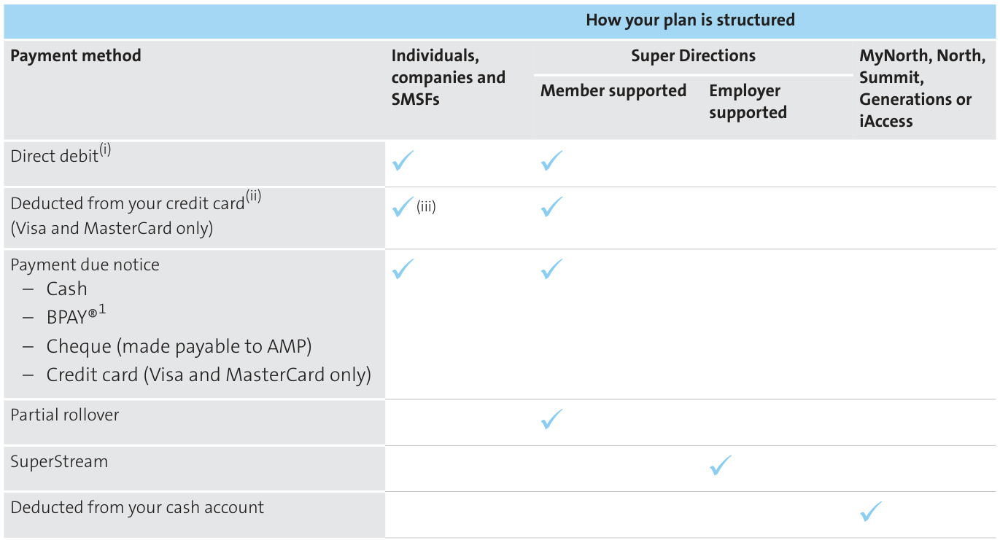  
(i) Please refer to the direct debit service request information for full details of the Direct Debit Request Service Agreement on page 111. (ii) The bank, financial institution or credit card provider may in its absolute discretion charge a fee for this service. In that event, we will pass the fee on to you. (iii) Not available for plans owned by SMSFs  

# For plans owned by Super Directions  

If you are a member of Super Directions and you elect to use the rollover facility, your premiums will be paid from your nominated superannuation fund via annual rollover or transfer.  

# For plans owned under MyNorth, North, Summit, Generations or iAccess  

Your premium, including the applicable plan fee and instalment loading, will be deducted from your cash account.  

# Paying using the rollover facility  

We offer members of Super Directions a facility that enables premiums to be paid using superannuation money. If you wish to have your insurance with us but your nominated superannuation account with another superannuation fund (provided it’s a taxed superannuation fund), you can pay the premiums using money from your nominated superannuation fund. You simplyneedtocompleteandsendusanenduringrollover authority (contained in the Application form). This authority allows us to act on your behalf to request a rollover or transfer from your nominated superannuation account as and when the policy premium is due.  

You won’t need to complete a new authority each year. The authority continues until the earliest of you requesting a revocation, you giving us a new authority, the policy ending or your death.  

If you change your nominated superannuation account, you will need to provide us with a new enduring rollover authority.  

If the amount received from your nominated superannuation account is not equal to the amount requested, it will be returned to the transferring fund. If this happens, or if the rollover or transfer is not successful for any other reason, an alternative payment is required otherwise your policy may lapse. If we can’t return any amounts to the transferring fund, we may transfer the amount to the AMP Eligible Rollover Fund. By purchasing a plan and completing an enduring rollover authority, you authorise us to do so.  

The amount required to pay the premium by rollover or transfer will be reduced by a 15% tax benefit, which means that only 85% of the premium due needs to be rolled over. For example, if your annual premium is \$100, we will only request for a rollover of \$85. If you change the method of payment in the future or a rollover or transfer request is not successful and an alternative payment method is required, you may not receive the credit of the tax benefit. This tax benefit is allocated at the Trustee’s discretion. The Trustee may review or change its practice in the future.  

Importantly,onlyannualpremiumpaymentsareavailable when paying using the rollover facility.  

# How to pay the premium  

Make your premium payments using telephone or internet banking from your credit card, cheque or savings account.  

For information on your biller code and CRN, please refer to your payment due notice. You can also access your payment due notice by logging onto your My AMP account and viewing your statements.  

# Direct debit request service agreement  

This charter outlines our and your responsibilities to ensure the smooth and secure operation of our direct debit agreement.  

# Our responsibilities  

– We’ll only deduct premiums from your chosen account. Your insurance schedule shows the premium amount and how often we have agreed to deduct it.   
– We will not disclose your bank details to anyone, unless you have agreed in writing that we can, or the law requires or allows us to do this.   
– If the payment date is a weekend or public holiday, we will debit your account on the next business day following the weekend or public holiday.   
– We’ll give you at least 14 days’ notice when changes to the initial terms of this arrangement are made.   
– AMP Life will keep your financial details confidential. However, it will disclose these details: – if you give permission – if a court order applies – to settle a claim – if AMP Life’s financial institution needs information.  

# Your responsibilities  

– Before sending us your account details, please check with your financial institution that direct debit deductions are allowed on the account you have chosen.   
– Please ensure you have enough money in your account to pay your premiums when due.   
– Your bank or financial institution may charge a fee if the payment can’t be met.   
– Your bank or financial institution may charge a direct debit fee. This will be reflected in your account statement.  

# Can we help?  

Contact our Customer Service Centre on 131 267 or your financial adviser if:  

– You need to change your payment details, cancel or alter direct debit deductions at any time, or – You have any queries about your direct debit agreement.  

We respond to queries concerning disputed transactions within five working days of notification.  

# Financial adviser remuneration  

If you purchase an individual insurance policy from AMP through a financial adviser , we will pay your financial adviser remuneration. The payment is already  

incorporated in your premium. Your financial adviser has the option to reduce their commission, which in turn will decrease your premium.  

From time to time, we may decide to provide financial advisers with non-monetary benefits (such as training or entertainment). This is in addition to the commission your financial adviser may receive.  

AMP maintains a register of the non-monetary benefits that we pay to financial advisers from time to time, also known as AMP’s gifts and entertainment register. A copy oftheregistermayberequestedbycalling1800780085.  

Your financial adviser is required to provide details of the remuneration they receive in the Statement of Advice they must provide to you.  

# Declarations and consent  

By proceeding with your application you are deemed to have acknowledged and agreed with the following:  

<html><body><table><tr><td>Product Disclosure Statement</td><td>Yourfinancial adviser has provided you with, and you have read, the current insurance PDs. Yourinsurance needs have been discussed with your financial adviser, and you will retain this PDs for future reference.</td></tr><tr><td>Duty of disclosure</td><td>You have read the PDs, and your financial adviser has drawn to your attention the Duty of Disclosure Statement set out in the Stepsto being insured section on page 13. You are required tofulfilyour obligations in accordance with your duties as explained in this PDs. (Important: You have a duty to disclose on your application form all information relevant to the insurer's decision to accept your application, as explained fully inYour duty of disclosure section on page 14)</td></tr><tr><td>Truth and accuracy</td><td>You are required to check the truth, accuracy and completeness of the information contained in your If your financial adviser submits your application online and you have not signed a printed copy, your nbai ae nos uissans o sep usom an uurm do e no puas n painbai si lasipe peueu of any amendments. If you do not receive a printed copy of your online application within five working</td></tr><tr><td>Online application Changes in material</td><td></td></tr><tr><td>circumstances</td><td>adviser and the issue of yourinsurance schedule must be disclosed to the insurer. Failure to do so may resultin theinsurer avoiding the contract ofinsurance.</td></tr><tr><td>Replacement of existing insurance</td><td>will be required to cancel this existing insurance at the time that your application is accepted by us. However,if the existing insurance is held with us or another company within the AMP group of companies, you authorise: - us to cancel, or to instruct the other insurerto cancel, that insurance effective the date that the new insurancecommences,and</td></tr><tr><td>Medical and other information</td><td>- the other insurer (if any) to cancel that insurance at our request on the basis of this authority. By completing your application, you're authorising: - any medical practitioner, doctor, health professional, hospital, clinic, other insurers (including related companies of AMP) or other professional, such as a financial adviser or accountant, to disclose any information they may possess about you, whether held in hard copy or in any other format, to AMP, and - AMP to collect any information they have on your health, medical history, pastimes, work history or anything else that AMP considers to be relevant to assessing or underwriting this cover or assessing</td></tr><tr><td>Privacy - use and disclosure of personal information</td><td>any claim under it. By proceeding with your application, you are authorising us to disclose any information related to your application forinsurance to any person/authorised third parties. We will only share sensitive information, such as medical details, where it is necessary to do so to properly assess your application. You are deemed to have agreed that personal information may be disclosed to third parties, where that disclosure is for to a claim made under the policy of insurance. of arranging a health screening appointment. This third party may be a spouse, family member, personal</td></tr><tr><td>Privacy</td><td>sensitive nature to this third party. You give the insurer permission to advise your usual doctor of the reason(s) behind any adverse assessment of your application if it was based on health evidence obtained during the assessment of your application. You are required to read and understand thePrivacy-use and disclosure of personal information section</td></tr></table></body></html>  

PDS and our policy on privacy. You can opt out from the use of that information for the purpose of direct marketing by contacting us.  

Acceptance of your application is subject to the insurer searching its records for any other business with the person to be insured. The insurer may vary the terms of the policy of insurance to be issued on the basis of any information contained in its records.  

# Significant risks  

There are a number of risks associated with holding an AMP Elevate insurance product:  

– the insurance you select may not provide sufficient cover for your needs. Your financial adviser can help you select the insurance that is the most appropriate for your needs and circumstances   
– we may reduce or not pay a benefit, or cancel your plan, if you don’t comply with Your duty of disclosure set out on page 14   
– we may not pay a benefit because exclusions apply, based on your personal circumstances   
– if you purchase insurance through super, the Trustee can only pay a benefit if the insured person satisfies the condition of release required under superannuation law   
– the premium rates aren’t guaranteed and will increase over time   
– we may cancel your plan if your premium isn’t paid in time, in which case you will no longer be covered and won’t be able to make a claim.  

# Your application  

# Application  

<html><body><table><tr><td>Byproceedingwith hyourapplicationyou areaskingtheinsurertoprovideinsuranceonthe usual conditions set out in this PDs—including any modifications to the plan that the insure considersappropriateg given the information submitted for your application.</td></tr><tr><td></td></tr><tr><td>The payment of benefits from the Life Insurance Plan will be made on the basis of the latest</td></tr><tr><td>nominationreceivedinwritingtoAMP.</td></tr></table></body></html>  

Nomination of beneficiary  

When applying for the Life Insurance Superannuation Plan, TPD Insurance Superannuation Plan or Income Insurance Superannuation Plan  

# Prospective members of Super Directions  

# Application  

By submitting your application you are applying to NM Super for membership of Super Directions . You're asking the Trustee to propose to the insurer to provide insurance on the terms and conditions set out in this PDS —including any modifications to the plan that the insurer considers appropriate given the information submitted for your application. You are confirming you are eligible to contribute to superannuation, and agree to notify the Trustee of the Fund in writing immediately if you cease to be gainfully employed or if you cease to be eligible to contribute to the Fund. You should review your binding nomination every three years, or as your circumstances change. If you don't it may cease to have effect.  

# Fund Membership  

You are submitting your application for the Life Insurance Superannuation Plan and/or the TPD Insurance Superannuation Plan and/or the Income Insurance Superannuation Plan as a prospective member of Super Directions .  

# Prospective members of Wealth Super  

Application  

By submitting your application you are confirming you are already a member, or have applied to become a member, of Wealth Super .  

# Fund Membership  

In applying for the Life Insurance Superannuation Plan and/or the TPD Insurance Superannuation Plan and/or Income Insurance Superannuation Plan you are doing so as a plan holder or prospective plan holder of MyNorth, Summit, Generations or iAccess as part of Wealth Super .  

If you are paying through AMP’s MyNorth, Summit, Generations or iAccess, your plan will be held within Wealth Super with NM Super as the Trustee.  

Nomination of beneficiary  

Please refer to the Nomination of dependant section on page 105 for further details.  

# Privacy – use and disclosure of personal information  

The privacy of your personal information is important to you and also to us. We may collect personal information directly from you or your financial adviser . We may also collect personal information if it is required or authorised by law, including the Superannuation Industry (Supervision) Act 1993, the Corporations Act 2001 and the Anti-Money Laundering andCounter-Terrorism Financing Act 2006 (AML/CTF).  

Our main purpose in collecting personal information from you is so we can establish and manage your plan. If you choose not to provide the information necessary to process your application, then we may not be able to process it. We may also use this information for related purposes—for example, enhancing customer service and product options and providing you with ongoing information about opportunities that may be useful for your financial needs through direct marketing. These may include investment, retirement, financial planning, banking, credit, life and general insurance products and enhanced customer services that may be made available by us, other members of the AMP group, or by your financial adviser .  

If, at any time, you do not want to receive this information, you can opt out by telephoning our Customer Contact Centre on 131 267 and quoting your plan number.  

If you are applying for the Life Insurance Superannuation Plan, TPD Insurance Superannuation Plan or the Income Insurance Superannuation Plan, we will also use this information to assess your application for, and manage your membership of, Super Directions or Wealth Super . We will only use information about your dependants in the event of your death.  

We usually disclose information of this kind to:  

– other members of the AMP group   
– your financial adviser or broker (if any)   
– the owner of the plan   
– your parent or guardian, if you are under age 18   
– external service suppliers who may be located in Australia or overseas, who supply administrative, financial or other services to assist the AMP group in providing you with services. A list of countries where these providers are likely to be located can be accessed via our Privacy Policy   
– the Australian Transaction Reports and Analysis Centre (AUSTRAC) where required by our anti-money laundering compliance plan   
– the Australian Taxation Office (ATO) to conduct searches on the ATO’s Lost Member Register for lost superannuation, or   
– anyone you have authorised or if required by law.  

If sensitive information, such as health information is collected in relation to this financial product, then additional restrictions apply. AMP Life may collect health information using a third party provider. The primary purpose for obtaining this health information is for the insurer, AMP Life, to assess your application for new or additional insurance. AMP Life may also use this information for directly related purposes—for example, deciding whether more information is needed, arranging reinsurance, assessing further applications and processing claims. AMP Life may disclose your health information to:  

– the financial adviser or broker responsible for the plan   
– your parent or guardian, if you are under age 18   
– the trustee   
– the owner of your personal insurance plan (if applicable)   
– AMP Life’s reinsurers   
–medical practitioners   
– any person AMP Life considers necessary to help either assess claims or resolve complaints – anyone you have authorised or if required by law.  

If you are an insured person , aspects of your health information may be provided to the owner of your plan in resolving terms of acceptance or if the standard plan rates are varied.  

If you are an insured person , AMP Life and/or its health screening provider may also speak to a third party for the sole purpose of arranging a health screening appointment. This third party may include a spouse, family member, personal assistant, financial adviser or other relevant party.  

Under the current AMP Privacy Policy you may access personal information about you held by the AMP group. The AMP Privacy Policy sets out the AMP group’s policies on management of personal information, including information about how you can access your personal information, seek to have any corrections made on inaccurate, incomplete or out-of-date information, how you can make a complaint about privacy, and information about how we deal with such complaints. The AMP Privacy Policy can be obtained online at amp.com.au or by calling our Customer Contact Centre on 131 267.  

# Glossary of terms  

Glossary of general terms in this document   

<html><body><table><tr><td>Term</td><td>Definition</td></tr><tr><td>25% impairment</td><td>Wherethetrauma condition definitionreferstoa 25%impairmentofwholebodyfunction,wewill rely on thelatest published edition of American Medical Association(AMA)Guides to the Evaluation of Permanent Impairment at the time of claim. Assessment must be carried out by a medical practitioner accredited in the evaluation of permanent impairment.</td></tr><tr><td>Activities of daily living (ADL)</td><td>Activities of daily living are the following: － bathing/showering - dressing/undressing - eating/drinking -using the toilet to maintain personal hygiene</td></tr><tr><td>Business</td><td>or with a walking aid. Business means the entity on which we based our underwriting at the time you applied for insurance under AMP Elevate.</td></tr><tr><td>Claimable event</td><td>Claimableeventmeans: For Life insurance: － Death － Terminal illness For Total and permanent disability (TPD) insurance: - suffer a specific loss, or - is unlikely to work, or - is unlikely to perform domestic work, or - requires future care, or</td></tr><tr><td>De facto relationship</td><td>- suffers significant cognitive impairment, as defined in Glossary of TPD definitions (pages 119 to 120). For trauma insurance: -Suffers a trauma condition. Each trauma condition is defined in the Glossary of medical conditions starting on page 120. - Total disability － Partial disability - Specific injuries and sicknesses De facto relationship means: - a relationship between two persons (whether of the same sex or different sexes) that is registered</td></tr><tr><td></td><td>under a law of a State orTerritory of Australia,or a relationship between two persons (whether of the same sex or different sexes) who, although not couple.</td></tr><tr><td>Dependant child Double TPD option(s)</td><td>Dependant child means a natural child,a step child or adopted child ora child underthelegal guardianship of the insured person. Double TPD option(s) means any of:</td></tr><tr><td></td><td>- Double TPD insurance option (Any) - Double TPD insurance option (Own)</td></tr><tr><td></td><td>Double trauma option(s) Double trauma option(s) means any of: -Double Trauma insurance option - Double Trauma insurance plus option.</td></tr></table></body></html>  

<html><body><table><tr><td>Term</td><td>Definition</td></tr><tr><td>FlexiLink plan(s)</td><td>FlexiLink plan(s) means any of: - FlexiLink TPD Insurance Plan (Own) - FlexiLink TPD Insurance Plan (Any) FlexiLink Trauma Insurance Plan</td></tr><tr><td>FlexiLink TPD plan(s)</td><td>-FlexiLink Trauma Insurance Plus Plan FlexiLink TPD plan(s) means any of: -FlexiLink TPD Insurance Plan (Own) - FlexiLink TPD Insurance Plan (Any)</td></tr><tr><td>FlexiLink Trauma plan(s) FlexiLink Trauma plan(s) means any of:</td><td>- FlexiLink Trauma Insurance Plan -FlexiLink Trauma Insurance Plus Plan</td></tr><tr><td>Immediate family member</td><td>Immediate family member means: -the insured person's legal husband or wife, or faith. He or she can be of the same sex as the insured person, or - the insuredperson's mother, father, mother-in-law or father-in-law, or - a child of the insured person.</td></tr><tr><td>Income insurance plans</td><td>Income insurance plans means any of: - Income Insurance Premier Plan -Income Insurance Plus Plan -Income Insurance Plan -Income Insurance Senior Plan</td></tr><tr><td>Insuranceschedule</td><td>- Income Insurance Superannuation Plan - Income Insurance SMSF Plan The insurance schedule issued to the policy owner if we have accepted their application for insurance,</td></tr><tr><td>Insured person</td><td>and specifies important details about the plan. The person who is to be insured.</td></tr><tr><td>Involuntarily unemployed</td><td>of his or her employment by his or her employer, or the insured person being made redundant without his or her consent. It does not includeunemployment as aresult of: - The insured person ceasing employment of a casual, seasonal or temporary nature,</td></tr><tr><td>Life insurance plans</td><td>-the insured person's deliberate or serious misconduct. Life insurance plans means any of: - Life Insurance Plan - Life Insurance Superannuation Plan</td></tr><tr><td>Loading</td><td>- Life Insurance SMSF Plan A loading is an increase in the standard premium, usually due to a pre-existing medical condition, occupation or pastimes.</td></tr><tr><td>Medical care</td><td>Medicalcaremeanstheinsuredperson: - has sought and is following advice, care and associated treatment that is reasonably necessary and and been provided with full clinical details in relation to his or her illness or injury, and is continuing to doso atreasonableintervalsin the circumstances,and</td></tr><tr><td>Medical practitioner</td><td>- is taking all other reasonable measures to minimise or avoid further illness or injury. in Australia, New Zealand, the United Kingdom, the United States of America, Canada or any other countryapproved by us.</td></tr><tr><td>NM Super</td><td>family. N. M. Superannuation Proprietary Limited.</td></tr><tr><td>Nominated child</td><td>Nominated child means a child nominated in theinsurance schedule forthe purposes of a Children's trauma option (page 60).</td></tr></table></body></html>  

<html><body><table><tr><td>Term</td><td>Definition</td></tr><tr><td>Option(s)</td><td>For Life, TPD and Trauma insurance plans, option(s) mean any of: -Business solutions option- Life -Premium waiver option - TPD insurance option (Own) - TPD insurance option (Any) - Double TPD insurance option (Own) -Double TPD insurance option (Any) -Activities of Daily Living TPD insurance option</td></tr><tr><td></td><td>- Business solutions option -TPD -Life buy back - TPD option -PremierLink TPD option (held on a separate insurance schedule) - Trauma insurance option - Trauma insurance plus option -Double trauma insurance option - Double trauma insurance plus option -Business solutions option- Trauma - Children's trauma option (held on a separate insurance schedule)</td></tr><tr><td></td><td>-Life buy back - Trauma option - Trauma reinstatement option For income insurance plans, options means any of: - Accelerated accident option - Accident lump sum option - Cover boost option - Increasing claim option</td></tr><tr><td></td><td></td></tr><tr><td>Permanent incapacity</td><td></td></tr><tr><td></td><td></td></tr><tr><td></td><td></td></tr><tr><td></td><td></td></tr><tr><td></td><td></td></tr><tr><td></td><td></td></tr><tr><td></td><td></td></tr><tr><td></td><td>- Superannuation contributions option</td></tr><tr><td></td><td>- PremierLink IP option</td></tr><tr><td></td><td>- Occupationally acquired Hiv, Hepatitis B and Hepatitis C option</td></tr><tr><td></td><td></td></tr><tr><td></td><td>- StandardLink IP option</td></tr><tr><td></td><td></td></tr><tr><td></td><td>This Product Disclosure Statement and Plan Document, and any updates to this document.</td></tr><tr><td>PDS</td><td></td></tr><tr><td></td><td></td></tr><tr><td></td><td>physical or mental) makes it unlikely that he or she will engage in gainful employment for which he or</td></tr><tr><td></td><td>she is reasonably fitted by education, training or experience.</td></tr><tr><td>Plan(s)</td><td></td></tr><tr><td></td><td></td></tr><tr><td></td><td>Plan(s) means any of:</td></tr><tr><td></td><td>- Life Insurance Plan</td></tr><tr><td></td><td>- Life Insurance Superannuation Plan</td></tr><tr><td></td><td>-Life Insurance SMSF Plan</td></tr><tr><td></td><td></td></tr><tr><td></td><td>- Total and Permanent Disability Insurance Plan (Own)</td></tr><tr><td></td><td>- Total and Permanent Disability Insurance Plan (Any)</td></tr><tr><td></td><td>- Total and Permanent Disability Superannuation Plan (Any)</td></tr><tr><td></td><td>- Total and Permanent Disability SMSF Plan (Any)</td></tr><tr><td></td><td>-Activities of Daily Living TPD Insurance Plan</td></tr><tr><td></td><td>-Trauma Insurance Plan -Trauma Insurance Plus Plan</td></tr><tr><td></td><td>-Income Insurance Premier Plan</td></tr><tr><td></td><td>-IncomeInsurance Plus Plan</td></tr><tr><td></td><td>- Income Insurance Plan</td></tr><tr><td></td><td>- Income Insurance Senior Plan</td></tr><tr><td></td><td>- Income Insurance Superannuation Plan</td></tr><tr><td></td><td>-IncomeInsuranceSMSF Plan -Business ExpensesInsurance Plan</td></tr><tr><td>Policy</td><td></td></tr><tr><td></td><td>Policy means the contract of insurance which is documented by this PDS and the insurance schedule.</td></tr><tr><td>Policy owner</td><td></td></tr><tr><td></td><td></td></tr><tr><td></td><td>o aet o idde uen laumo od e ng uosad pansui au se uosiad as au si laumo od a</td></tr><tr><td></td><td></td></tr><tr><td></td><td></td></tr><tr><td></td><td></td></tr><tr><td></td><td></td></tr><tr><td></td><td></td></tr><tr><td></td><td></td></tr><tr><td></td><td></td></tr><tr><td></td><td></td></tr><tr><td></td><td></td></tr><tr><td></td><td></td></tr><tr><td></td><td></td></tr><tr><td></td><td>insurance on a different person.</td></tr><tr><td></td><td></td></tr><tr><td></td><td></td></tr><tr><td></td><td></td></tr><tr><td></td><td></td></tr><tr><td></td><td></td></tr><tr><td></td><td></td></tr><tr><td></td><td></td></tr><tr><td></td><td></td></tr><tr><td></td><td></td></tr><tr><td></td><td></td></tr><tr><td></td><td></td></tr><tr><td></td><td>When applying for the Life Insurance Superannuation Plan, TPD Insurance Superannuation Plan or the</td></tr><tr><td></td><td></td></tr><tr><td>Income Insurance Superannuation Plan, the policy owner is NM Super as trustee of Super Directions and the Wealth Super.</td><td></td></tr></table></body></html>  

<html><body><table><tr><td>Term</td><td>Definition</td></tr><tr><td></td><td>When applying for the Life Insurance SMSF Plan, TPD Insurance SMSF Plan or the Income Insurance SMSF for providing information and meetingthe requirements underthe Superannuation Industry (Supervision) Act 1993 (SIS).</td></tr><tr><td>Pre-existing condition</td><td>Pre-existing condition means a medical condition, injury or sickness the insured person was diagnosed of theircover unless: - the insured person was not aware of, and</td></tr><tr><td></td><td>a reasonable person in the circumstances could not be expected to have been aware of the medical condition, injury or sickness at the time.</td></tr><tr><td>Renewal date Revised terms</td><td>Renewal date means the anniversary of your plan commencement date. Revised terms means any terms which we apply to the insured person or the plan which does not apply to all AMP Elevate insurance plans.</td></tr><tr><td>Separation/separating</td><td>Separation/separatingmeans: application for divorce has been made, or - in the case of a de facto relationship, ceasing to be in that de facto relationship for a period of 12 months.</td></tr><tr><td>Sum insured</td><td>s st pue uawed wns duni e o pansui wns au se umou sio pansui no eu hunoe a in your insurance schedule. This amount is fixed and will only change if it is increased in accordance with</td></tr><tr><td></td><td>'id aney am nauaq Kue jo junowe au a The Super Directions Fund.</td></tr><tr><td>Super Directions Terminal illness</td><td>Terminal illness for a Life insurance plan is defined on page 50.</td></tr><tr><td></td><td>Terminal illness for the Children's Trauma option is defined on page 60. Total and permanent disability</td></tr><tr><td>TPD TPD ADL plan</td><td>Activities of Daily Living TPD Insurance Plan</td></tr><tr><td>TPD ADL option</td><td>Activities of Daily Living TPD insurance option</td></tr><tr><td>TPD any occupation 一</td><td>TPD any occupation means any of: - Total and Permanent Disability Insurance Plan (Any) - Total and Permanent Disability Superannuation Plan (Any) Total and Permanent Disability SMSF Plan (Any) FlexiLink TPD Insurance Plan (Any)</td></tr><tr><td></td><td></td></tr><tr><td></td><td></td></tr><tr><td></td><td></td></tr><tr><td></td><td></td></tr><tr><td></td><td></td></tr><tr><td></td><td></td></tr><tr><td></td><td></td></tr><tr><td></td><td></td></tr><tr><td></td><td></td></tr><tr><td></td><td></td></tr><tr><td></td><td>TPD option(s) means any of:</td></tr><tr><td></td><td></td></tr><tr><td>TPD option(s)</td><td>- Double TPD insurance option (Any)</td></tr><tr><td></td><td></td></tr><tr><td></td><td></td></tr><tr><td></td><td></td></tr><tr><td></td><td>- Total and Permanent Disability insurance option (Any)</td></tr><tr><td></td><td>-Total and Permanent Disability insurance option (Own)</td></tr><tr><td></td><td>Business solutions option - TPD</td></tr><tr><td></td><td>Life buy back-TPD option</td></tr><tr><td></td><td></td></tr><tr><td></td><td>-PremierLink TPD option (held on a separate insurance schedule)</td></tr><tr><td></td><td>Double TPD insurance option (Own)</td></tr><tr><td></td><td>Double TPD insurance option (Any)</td></tr><tr><td></td><td>- Activities of Daily Living TPD insurance option</td></tr><tr><td>TPD own occupation</td><td></td></tr><tr><td></td><td>TPD own occupation means any of:</td></tr><tr><td></td><td></td></tr><tr><td></td><td>- Total and Permanent Disability Insurance Plan (Own)</td></tr><tr><td></td><td>- FlexiLink TPD Insurance Plan (Own)</td></tr><tr><td></td><td>- Total and Permanent Disability insurance option (Own)</td></tr><tr><td></td><td></td></tr><tr><td></td><td>Double TPD insurance option (Own)</td></tr><tr><td></td><td>-PremierLink TPD option</td></tr><tr><td></td><td></td></tr><tr><td>TPD insurance plans</td><td></td></tr><tr><td></td><td>TPD insurance plans means any of:</td></tr><tr><td></td><td></td></tr><tr><td></td><td>- Total and Permanent Disability Insurance Plan (Own)</td></tr><tr><td></td><td></td></tr><tr><td></td><td>-Total and Permanent Disability Insurance Plan (Any)</td></tr><tr><td></td><td></td></tr><tr><td></td><td></td></tr><tr><td></td><td></td></tr><tr><td></td><td>- Total and Permanent Disability Insurance Superannuation Plan (Any)</td></tr><tr><td></td><td></td></tr><tr><td></td><td></td></tr><tr><td></td><td></td></tr><tr><td></td><td></td></tr><tr><td></td><td></td></tr><tr><td></td><td></td></tr><tr><td></td><td></td></tr><tr><td></td><td></td></tr><tr><td></td><td></td></tr><tr><td></td><td>-Total and Permanent Disability Insurance SMSF Plan (Any)</td></tr><tr><td></td><td></td></tr><tr><td></td><td></td></tr><tr><td></td><td></td></tr><tr><td></td><td></td></tr><tr><td></td><td></td></tr><tr><td></td><td></td></tr><tr><td></td><td></td></tr><tr><td></td><td></td></tr><tr><td></td><td></td></tr><tr><td></td><td></td></tr><tr><td></td><td></td></tr><tr><td></td><td></td></tr><tr><td></td><td></td></tr><tr><td></td><td></td></tr><tr><td></td><td></td></tr><tr><td></td><td></td></tr><tr><td></td><td></td></tr><tr><td></td><td></td></tr><tr><td></td><td></td></tr><tr><td></td><td></td></tr><tr><td></td><td></td></tr><tr><td></td><td></td></tr><tr><td></td><td></td></tr><tr><td></td><td></td></tr><tr><td></td><td></td></tr><tr><td>Activities of Daily Living TPD Insurance Plan</td><td></td></tr></table></body></html>  

<html><body><table><tr><td>Term</td><td>Definition</td></tr><tr><td>Trauma condition</td><td>Trauma condition means: -in relation toa Trauma Insurance Plan or Trauma Insurance Plus Plan, one ofthe medical conditions</td></tr><tr><td></td><td>listed on pages 44 to 46. - In relation to a Children's trauma option, one of the medical conditions listed on pages 46 to 47. Each trauma condition is defined in the Glossary of medical conditions starting on page 120. Trauma option(s) means any of:</td></tr><tr><td>Trauma option(s)</td><td>- Trauma insurance option - Trauma insurance plus option - Business solutions option - Trauma - Double trauma insurance option</td></tr><tr><td></td><td>- Double trauma insurance plus option - Life buy back - Trauma option -Trauma reinstatement option</td></tr><tr><td>Trauma insurance plan(s) Trauma insurance plans means any of:</td><td></td></tr><tr><td></td><td>- Trauma Insurance Plan</td></tr><tr><td></td><td>- Trauma Insurance Plus Plan</td></tr><tr><td>Trauma plus</td><td></td></tr><tr><td></td><td>Trauma plus means any of:</td></tr><tr><td></td><td></td></tr><tr><td></td><td>- Trauma Insurance PlusPlan</td></tr><tr><td></td><td></td></tr><tr><td></td><td>-FlexiLink Trauma Insurance Plus Plan</td></tr><tr><td></td><td>- Trauma insurance plus option</td></tr><tr><td>Treatment</td><td></td></tr><tr><td></td><td>practitioner and which is reasonable and necessary for the management the insured person's injury or</td></tr><tr><td>Trustee</td><td>sickness.</td></tr><tr><td></td><td>'asmauo sadns wn (sueid asou ot pausee suodo Kue upnpous) ueid uoenuuadns aueansul the trustee of theSMSF or small APRASuperFund.</td></tr><tr><td>Wealth Super</td><td>The Wealth Personal Superannuation and Pension Fund.</td></tr><tr><td>Valuation, value</td><td>Valuation, value means a valuation ofthe businessbased on the same method of valuation forthe business</td></tr><tr><td></td><td></td></tr><tr><td>Value of the insured person to the business</td><td>Value of the insured person to the business means either the value of the proportion of the business</td></tr><tr><td>Value of the relevant loan</td><td>Value of the relevant loan means the value of a loan or loans (agreed to by us).</td></tr></table></body></html>  

# Glossary of Total and Permanent Disability (TPD) insurance definitions  

<html><body><table><tr><td>Term</td><td colspan="2">Definition</td></tr><tr><td rowspan="5">Total and permanent disability</td><td colspan="2">A.Unlikelytowork</td></tr><tr><td>Isunlikelytowork(anyoccupation)</td><td>The insured person has been unable to follow his orher own occupation for a continuous</td></tr><tr><td>NS</td><td>period of three months solely because of an injury or sickness, and in our opinion, based on to be able to follow his or her occupation or any other occupation for which he or she is reasonably fitted by education, training or experience, which would pay remuneration at a rate greater than 25% of his or her income during his or her last 12 months of work.</td></tr><tr><td>SSMSF</td><td>The insured person has been unable to follow his or her own occupation for a continuous period of three months solely because of an injury or sickness, and in our opinion, based on reasonablyfittedby education,training orexperience.</td></tr><tr><td>injury or sickness, he or she is unlikely ever to be able to follow his or her own occupation.</td><td>Isunlikelytowork(ownoccupation) The insured person is unable to follow his or her own occupation fora continuous period ofthree months because of an injury or sickness and in our opinion, based on medical or other evidence, because of that</td></tr></table></body></html>  

The insured person has suffered the total and permanent loss of the use of: – both hands – both feet – one hand and one foot – the entire sight in both eyes – one hand and the entire sight in one eye, or – one foot and the entire sight in one eye.  

# C. Requires future care  

Because of an injury or sickness, the insured person is totally and permanently unable to perform at least two of the five activities of daily living without assistance.  

# D. Is unlikely to perform domestic work  

The insured person is totally unable to perform his or her usual unpaid domestic work for a continuous period of three months because of an injury or sickness and in our opinion, based on medical or other evidence, because of that injury or sickness, he or she:  

– is unlikely ever to be able to perform all of his or her usual unpaid domestic work – is diagnosed by a medical practitioner as having a permanent disability and AMP agrees – is unlikely ever to be able to engage in any occupation, and   
– receives regular medical attention from a medical practitioner .  

# Domestic Work  

The insured person is engaged in domestic work if they are performing the following duties related to running the family home:  

– Cleaning the family home—to use domestic appliances and equipment such as a vacuum and mop to clean and maintain the family home.   
– Shopping for food and household items—to shop for everyday household provisions.   
– Meal preparation—to use kitchen and cooking utensils, appliances and equipment to prepare more than the most basic meals for oneself and/or others.   
– Laundry services—means the ability to do household laundry to a basic standard.   
– Caring for a child or dependant including driving or transporting family to and from school, sport, work or social events (if applicable).  

# E. Suffers significant cognitive impairment  

<html><body><table><tr><td>Term</td><td></td></tr><tr><td></td></tr></table></body></html>  

The insured person suffers a permanent deterioration of cognitive functioning as observed clinically and confirmed by standardised testing, which results in a requirement for continuous supervision and care of the insured by another person.  

# Glossary of medical conditions  

These definitions apply to trauma conditions and medical procedures covered under Trauma insurance plans ,trauma options, income insurance plans and the Day one TPD benefit (page 52).  

# Claims guiding statement  

Medical diagnoses and investigation methods used in many of the trauma conditions that we cover are advancing at a rapid rate. If the method for diagnosing one of the conditions in this Glossary has been superseded due to medical improvements, we may consider other appropriate and medically recognised methods or tests that conclusively diagnose the event to at least the same severity. This may assist in the assessment of your claim.  

<html><body><table><tr><td>Term</td><td>Definition</td></tr><tr><td>Adultinsulindependent diabetes</td><td>Adult insulin dependent diabetes means the diagnosis oftype 1 insulin dependent diabetes mellitus</td></tr><tr><td>Partial payment</td><td>(IDDM) by an appropriate consultant specialist after the insured person's 3oth birthday.</td></tr><tr><td>only</td><td>We'll pay 10% of the Trauma insurance sum insured, up to a maximum of $25,000.</td></tr></table></body></html>  

# Term  

<html><body><table><tr><td>day qualifying period -Not available for Children's trauma option</td><td></td></tr><tr><td>Advanceddiabetes - Not available for Children's trauma</td><td>For us to pay a claim under this condition, the diabetes must be of a specified severity as set out below.</td></tr><tr><td>option</td><td>Advanced diabetes means severe diabetes mellitus, either insulin or non-insulin dependent, as certified severe diabetic retinopathy resulting in visual acuity uncorrected and corrected of 6/36 or worse in both eyes - severe diabetic neuropathy causing motor and/or autonomic impairment</td></tr><tr><td>Alzheimer's disease and</td><td>- diabetic gangrene leading to surgical intervention, or - severe diabetic nephropathy causing chronic irreversible renal impairment (as measured by a corrected creatinine clearance below the laboratory's measured normal range).</td></tr><tr><td>other dementias</td><td>For us to pay a claim under this condition, the definition of Alzheimer's disease and other dementias must be of a specified severity as set out below. Alzheimer's disease and other dementias means an unequivocal clinical diagnosis of dementia (including</td></tr><tr><td></td><td>Significant cognitive impairment means a deterioration in the insured person's Mini-Mental State Examination scores to 24 orless.</td></tr><tr><td>Angioplasty - Partial payment only -Not available for</td><td>The treatment of a coronary artery obstruction by balloon angioplasty, other catheter-based techniques, or endoscopic surgery, where at least one of the following criteria have been met: - the obstruction is giving rise to impairment of ventricular function</td></tr><tr><td>Children's trauma option</td><td>- the obstruction is giving rise to disabling symptoms, or - the obstruction is associated with unstable angina pectoris or myocardial infarction. In the case of angioplasty, we'll pay 25% of the Trauma insurance sum insured, up to a maximum of</td></tr><tr><td></td><td>$100,000. We'll pay a benefit for angioplasty on more than one occasion provided that the procedures occur at least</td></tr><tr><td>Aplastic anaemia</td><td>six months apart.</td></tr><tr><td>Subject to a 90 day qualifying period for</td><td>For us to pay a claim under this condition, the aplastic anaemia must be of a specified severity as set out below.</td></tr><tr><td>Children's trauma option</td><td>The insured person has severe aplasia as diagnosed by an appropriate medical specialist and requiring</td></tr><tr><td></td><td>treatment with at least one of the following: - Blood product support of red cell or platelet transfusion, or</td></tr><tr><td></td><td>- Bone marrow transplantation, or</td></tr><tr><td>Benign brain tumour</td><td>- Immunosuppressive agents.</td></tr><tr><td></td><td>For us to pay a claim under this condition, the benign brain tumour must be of a specified</td></tr><tr><td></td><td>severity as set out below.</td></tr><tr><td></td><td>A non-cancerous tumour in the brain that gives rise to characteristic symptoms of increased intracranial</td></tr><tr><td></td><td>pressure such as papilledema, mental symptoms, seizures and sensory impairment. The tumour must</td></tr><tr><td></td><td>result in neurological deficit, where:</td></tr><tr><td></td><td>- there is at least 25% permanent impairment of whole body function, or</td></tr><tr><td></td><td>- cranial surgery is required for its treatment.</td></tr><tr><td></td><td>The presence of the underlying tumour must be confirmed by imaging studies such as CT scan or MRI</td></tr><tr><td></td><td>(Magnetic Resonance Imaging). The following are excluded:</td></tr><tr><td></td><td></td></tr><tr><td></td><td>- cysts</td></tr><tr><td></td><td></td></tr><tr><td></td><td>－ granulomas</td></tr><tr><td></td><td></td></tr><tr><td></td><td></td></tr><tr><td></td><td></td></tr><tr><td></td><td></td></tr><tr><td></td><td>- malformations in or of the arteries or veins of the brain</td></tr><tr><td></td><td></td></tr><tr><td></td><td></td></tr><tr><td></td><td></td></tr><tr><td></td><td></td></tr><tr><td></td><td></td></tr><tr><td></td><td></td></tr><tr><td></td><td></td></tr><tr><td></td><td></td></tr><tr><td></td><td></td></tr><tr><td></td><td></td></tr><tr><td></td><td></td></tr><tr><td></td><td></td></tr><tr><td></td><td></td></tr><tr><td></td><td></td></tr><tr><td></td><td></td></tr><tr><td></td><td></td></tr><tr><td></td><td>- haematomas, and</td></tr><tr><td></td><td></td></tr><tr><td></td><td></td></tr><tr><td></td><td></td></tr><tr><td></td><td></td></tr><tr><td></td><td></td></tr><tr><td></td><td></td></tr><tr><td></td><td></td></tr><tr><td></td><td></td></tr><tr><td></td><td></td></tr><tr><td></td><td></td></tr><tr><td></td><td></td></tr><tr><td></td><td></td></tr><tr><td>- tumours in the pituitary gland or spine.</td><td></td></tr><tr><td></td><td></td></tr><tr><td></td><td></td></tr><tr><td></td><td></td></tr><tr><td></td><td></td></tr><tr><td></td><td></td></tr><tr><td></td><td></td></tr><tr><td></td><td></td></tr><tr><td></td><td></td></tr><tr><td></td><td></td></tr><tr><td></td><td></td></tr><tr><td></td><td></td></tr><tr><td></td><td></td></tr><tr><td></td><td></td></tr><tr><td></td><td></td></tr><tr><td></td><td></td></tr><tr><td></td><td></td></tr><tr><td></td><td></td></tr><tr><td></td><td></td></tr><tr><td></td><td></td></tr><tr><td></td><td></td></tr><tr><td></td><td></td></tr><tr><td></td><td></td></tr><tr><td></td><td></td></tr><tr><td></td><td></td></tr><tr><td></td><td></td></tr><tr><td></td><td></td></tr><tr><td></td><td></td></tr><tr><td></td><td></td></tr><tr><td></td><td></td></tr><tr><td></td><td></td></tr><tr><td></td><td></td></tr></table></body></html>  

<html><body><table><tr><td>Term</td><td>Definition</td></tr><tr><td>Blindness</td><td>For us to pay a claim under this condition, blindness must be of a specified severity as set out below.</td></tr><tr><td>Blindness (partial</td><td>Blindness means the permanent loss of sight in both eyes as a result of disease, illness or injury to the extent that visual acuity is 6/60 or less in both eyes, orto the extent that visual field is reduced to 20 degrees or less of arc irrespective of corrected visual acuity.</td></tr><tr><td>payment) - Partial payment only -Not available for Children's trauma option Cancer - Subject to a 90 day qualifying</td><td>illness or injury to the extent that visual acuity is 6/60 or less in one eye, or to the extent that visual field In the case of blindness partial payment, we'll pay 10% of the Trauma insurance sum insured, up to a maximum of $25,000. For us to pay a claim under this condition, the cancer must be of a specified severity and</td></tr><tr><td>period</td><td>cannot be of an early stage as set out below. Cancer as defined in this policy means an abnormal growth of cells that is confirmed on pathology tests The term cancer includes leukaemia, lymphomas such as Hodgkin's disease, other malignant tumours or where the melanoma is showing signs of ulceration, unless excluded below: - carcinoma in situ of the breast where the tumour is classified as TNM Stage Tis unless requiring surgery that results in the removal of the entire breast or requiring breast conserving surgery and radiotherapy - all other tumours classified as carcinoma in situ - melanomas that are both less than Clark Level 3 and less than 1.0 mm in thickness (unless there is histological evidence of ulceration) - other skin cancers unless there has been evidence of spread (that is, metastasis) to other parts of the body unless the tumour also has a Gleason score of 7 or above, or prostatectomy is performed (please see the Cancer early payment condition below for Trauma Insurance Plus)</td></tr><tr><td>Cancer early payment - Subject to a 90 day qualifying period -For Trauma Insurance Plus only -Not available for Children's trauma option classification system. equivalent) classification system.</td><td>- Chronic lymphocytic leukaemia less than Rai stage I - tumours that occur within the 90 day qualifying period, and - tumours that recur outside the 90 day qualifying period unless the recurrence can be shown to be unrelated. Cancer as defined in this policy means an abnormal growth of cells that is confirmed on pathology tests to include the uncontrolled spread of malignant cells and the invasion and destruction of normal tissue. sdog ra pasouep uaaq aaeu pue sanss peou The conditions defined below are noteligible fora full benefit payment but we will make an early payment of the greater of 20% of the Trauma insurance sum insured or $10,000, up to a maximum of $1o0,000. - Melanomas that are both less than Clark Level 3 and less than 1.0 mm in thickness. - Prostate tumours classified as T1a or T1b under the TNM (orequivalent) classification system with either a Gleason score less than 6, or where major interventionist therapy is not required. excision. - Carcinoma in situ of one or both testes where the cancer cells do not penetrate the basement membrane nor invade the surrounding tissue and the tumour is classified as TNM stage Tis. equivalent) classification system. - Carcinoma in situ of the breast where the tumour is classified as TNM stage Tis. under the TNM (or equivalent) classification system. - Carcinoma in situ of the cervix that is classified as TNM stage Tis or CIN 3 grading. - Carcinoma in situ ofthe ovary where the tumour is classified as stage Tis underthe TNM (or equivalent) - Carcinoma in situ of the uterus where the tumour is classified as stage Tis under the TNM (or We will make a payment of 1oo% of the Trauma insurance sum insured in the following circumstances: - If a prostate tumour is classified under the TNM (or equivalent) classification system as:</td></tr></table></body></html>  

<html><body><table><tr><td>Term</td><td>Definition</td></tr><tr><td></td><td>-T1c or above,or -T1a or T1b with a Gleason Score of 6 or above, or -T1a or Tib and is considered untreatable orif the insured person is required to undertake response modifiers or any other major treatment - Carcinoma in situ of the testicle, where one or both testes are removed by radical orchidectomy.</td></tr><tr><td></td><td>Where a partial payment is made fora cancer early payment condition, the Trauma insurance sum insured condition. We will, however, make subsequent partial payments for cancer early payment conditions, as long as we have not already made a payment for the same condition. The total of all claim payments must not exceed the Trauma insurance sum insuredinsured.</td></tr><tr><td></td><td>The following are excluded: - tumours that occur within the 90 day qualifying period, and - tumours that recur outside the 90 day qualifying period unless the recurrence can be shown to be unrelated.</td></tr><tr><td>Carcinoma in situ</td><td>Carcinoma in situ means focal new growth of malignant cells that have not yet invaded normal tissues and have been diagnosed by biopsy.</td></tr><tr><td>Cardiac arrest</td><td>-is due to asystole or ventricular fibrillation, and - is not associated with any clinical procedure, and - is documented by electrocardiographic (ECG) changes, and</td></tr><tr><td>Cardiomyopathy</td><td>- occurs outside a hospital or other medical facility. For us to pay a claim under this condition, the cardiomyopathy must be of a specified</td></tr><tr><td></td><td>severity as set out below. Cardiomyopathy meansimpairment ofthe ventricularfunction of variable aetiology resulting in significant</td></tr><tr><td></td><td>classification of cardiacimpairment.</td></tr><tr><td>Chronic kidney failure</td><td>For us to pay a claim under this condition, the kidney failure must be of a specified severity as set out below.</td></tr><tr><td></td><td>Chronic irreversible failure of both kidneys requiring either permanent renal dialysis or kidney transplantation.</td></tr><tr><td>Chronic liver disease</td><td>For us to pay a claim under this condition, the liver disease must be of a specified severity as</td></tr><tr><td></td><td>set out below.</td></tr><tr><td></td><td>Chronic liver disease means end stage liver failure resulting in: - permanent jaundice, and - ascites or encephalopathy.</td></tr><tr><td>Chronic lung disease</td><td>For us to pay a claim under this condition, the lung disease must be of a specified severity as</td></tr><tr><td></td><td>set out below. Chronic lung disease requiring permanent supplementary oxygen. Forthe purposes ofthis definition,the</td></tr><tr><td></td><td>or less, while breathing room air.</td></tr><tr><td>Coma</td><td></td></tr><tr><td></td><td></td></tr><tr><td>Coronary artery bypass</td><td></td></tr><tr><td></td><td>Coronary artery bypass surgery means coronary artery bypass grafting surgery, which is considered</td></tr><tr><td></td><td></td></tr><tr><td>surgery</td><td></td></tr><tr><td></td><td>medically necessary to treat coronary artery disease but does not include:</td></tr><tr><td></td><td></td></tr><tr><td>- Subject to a 90</td><td></td></tr><tr><td></td><td></td></tr><tr><td></td><td>- angioplasty</td></tr><tr><td></td><td></td></tr><tr><td></td><td></td></tr><tr><td>day qualifying</td><td></td></tr><tr><td></td><td>- intra-arterial procedures</td></tr><tr><td></td><td></td></tr><tr><td></td><td></td></tr><tr><td></td><td></td></tr><tr><td></td><td></td></tr><tr><td></td><td></td></tr><tr><td></td><td></td></tr><tr><td>period</td><td>- laser techniques, or</td></tr><tr><td></td><td></td></tr><tr><td></td><td></td></tr><tr><td></td><td></td></tr><tr><td></td><td></td></tr><tr><td></td><td></td></tr><tr><td></td><td></td></tr><tr><td></td><td></td></tr><tr><td></td><td></td></tr><tr><td></td><td></td></tr><tr><td></td><td></td></tr><tr><td></td><td></td></tr><tr><td></td><td></td></tr><tr><td></td><td></td></tr><tr><td></td><td></td></tr><tr><td></td><td> other non-surgical techniques.</td></tr></table></body></html>  

<html><body><table><tr><td>Term</td><td>Definition</td></tr><tr><td>Deafness</td><td>For us to pay a claim under this condition, deafness must be of a specified severity as set out below.</td></tr><tr><td>Deafness (partial</td><td>The total, irreversible and irreparable loss of hearing, both natural and assisted, in both ears as a result of disease, illness or injury. We will make a partial payment, once only, iftotal irreversible and irreparable loss of hearing, both naturally</td></tr><tr><td>payment) - Partial payment only -Not available for Children's trauma option</td><td>and assisted, occurs in one ear as a result of disease, illness or injury. In the case of deafness partial payment, we'll pay 1o% of the Trauma insurance sum insured, up to a maximum of $25,000.</td></tr><tr><td>Diplegia</td><td>For us to pay a claim under this condition, there must be permanent loss as set out below.</td></tr><tr><td>Encephalitis</td><td>The total and permanent loss of the use of both sides of the body due to injury or sickness. For us to pay a claim under this condition, the encephalitis must be of a specified severity as set out below.</td></tr><tr><td></td><td>Encephalitis means the severe inflammation of brain substance that results in significant and permanent neurological sequelae:</td></tr><tr><td></td><td>- with at least 25% impairment of wholebody function, or - the insured person being totally and permanently unable to perform at least one of the activities of daily living. Encephalitis as a result of HIV infection is excluded.</td></tr><tr><td>Heart attack - Subject to a 90 day qualifying period</td><td>Heart attack (myocardial infarction) means the death of heart muscle as a result of inadequate blood supply to the relevant area. and/or fall of cardiac biomarkers with at least one value above the 99th percentile of the upper reference</td></tr><tr><td></td><td>limit, plus at least one of the following: - cardiac symptoms and signs consistent with myocardial infarction (eg chest pain), - new serial ECG changes with the development of any of the following: ST elevation or depression, T wave inversion, pathological Q waves or left bundle branch block (LBBB), or</td></tr><tr><td></td><td>- imaging evidence of new loss of viable myocardium or new regional wall motion abnormality. If the above tests are inconclusive, we may consider other appropriate and medically recognised tests that unequivocally diagnose a myocardial infarction to the degree of severity or greaterthan that outlined above.</td></tr><tr><td></td><td>The following are not covered: - other acute coronary syndromes including but not limited to angina pectoris, and</td></tr><tr><td>Heart valve surgery</td><td>- elevated cardiac enzymes or biomarkers arising from elective percutaneous coronary interventions or coronary bypass grafting.</td></tr><tr><td></td><td>Angioplasty, intra-arterial procedures and other non-surgical techniques are excluded.</td></tr><tr><td>Hemiplegia</td><td>For us to pay a claim under this condition, there must be permanent loss as set out below.</td></tr><tr><td>Invade</td><td></td></tr><tr><td></td><td>Invade means to infiltrate and/or destroy the tissue of origin or surrounding tissue.</td></tr><tr><td>Loss of capacity for independent living - Not available for Children's trauma option</td><td>For us to pay a claim under this condition, the definition of Loss of capacity for independent living must be of a specified severity as set out below. Loss of capacity for independent living means that as a result of an injury or sickness, the insured person is permanently unable to perform at least two of the activities of daily living without assistance.</td></tr></table></body></html>  

<html><body><table><tr><td>Term</td><td>Definition</td></tr><tr><td>Loss of a limb - Partial payment</td><td>For us to pay a claim under this condition, there must be permanent loss as set out below.</td></tr><tr><td>only</td><td>In the case of the total and permanent loss of the use of one hand or one foot we will pay the lowest of:</td></tr><tr><td>- For Trauma Insurance Plus</td><td>- 25% of the sum insured, or</td></tr><tr><td>only</td><td>－$100,000. We will only pay the higher of:</td></tr><tr><td> Not available for</td><td>- Partial TPD under a TPD insurance option, or</td></tr><tr><td>Children's trauma</td><td>- Loss of a limb under Trauma insurance plus,</td></tr><tr><td>option</td><td>in the event you are eligible to claim under both benefits and they are linked to the same plan.</td></tr><tr><td>Loss of limbs</td><td></td></tr><tr><td></td><td>For us to pay a claim under this condition, there must be permanent loss as set out below.</td></tr><tr><td></td><td>The total and permanent loss of:</td></tr><tr><td></td><td>- the use of both hands</td></tr><tr><td></td><td>- the use of both feet, or -the use of one hand and one foot.</td></tr><tr><td>Loss of limbs and sight</td><td>For us to pay a claim under this condition, there must be permanent loss as set out below.</td></tr><tr><td></td><td></td></tr><tr><td></td><td>The total and permanent loss of: - the use of one hand and the sight of one eye, or</td></tr><tr><td></td><td>- the use of one foot and the sight of one eye.</td></tr><tr><td>Loss of speech</td><td>For us to pay a claim under this condition, there must be permanent loss as set out below.</td></tr><tr><td></td><td>Total and permanent loss of the ability to produce intelligible speech as a result of permanent damage to the larynx or its nerve supply from the speech centres of the brain, whether caused by injury, tumour</td></tr><tr><td>Major head injury</td><td>or sickness. For us to pay a claim under this condition, the major head injury must be of a specified</td></tr><tr><td></td><td>severity as set out below.</td></tr><tr><td></td><td>Major head injury means cerebralinjury caused by externaltrauma which results in permanent neurological deficit:</td></tr><tr><td></td><td>- with at least 25% impairment of whole body function, or</td></tr><tr><td></td><td>activities of daily living.</td></tr><tr><td>Major organ transplant</td><td>Major organ transplant means:</td></tr><tr><td>- Subject to a 90</td><td>- the receipt of a transplant, from someone else, of human stem cells from blood or bone marrow, or of whole human organs, or</td></tr><tr><td>day qualifying</td><td></td></tr><tr><td>period for Children's trauma</td><td>waiting list to undergo necessary organ transplant, or</td></tr><tr><td>option</td><td></td></tr><tr><td></td><td>heart, lung, liver, kidney, pancreas or small bowel.</td></tr><tr><td>Medical condition requiring life support </td><td>The occurrence ofa medicalconditionthatcauses the needforcontinuousmechanical ventilationvia</td></tr><tr><td>- Partial payment</td><td>tracheal intubation 24 hours per day for 10 consecutive days in an authorised intensive care unit of an acute care hospital.</td></tr><tr><td>only</td><td>Any medical conditions resulting from alcohol or drug intake, or other self inflicted means, are excluded.</td></tr><tr><td>Not available for</td><td>In the case of medical condition requiring life support, we'll pay 10% ofthe Trauma insurance sum insured,</td></tr><tr><td>Children's trauma option</td><td>up to a maximum of $25,000.</td></tr><tr><td></td><td>Medically acquired HIV is the accidental infection with the Human Immunodeficiency Virus (HiV) after</td></tr><tr><td>Medically acquired HIV infection</td><td></td></tr><tr><td></td><td></td></tr><tr><td></td><td>professional:</td></tr><tr><td></td><td></td></tr><tr><td></td><td>- a blood transfusion</td></tr><tr><td></td><td>- transfusion with blood products</td></tr><tr><td></td><td>-organ transplant to the insured person</td></tr><tr><td></td><td></td></tr><tr><td></td><td>-assisted reproductive techniques, or</td></tr><tr><td></td><td></td></tr><tr><td></td><td></td></tr><tr><td></td><td></td></tr><tr><td></td><td></td></tr><tr><td></td><td></td></tr><tr><td></td><td></td></tr><tr><td></td><td></td></tr><tr><td></td><td></td></tr><tr><td></td><td></td></tr><tr><td></td><td></td></tr><tr><td></td><td></td></tr><tr><td></td><td></td></tr><tr><td></td><td></td></tr><tr><td></td><td></td></tr><tr><td></td><td></td></tr><tr><td></td><td></td></tr><tr><td></td><td></td></tr><tr><td></td><td></td></tr><tr><td></td><td></td></tr><tr><td></td><td></td></tr><tr><td></td><td></td></tr><tr><td></td><td></td></tr><tr><td></td><td></td></tr><tr><td></td><td></td></tr><tr><td></td><td></td></tr><tr><td></td><td></td></tr><tr><td></td><td></td></tr><tr><td></td><td></td></tr><tr><td></td><td></td></tr><tr><td></td><td></td></tr><tr><td></td><td></td></tr><tr><td></td><td></td></tr><tr><td></td><td></td></tr><tr><td></td><td></td></tr><tr><td></td><td></td></tr><tr><td></td><td></td></tr><tr><td></td><td></td></tr><tr><td></td><td></td></tr><tr><td></td><td></td></tr><tr><td></td><td></td></tr><tr><td></td><td></td></tr><tr><td></td><td></td></tr><tr><td></td><td></td></tr><tr><td></td><td></td></tr><tr><td></td><td></td></tr><tr><td></td><td></td></tr><tr><td></td><td></td></tr><tr><td></td><td></td></tr><tr><td></td><td></td></tr><tr><td></td><td></td></tr><tr><td></td><td></td></tr><tr><td></td><td></td></tr><tr><td></td><td></td></tr><tr><td></td><td></td></tr><tr><td></td><td></td></tr><tr><td></td><td></td></tr></table></body></html>  

<html><body><table><tr><td>Term</td><td>Definition</td></tr><tr><td></td><td>Notification and proof of the incident will be required via a statement from the appropriate Statutory Health Authority that the infection is medically acquired. HIV infection transmitted by any other means including sexual activity or recreational intravenous drug use is specifically excluded. This benefit will not apply in the event that any medical cure is found for AlDS or the effects of the HIV virus or a medical treatment is developed that results in the prevention of the occurrence of AiDs. Cure means any treatment that renders the HiV inactive or non infectious. All testing must be conducted by Australian Government approved specialist pathology laboratories. If required by us, we must be given accessto all blood and body fluid samples tested and we must be allowed to independently test them.</td></tr><tr><td>Motorneuronedisease Multiple sclerosis</td><td>We may require that blood and body fluid collection and diagnostic testing be repeated. All evidence provided must be acceptableto us. Motor neurone disease means unequivocal diagnosis of motor neurone disease bya consultant neurologist and confirmed by neurological investigations. Multiple sclerosis means the unequivocal diagnosis of multiple sclerosis confirmed by a consultant</td></tr><tr><td></td><td>neurologist where there has been more than one episode of neurological deficit with persisting neurological abnormalities. unsuo e a pauos ydosp seinosnu jo sisoue ieoinbaun au sueau rudosap seinosnn</td></tr><tr><td>Muscular dystrophy</td><td>neurologist. Infection with the Human Immunodeficiency Virus (Hiv) which resulted from an accident occurring while</td></tr><tr><td>Occupationally acquired HIV infection</td><td>the insured person was carrying out the normal duties of his or her usual occupation. No payment will be made unless all the following are proven to our satisfaction: - proof of the accident giving rise to the infection - proof that the accident involved a definite source of the HiV infection, and - proof of sero-conversion from HiV negative to HIV positive occurring during the 180 days after the documented accident. All testing must be conducted by Australian Government approved specialist pathology laboratories. If</td></tr><tr><td>Paraplegia</td><td>required by us, we mustbe given accesstoall blood and bodyfluid samplestested and we must be allowed be repeated. All evidence provided must be acceptable to us. HIV infection resulting from any other means including sexual activity and the use of intravenous drugs is excluded. This benefit will not apply in the event that any medical cure is found for AIDS or the effects of the HIV virus ora medical treatmentis developed thatresultsin theprevention ofthe occurrenceofAiDs.Cure means any treatment that renders the HiV inactive or non infectious.</td></tr><tr><td>Parkinson's disease</td><td>For us to pay a claim under this condition, there must be permanent loss as set out below. The total and permanent loss ofthe use ofthelowerlimbsdueto spinal cord injury ordisease. For us to pay a claim under this condition, Parkinson's disease must be of a specified severity</td></tr><tr><td></td><td>as set out below. Parkinson's disease means the unequivocal diagnosis of degenerative idiopathic Parkinson's disease</td></tr><tr><td></td><td></td></tr><tr><td>Pneumonectomy</td><td></td></tr><tr><td></td><td></td></tr><tr><td></td><td></td></tr><tr><td></td><td></td></tr><tr><td></td><td></td></tr><tr><td></td><td>- rigidity,</td></tr><tr><td></td><td>the following:</td></tr><tr><td></td><td></td></tr><tr><td></td><td></td></tr><tr><td></td><td>- tremor, and</td></tr><tr><td></td><td>－ akinesia</td></tr><tr><td></td><td>resulting in the degeneration of the nigrostriatal system. All other types of Parkinsonism are excluded (for example, secondary to medication).</td></tr><tr><td></td><td></td></tr><tr><td></td><td>by our medical advisers.</td></tr><tr><td>Primary pulmonary</td><td></td></tr><tr><td></td><td></td></tr><tr><td>hypertension</td><td>enlargement established by investigations including cardiac catheterisation.</td></tr><tr><td></td><td></td></tr><tr><td></td><td></td></tr><tr><td>Quadriplegia (also</td><td></td></tr><tr><td></td><td></td></tr><tr><td></td><td></td></tr><tr><td></td><td></td></tr><tr><td></td><td></td></tr><tr><td></td><td>For us to pay a claim under this condition, there must be permanent loss as set out below.</td></tr><tr><td>defined as tetraplegia)</td><td></td></tr><tr><td></td><td></td></tr><tr><td></td><td></td></tr><tr><td></td><td></td></tr><tr><td></td><td></td></tr><tr><td></td><td></td></tr><tr><td></td><td></td></tr><tr><td></td><td></td></tr><tr><td></td><td></td></tr><tr><td></td><td></td></tr><tr><td></td><td></td></tr><tr><td></td><td></td></tr><tr><td></td><td></td></tr></table></body></html>  

<html><body><table><tr><td>Term</td><td>Definition</td></tr><tr><td>Severe burns</td><td>For us to pay a claim under this condition, the burns must be of a specified severity as set out below. Severe burns means third degree burns to: -20% or more of the body surface as measured by the Lund and Browder Body Surface chart (or</td></tr><tr><td>Severe rheumatoid arthritis</td><td>equivalentclassification),or -50% or more of the face requiring surgical debridement and/or grafting, or - 50% of both hands or both feet requiring surgical debridement and/or grafting. For us to pay a claim under this condition, the rheumatoid arthritis must be of a specified severity asset outbelow.</td></tr><tr><td></td><td>Severe rheumatoid arthritis means the unequivocal diagnosis of severe rheumatoid arthritis by a rheumatologist. To fulfil the criteria for severe rheumatoid arthritis there must be: - diagnosis of Rheumatoid Arthritis as specified bythe 2010 Rheumatoid Arthritis Classification Criteria1, and -unresponsive to treatment for at least 9 months with disease-modifying antirheumatic drugs and biologic agents, and - symptoms and signs of persistent inflammation (swelling and tenderness) of multiple joints, and - due to rheumatoid arthritis, the insured person must permanently satisfy two ofthe following criteria: - Dexterity - The inability to use hands and fingers to pick up and manipulate small objects such as cutlery, including being unable to write using a pen or pencil. Lifting - The inability to lift, carry or otherwise move everyday objects by hand. Everyday objects</td></tr><tr><td>Stroke - Subject to a 90 day qualifying period</td><td>include a kettle of water, a bag of shopping, an overnight bag or briefcase. -Bending- The inability to bend or kneel to pick up something from the floor and stand up -Mobility- The inability to walk a distance of 200 metres on flat ground, with or without the Stroke means the damage of brain tissue as a result of a cerebrovascular incident caused by haemorrhage, other reliable imaging techniques approved by us. Excluded:</td></tr><tr><td>Subacute sclerosing panencephalitis - For Children's trauma option</td><td>- transient ischaemic attack - cerebral symptoms associated with reversible neurological deficit - symptoms due to migraine or headache, and - brain tissue damage caused by head injury. The certain diagnosis of subacute sclerosing panencephalitis.</td></tr><tr><td>only -Subject to a 90 day qualifying period Surgery of the aorta</td><td></td></tr><tr><td>Triple vessel angioplasty arteries.</td><td>thoracic or abdominal aorta but does not include angioplasty, intraarterial procedures or other non-surgical techniques. more coronary arteries,isrequired to confirm the needforthisprocedure. Coronary arteries refer to the right coronary, circumflex, left main stem and left anterior descending</td></tr></table></body></html>  

<html><body><table><tr><td>Term</td><td>Definition</td></tr><tr><td>Viralencephalitis ForChildren's traumaoption only</td><td>For us to pay a claim under this condition, the viral encephalitis must be of a specified severityassetoutbelow.</td></tr><tr><td>Subject to a90 day qualifying period</td><td>Viralencephalitismeansthesevereinflammationofbrainsubstancethatresultsinsignificantand permanent neurological sequelae,with at least 25%impairment ofwhole bodyfunction.Viralencephalitis asaresultofHlVinfectionisexcluded.</td></tr></table></body></html>  

Glossary of Income insurance definitions   

<html><body><table><tr><td>Term</td><td>Definition</td></tr><tr><td>Appropriatework</td><td>Appropriate work means an occupation that: to work, and - involves the important duties that are consistent with those performed by the insured person prior to their disability, and - based on medical evidence, involves duties that can be performed by the insured person.</td></tr><tr><td>Benefit period</td><td>Benefit period means the maximum period of time that we'll pay a benefit for any one injury or sickness for which we assess the insured person as totally or partially disabled. Unless otherwise specified, the benefit period commences at the end of the waiting period. The insurance schedule specifies the benefit period that hasbeenselected.</td></tr><tr><td>Earnings</td><td>Earnings means the total ofthe proceeds of sales of goods and/or services that is earned in the course of the business before any expenses.</td></tr><tr><td>Farming</td><td></td></tr><tr><td>HIV</td><td>HIV means any Human Immunodeficiency Virus evidenced by the presence of the virus, or antibodies to the virus, in the blood of the insured person.</td></tr><tr><td>Important duties</td><td>Important duties means one or more duties that are important and essential in producing income.</td></tr><tr><td>Income</td><td>Occupation categoriesMP,AA,A,B,C,D,BY,Yand DY Income means: have been deducted,or</td></tr><tr><td></td><td>- if the insured person is employed, his or her income is the total package, including commissions, regular bonuses, superannuation and fringe benefits. Income doesnotincludeinvestmentorinterestincome. is capable of returning to work, income is the amount the insured person would be capable of earning. Occupation category F</td></tr><tr><td></td><td>Income means the gross farm income attributable to the insured person. Income does not include investment orinterest income.</td></tr><tr><td></td><td>If you purchase the Superannuation contributions option(page 94) If you purchase the Superannuation contributions option your superannuation contributions, up to the</td></tr><tr><td></td><td>selected superannuation contributions rate,will not be included as income.Any contributions exceeding the selected superannuation contributions rate will be included as income.</td></tr><tr><td></td><td></td></tr><tr><td>Injury</td><td>Injury means accidental bodily injury.</td></tr><tr><td></td><td></td></tr><tr><td>Monthly benefit</td><td>The amountthatisinsured isknownasthemonthlybenefitforincome insuranceplansortheBusiness</td></tr><tr><td></td><td>Expenses InsurancePlan.This amount is fixed and will only changeif you choose toincrease your cover</td></tr><tr><td></td><td>to keep up with increases in inflation (see page 72), or you later apply to increase or decrease your cover.</td></tr><tr><td>Occupational incident</td><td>Occupational incident means an incident that happens while theinsured person is performing the usual</td></tr><tr><td></td><td></td></tr><tr><td>Offset amounts</td><td>duties of his or her normal occupation and involves contact with a body substance that may put the insured person at riskof transmission ofHlV,HepatitisB orHepatitisCinfection. Offset amounts means any sum of money paid to you for which we are entitled to reduce thebenefit. Refer toWhen your benefit is reduced from pages 80 to83.</td></tr></table></body></html>  

<html><body><table><tr><td>Term</td><td>Definition</td></tr><tr><td>Partialdisabilitybenefit amount</td><td>tThis is the amount calculated in the Partial disability benefit - How much we pay for partial disability section on page 78. If you purchase a benefit period to age 70 plan, your benefit amount will reduce when you are over the age of 65. The percentage of the benefit that you will receive is outlined in the If your benefit period to</td></tr><tr><td>Pre-disability income Indemnity</td><td>age 70 section on page 96. Agreedvalue Pre-disabilityincome means the insured person's highest average monthly income in any consecutive 12 month period between the date two years before the commencement date of the plan and the start of the waiting period. Pre-disability income is indexed while on claim. Pre-disability income means the insured person's highest average monthly income for any</td></tr><tr><td>Rehabilitation</td><td>consecutive 12 months overthe three years priorto disability. Ifthe insured person is on maternity, paternity or sabbaticalleave and becomes disabled, the three year period will be upto immediately before the leave commenced. Pre-disability income is indexed while on claim. Rehabilitation means occupational rehabilitation for the purpose of returning the insured person to employment. Occupational rehabilitation includes initial rehabilitation assessment,functional assessment,</td></tr><tr><td>Sickness</td><td>workplace assessment, vocational assessment and vocational retraining. Any occupational rehabilitation must be as part of a return to work program approved by us. Sickness means illness or disease that manifests itself.</td></tr><tr><td>Superannuation Guarantee Rate</td><td>legislation for this to incrementally rise to a maximum of 15%. Please refer to ato.gov.au.</td></tr><tr><td>Total disability benefit amount</td><td>This is the amount calculated in the Total disability benefit-How much we payfortotal disability section on pages 74. If you purchase a benefit period to age 70 plan, your benefit amount will reduce when you are over the age of 65. The percentage of the benefit that you will receive is outlined in the If your benefit period to</td></tr><tr><td>Waiting period</td><td>age 70 section on page 96. paying a benefit. Unless otherwise specified, the waiting period starts from the date AMP agrees the insured person is totally disabled or partially disabled from, in accordance with the terms and conditions of your plan. Some benefits are payable during the waiting period. Where benefits are payable during the waiting period, this is described in the relevant definitions ofthis PDs. The insurance schedule specifies the waiting periodthathasbeenselected.</td></tr></table></body></html>  

# Interim cover certificate  

AMP Elevate insurance  

This certificate applies to all the plans listed below. It does not apply where an existing contract of insurance held with AMP is being replaced.  

Details (please print):  

# Insured/Proposer:  

# Person to be insured:  

AMP provides you with interim cover at no extra cost while your application for cover is being assessed.  

# Life insurance  

If you have applied for a life insurance plan , you are covered for interim death cover. The interim death cover will be payable if the insured person dies within 90 days of the date that interim cover commences as a result of an injury or sickness that occurs during the term of the interim cover.  

# Trauma insurance  

If you have applied for a trauma insurance plan or trauma option , you are covered for interim accident trauma cover. The interim accident trauma cover will be payable if the insured person suffers one of the following trauma conditions solely as a result of accidental body injury:  

– Blindness   
– Coma   
– Diplegia   
– Hemiplegia   
– Loss of capacity for independent living   
– Major head injury   
– Paraplegia   
– Quadriplegia (also defined as tetraplegia)   
– Severe burns  

Please refer to the Glossary of medical conditions starting on page 120.  

# Total and permanent disability (TPD) insurance  

If you have applied for a TPD insurance plan or TPD option (otherthan ADLTPD ),youarecoveredforinterimaccident TPD cover. The interim accident TPD cover will be payable if the insured person suffers TPD (based on the any occupation definition) as a result of an accidental body injury.  

Please refer to the Glossary of total and permanent disability (TPD) insurance definitions starting on page 119.  

# When we won’t pay for interim cover under Life insurance, Trauma insurance and TPD insurance  

We will not pay if death, trauma or TPD was as a result of or associated with or was caused by or contributed to by:  

– The insured person or the policy owner , on purpose   
– Suicide, whether sane or insane   
– Intentional self injury, including intentionally contracted infection by bacteria or virus, or any attempt there at   
– Making or attempting to make a flight in an aircraft other than as a passenger for whom a fare or fee has been paid, or as a passenger in an aircraft under charter   
– The use of alcohol, recreational, illegal or prescription drugs or medicine, except where following medical advice   
– An event which occurred before the application was submitted   
– Any medical condition, injury or sickness that you had before the application was submitted unless:  

– you were not aware of, and – a reasonable person in the circumstances could not be expected to have been aware of the medical condition, injury or sickness at or before the time the application was submitted.  

We will also not pay for the following:  

– If the insurance plan applied for is to replace existing insurance cover or another application for insurance on the insured person's life,   
– If your application for insurance would not have been accepted, had the underwriting decision been made immediately before the sickness or injury giving rise to a claim, under our standard underwriting rules at that time,   
– If the sickness or injury which is the cause of the claim would have been excluded, had the underwriting decision been made immediately before the sickness or injury, under our standard underwriting rules at that time.  

# Income insurance and Business expenses insurance  

If you have applied for an income insurance plan or the Business Expenses Insurance Plan, you are covered for interimincomeinsuranceorbusinessexpensesinsurance cover.  

We will pay the amount of cover if the total disability of the person to be insured lasts for at least the length of the waiting period that is applied for. The total disability must be caused by an injury which occurs after this cover starts, or by a sickness which is contracted and commences more than 30 days after this cover starts.  

The benefit period under this cover will be the shorter of:  

– The benefit period for injury or sickness applied for, or   
– Two years.  

# When we won’t pay for interim cover under income insurance or business expenses insurance  

No benefit is payable under this cover if total disability is caused or contributed to by:  

– An injury or sickness which you had before this cover began unless: – you were not aware of, and – a reasonable person in the circumstances could not be expected to have been aware of the medical condition, injury or sickness at or before the time the application was submitted.   
– The insured person or the policy owner on purpose   
– Uncomplicated pregnancy, miscarriage or childbirth   
– War or war-like activities   
– Football injuries (all codes, types and forms), or   
– Motor cycle riding injuries (including trail and dirt bike riding).  

# We will also not pay for the following:  

– If the insurance plan applied for is to replace existing insurance cover or another application for life insurance on the insured person' s life,   
– If your application for insurance would not have been accepted, had the underwriting decision been made immediately before the sickness or injury giving rise to a claim, under our standard underwriting rules at that time,   
– If the sickness or injury which is the cause of the claim would have been excluded, had the underwriting decision been made immediately before the sickness or injury, under our standard underwriting rules at that time.  

# When does interim cover commence?  

Cover commences on the date your Application form, Personal statement and first premium payment (or an effective deduction authority for that amount) are received by AMP Customer Service.  

# Duration of interim cover  

The cover provided is valid until the earliest of the following:  

– The time when insurance cover commences under another contract of insurance, being insurance cover that is intended to replace the insurance cover provided by the interim contract of insurance   
– The time when the interim contract of insurance is cancelled   
– The date of withdrawal, if you withdraw your application   
– The date your application for insurance is declined   
– 90 days after this cover starts.  

# Benefit payable for interim cover  

<html><body><table><tr><td>Benefit</td><td>Amount</td></tr><tr><td>Lifeinsurance</td><td>Lesser of amount applied for or $1,000,000</td></tr><tr><td>Traumainsurance</td><td>Lesser of amount applied for or $600,000</td></tr><tr><td>Total and permanent disability (TPD) insurance</td><td>Lesser of amount applied foror $1,000,000</td></tr><tr><td>Income insurance andThe lower of: Business expenses insurance</td><td>The Total disabilitybenefit applied for excluding additional options, and ：The Total disability benefit we would allow under our usual underwritingrules. Themaximumbenefitwewillpay underthis coveris$200,000</td></tr></table></body></html>  

This page has been left blank intentionally.  

This page has been left blank intentionally.  

This page has been left blank intentionally.  

This page has been left blank intentionally.  

# Contact us  

phone 131 267   
fax 1800 674 684   
web amp.com.au   
email askamp@amp.com.au   
mail AMP Customer Service PO Box 14330 MELBOURNE VIC 8001  